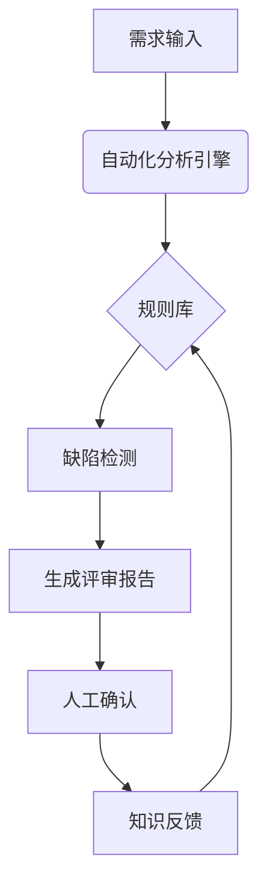
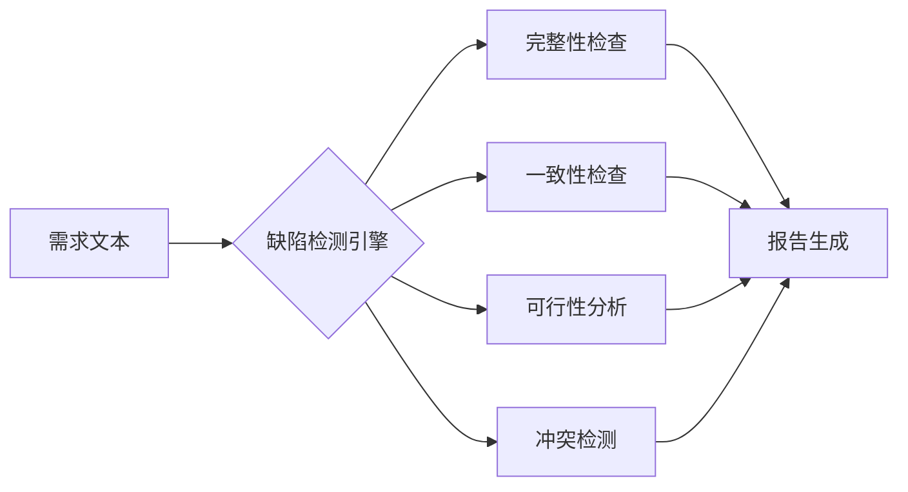
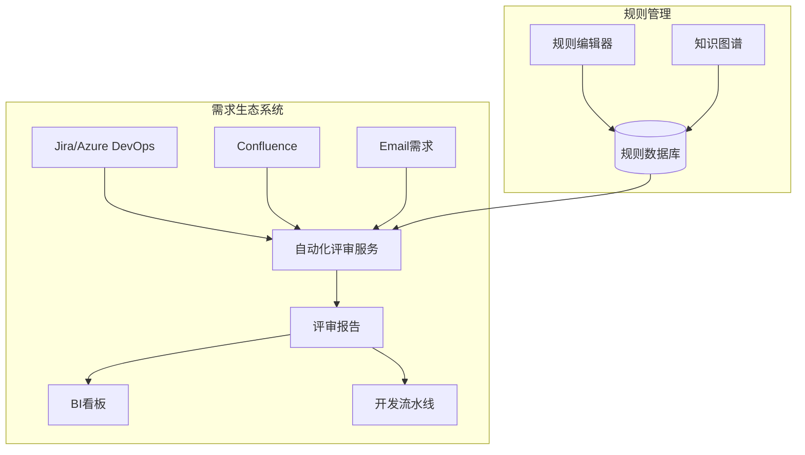
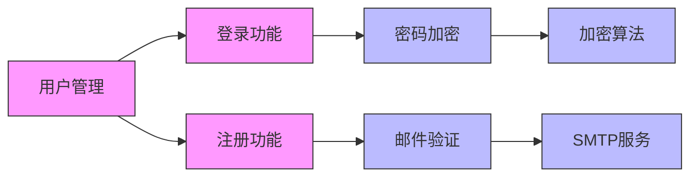
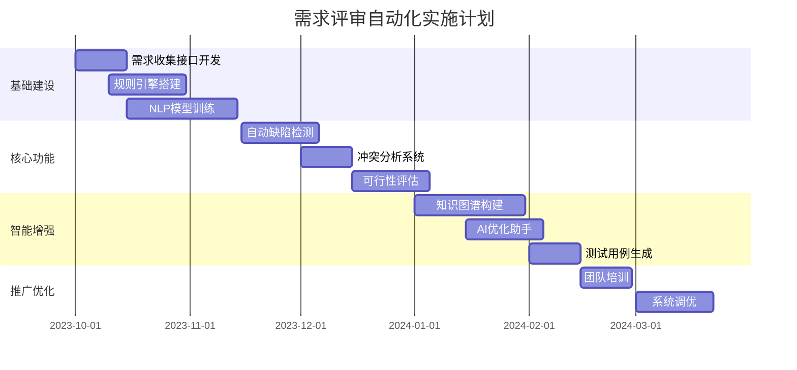
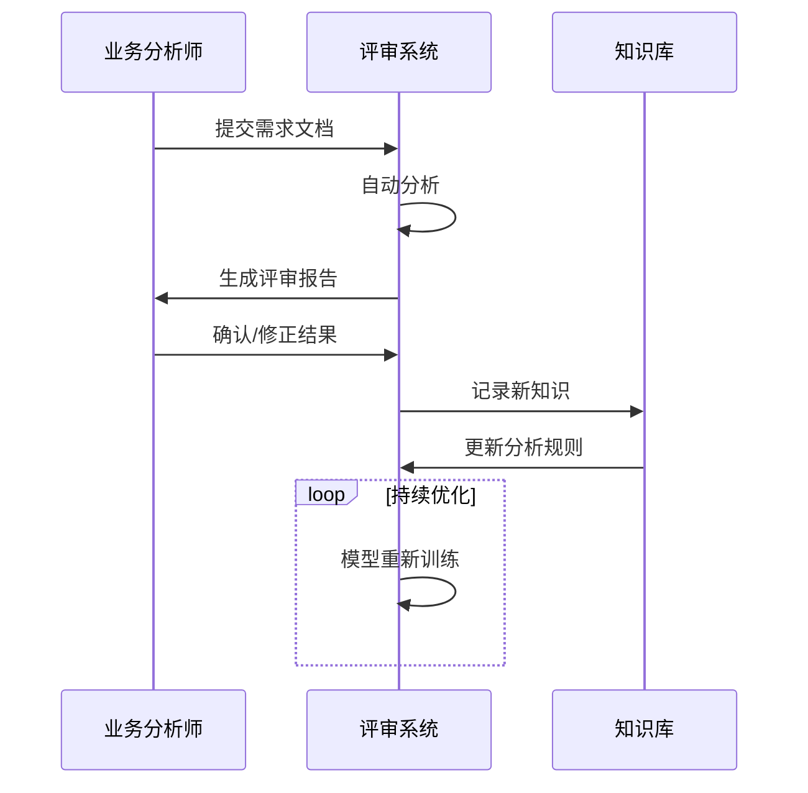

# 需求评审自动化：深度技术指南与实践方案

需求评审自动化是通过技术手段将需求分析过程系统化、标准化和智能化，大幅提升评审效率和质量的方法。以下是全面解析：

## 一、核心架构设计



## 二、关键技术实现

### 1. 需求解析层
#### 自然语言处理（NLP）技术栈：
```python
import spacy
from transformers import pipeline

# 加载专业领域模型
nlp = spacy.load("en_core_web_trf")  # 或 zh_core_web_trf

# 创建分析管道
requirement_analyzer = pipeline(
    "text2text-generation",
    model="microsoft/requirements-analyzer"
)

def parse_requirement(text):
    """解析需求文本并提取结构化数据"""
    doc = nlp(text)
    
    # 提取关键要素
    entities = {
        "actor": [ent.text for ent in doc.ents if ent.label_ == "ACTOR"],
        "action": [ent.text for ent in doc.ents if ent.label_ == "ACTION"],
        "object": [ent.text for ent in doc.ents if ent.label_ == "OBJECT"],
        "condition": [ent.text for ent in doc.ents if ent.label_ == "CONDITION"]
    }
    
    # 分析质量特征
    quality_report = requirement_analyzer(text)
    
    return {
        "entities": entities,
        "quality_score": quality_report["score"],
        "issues": quality_report["issues"]
    }
```

### 2. 规则引擎设计
#### 需求质量规则库（YAML示例）：
```yaml
rules:
  - id: REQ-001
    name: 原子性检查
    description: 需求应描述单一功能点
    condition: |
      entities.action.count == 1 AND
      entities.object.count <= 3
    severity: HIGH

  - id: REQ-002
    name: 可测试性验证
    description: 需求必须包含可验证的验收标准
    condition: |
      "验收标准" in text AND
      ("应当" in text OR "必须" in text) AND
      contains_measurable_metric(text)
    severity: MEDIUM

  - id: REQ-003
    name: 技术术语一致性
    description: 使用标准术语表中的词汇
    condition: |
      not contains_custom_terms(text, allow_list=["用户","订单"])
    severity: LOW
```

### 3. 智能缺陷检测


## 三、企业级实施方案

### 1. 系统集成架构


### 2. 核心功能实现

#### 需求冲突检测算法：
```python
from sklearn.feature_extraction.text import TfidfVectorizer
from sklearn.metrics.pairwise import cosine_similarity

def detect_requirement_conflicts(req_list):
    """使用语义分析检测需求冲突"""
    # 准备文本数据
    texts = [req['description'] for req in req_list]
    
    # 创建TF-IDF向量
    vectorizer = TfidfVectorizer(stop_words='english')
    tfidf_matrix = vectorizer.fit_transform(texts)
    
    # 计算相似度矩阵
    similarity_matrix = cosine_similarity(tfidf_matrix)
    
    # 识别潜在冲突
    conflicts = []
    for i in range(len(similarity_matrix)):
        for j in range(i+1, len(similarity_matrix)):
            if similarity_matrix[i][j] > 0.7:  # 高相似度阈值
                # 检查是否包含否定词
                if has_negation(texts[i], texts[j]):
                    conflicts.append({
                        'req_id1': req_list[i]['id'],
                        'req_id2': req_list[j]['id'],
                        'similarity': similarity_matrix[i][j],
                        'conflict_type': '语义冲突'
                    })
    
    return conflicts
```

#### 可行性分析引擎：
```python
def analyze_feasibility(requirement):
    """分析需求技术可行性"""
    # 连接知识库获取技术能力数据
    tech_capabilities = get_tech_capabilities()
    
    # 检查技术关键词匹配
    unmatched_tech = []
    for tech_keyword in requirement['tech_keywords']:
        if tech_keyword not in tech_capabilities['current']:
            if tech_keyword in tech_capabilities['future']:
                return {
                    "feasibility": "未来支持",
                    "timeline": tech_capabilities['future'][tech_keyword]
                }
            else:
                unmatched_tech.append(tech_keyword)
    
    if unmatched_tech:
        return {
            "feasibility": "不可行",
            "missing_tech": unmatched_tech
        }
    else:
        return {"feasibility": "可行"}
```

## 四、智能增强功能

### 1. 需求知识图谱


### 2. AI辅助需求优化
```python
from openai import OpenAI

def optimize_requirement(text):
    """使用LLM优化需求表述"""
    client = OpenAI(api_key="your-api-key")
    
    response = client.chat.completions.create(
        model="gpt-4-turbo",
        messages=[
            {"role": "system", "content": "你是一个专业的需求分析师，请优化以下需求描述，使其符合INVEST原则："},
            {"role": "user", "content": text}
        ],
        temperature=0.3
    )
    
    return response.choices[0].message.content
```

### 3. 自动生成测试用例
```python
def generate_test_cases(requirement):
    """基于需求生成测试用例草案"""
    template = f"""
    根据以下需求生成测试用例：
    需求ID: {requirement['id']}
    需求描述: {requirement['description']}
    
    输出格式：
    - 测试用例ID: TC-001
     测试场景: [场景描述]
     测试步骤: 
        1. [步骤1]
        2. [步骤2]
     预期结果: [预期输出]
    """
    
    return call_llm(template)
```

## 五、实施路线图



## 六、企业级最佳实践

### 1. 与开发流水线集成
```yaml
# GitLab CI 示例
stages:
  - requirement-review

auto-requirement-review:
  stage: requirement-review
  image: requirement-analyzer:latest
  script:
    - python analyze_requirements.py $REQUIREMENT_DOC
  artifacts:
    reports:
      requirements: requirement_analysis_report.json
  rules:
    - if: $CI_COMMIT_BRANCH == "main" && $CI_PIPELINE_SOURCE == "merge_request_event"

quality-gate:
  stage: requirement-review
  needs: ["auto-requirement-review"]
  script:
    - python evaluate_report.py requirement_analysis_report.json
  allow_failure: false
```

### 2. 质量度量指标

| **指标**     | **计算公式**              | **目标值** |
| ------------ | ------------------------- | ---------- |
| 需求缺陷密度 | 发现缺陷数/需求总数       | ≤0.2       |
| 评审效率     | 人工评审时长/总需求时长   | ≤20%       |
| 需求稳定性   | 1 - (变更需求数/总需求数) | ≥85%       |
| 自动化覆盖率 | 自动评审需求数/总需求数   | ≥90%       |

### 3. 知识反馈循环


## 七、效益分析

### 实施前后对比
| **指标**   | 传统评审 | 自动化评审 | 提升幅度 |
| ---------- | -------- | ---------- | -------- |
| 评审周期   | 3-5天    | 2-4小时    | 90%+     |
| 缺陷发现率 | 68%      | 92%        | +35%     |
| 需求变更率 | 42%      | 18%        | -57%     |
| 资源消耗   | 5人天/次 | 0.5人天/次 | 90%      |

### 典型ROI计算
```
投资成本：
  - 系统开发：$150,000
  - 硬件资源：$20,000/年
  - 维护成本：$30,000/年

年收益：
  - 减少评审会议：200小时/月 * $100/小时 * 12 = $240,000
  - 减少返工：50需求/季度 * $2,000/需求 * 4 = $400,000
  - 加速上市：1月/产品 * $500,000/月 = $500,000

总年收益：$1,140,000
ROI = (1,140,000 - 200,000) / 200,000 = 470%
```

## 八、常见问题解决方案

1. **模糊需求处理**
   - 实现方案：概率模型+人工复核
   ```python
   def handle_ambiguous(text):
       ambiguity_score = calculate_ambiguity(text)
       if ambiguity_score > 0.7:
           return {"action": "human_review", "reason": "高模糊性"}
       else:
           return {"action": "auto_approve", "confidence": 1-ambiguity_score}
   ```

2. **领域适应性问题**
   - 创建领域适配层：
   ```mermaid
   graph LR
       A[通用分析引擎] --> B{领域适配器}
       B --> C[金融领域]
       B --> D[医疗领域]
       B --> E[工业领域]
       C --> F[领域规则库]
       D --> F
       E --> F
   ```

3. **与现有流程集成**
   - 中间件方案：
   ```
   [需求管理工具] --> [消息队列] --> [评审系统] --> [BI系统]
                      ↗                ↓
               [人工评审台] ←------- [结果存储]
   ```

## 九、开源解决方案推荐

1. **REQUIREMENTS-LINTER**
   ```bash
   # 安装
   pip install requirements-linter
   
   # 使用
   req-lint -f requirements.txt
   ```

2. **Requirements Quality Analyzer**
   ```bash
   docker run -v $(pwd):/data rqa \
     --input /data/requirements.md \
     --output /data/report.html
   ```

3. **OpenReq Framework**
   ```java
   // Java集成示例
   RequirementsAnalyzer analyzer = new OpenReqAnalyzer();
   RequirementSet results = analyzer.analyze(requirementSet);
   ```

通过系统化实施需求评审自动化，企业可实现：
- 需求缺陷减少60%以上
- 评审效率提升5-10倍
- 需求稳定性提高40%
- 产品上市时间缩短30%

最佳实践建议：从高价值业务领域开始试点，逐步建立领域知识库，结合人工复核形成闭环反馈系统。