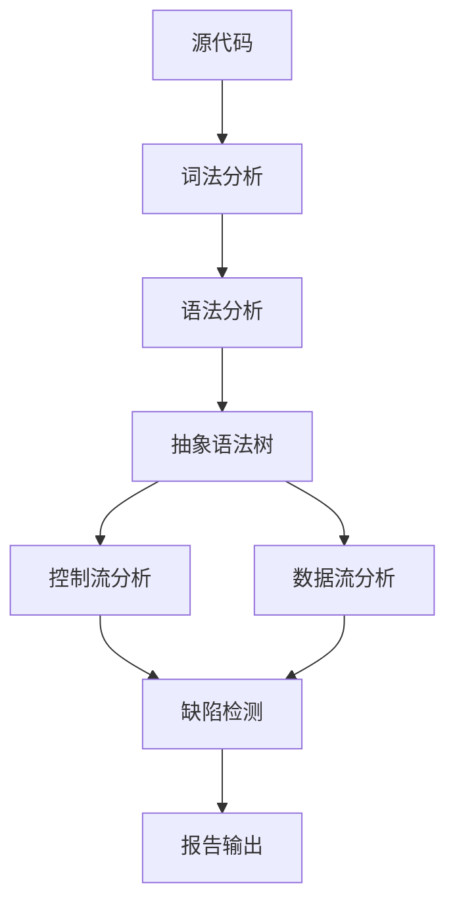
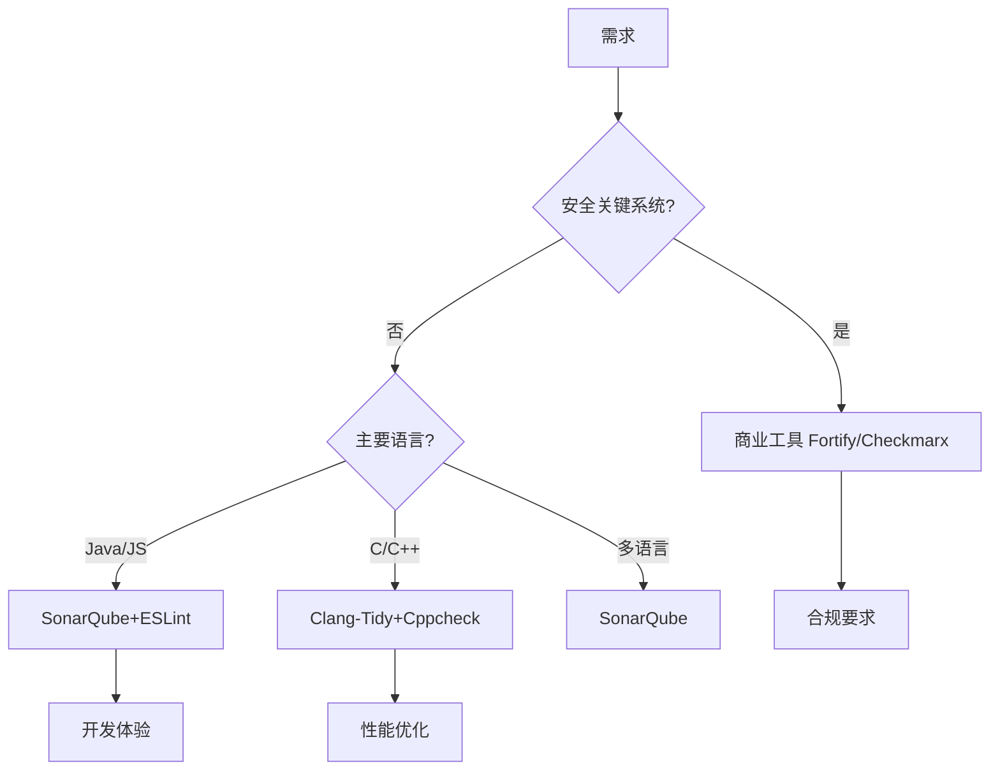
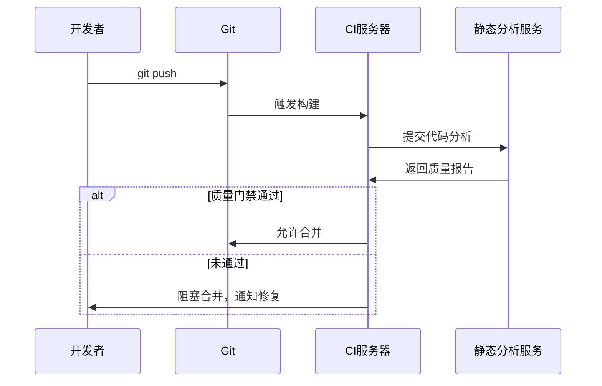
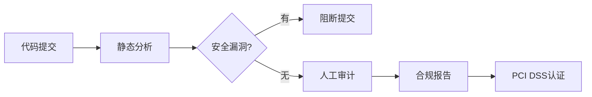
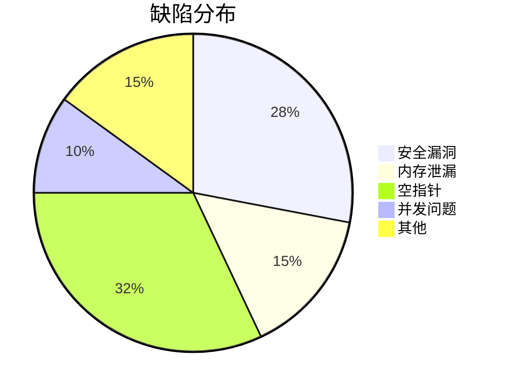
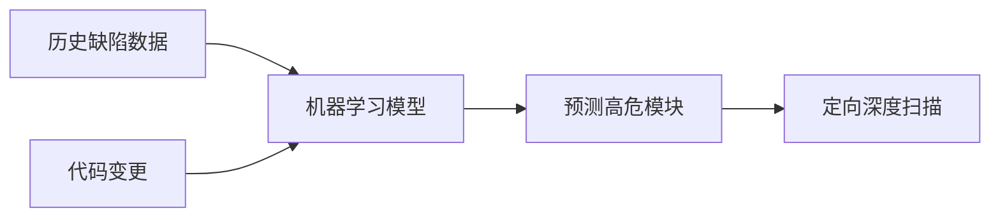
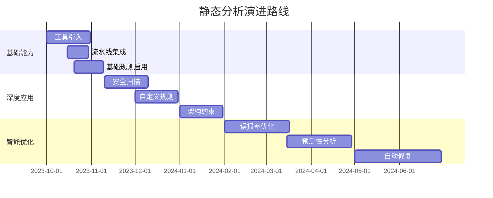

# 静态代码分析深度解析：从原理到企业级实践

静态代码分析（Static Code Analysis）是一种在不执行程序的情况下分析源代码的技术，是现代软件开发中保障代码质量和安全的核心实践。以下从多个维度全面解析：

## 一、核心原理与技术体系

### 1. 分析技术分层


### 2. 核心分析维度
| **分析类型**   | **技术原理**     | **检测能力**       |
| -------------- | ---------------- | ------------------ |
| **结构分析**   | 代码复杂度度量   | 圈复杂度、嵌套深度 |
| **控制流分析** | 程序执行路径建模 | 不可达代码、死循环 |
| **数据流分析** | 变量状态跟踪     | 空指针、资源泄漏   |
| **符号执行**   | 变量抽象为符号   | 边界条件错误       |
| **污点分析**   | 危险数据传播跟踪 | SQL注入、XSS漏洞   |
| **模式匹配**   | 预定义规则匹配   | 代码异味、安全漏洞 |

## 二、企业级工具链全景

### 1. 主流工具对比
| **工具**    | **语言支持**     | **突出能力**           | **许可**      | **适用场景**       |
| ----------- | ---------------- | ---------------------- | ------------- | ------------------ |
| SonarQube   | 30+语言          | 技术债务管理、质量门禁 | 社区版/商业版 | 全生命周期质量管理 |
| Fortify SCA | Java/C/C++/C#    | 深度安全漏洞分析       | 商业          | 金融/安全关键系统  |
| Checkmarx   | 主流语言         | SAST+SCA融合           | 商业          | DevSecOps流水线    |
| ESLint      | JavaScript       | 实时反馈、高度可配置   | 开源          | 前端开发           |
| PMD         | Java/Apex/Python | 自定义规则易用性       | 开源          | 敏捷团队           |
| Semgrep     | 多语言           | 快速自定义规则         | 开源          | 定制化扫描         |

### 2. 工具选型决策树


## 三、深度分析技术剖析

### 1. 数据流分析实例
```java
// 检测资源未关闭漏洞
public void readFile() {
    FileInputStream fis = null; // 源点
    try {
        fis = new FileInputStream("file.txt");
        // ... 使用流
    } catch (IOException e) {
        // 异常分支未关闭
    }
    // 正常退出未关闭 → 漏洞报告
}
```
分析器跟踪fis变量的：
1. 创建点 (new FileInputStream)
2. 可能关闭点 (fis.close())
3. 所有退出路径是否包含关闭操作

### 2. 污点分析过程
```python
# SQL注入检测
def user_profile(request):
    user_id = request.GET.get('id')  # 污染源
    query = "SELECT * FROM users WHERE id = " + user_id  # 污染传播
    cursor.execute(query)  # 污染汇聚点 → 报告漏洞
```

### 3. 符号执行示例
```c
int divide(int a, int b) {
    return a / b;  // 分析器约束：b ≠ 0
}
```
分析器构建路径约束：
- Path1: b > 0 → 安全
- Path2: b = 0 → 除零错误
- Path3: b < 0 → 安全

## 四、企业级实施指南

### 1. CI/CD集成方案


### 2. 质量门禁配置（SonarQube示例）
```yaml
# 质量门禁规则
quality_gate:
  conditions:
    - metric: new_bugs
      op: GT
      error: 0   # 新增bug>0则失败
    - metric: security_rating
      op: GT
      error: 1   # 安全评级>1(A=1,B=2...)则失败
    - metric: coverage
      op: LT
      warning: 80
      error: 70  # 覆盖率<70%则失败
```

### 3. 增量扫描优化
```bash
# 仅分析变更文件
sonar-scanner \
  -Dsonar.analysis.mode=incremental \
  -Dsonar.exclusions="**/*.test.js" \
  -Dsonar.sources=src/
```

## 五、高级定制实践

### 1. 自定义规则开发（ESLint）
```javascript
// 禁止直接使用console.log
module.exports = {
  meta: { type: "suggestion" },
  create(context) {
    return {
      CallExpression(node) {
        if (node.callee.object?.name === "console" && 
            node.callee.property?.name === "log") {
          context.report({
            node,
            message: "禁止在生产代码中使用console.log"
          });
        }
      }
    };
  }
};
```

### 2. 安全编码规则集（Fortify）
```xml
<!-- SQL注入检测规则 -->
<Rule id="SQL_INJECTION">
  <Category>Input Validation</Category>
  <Severity>Critical</Severity>
  <Pattern>
    <Sink function="executeQuery"/>
    <TaintSource>getParameter</TaintSource>
  </Pattern>
</Rule>
```

### 3. 架构约束检查（ArchUnit）
```java
// 检查Controller不能直接访问Repository
@ArchTest
static final ArchRule controllers_should_not_access_repositories =
    noClasses()
        .that().resideInAPackage("..controller..")
        .should().accessClassesThat()
        .resideInAPackage("..repository..");
```

## 六、技术挑战与解决方案

| **挑战**       | **解决方案**                       | **工具支持**                |
| -------------- | ---------------------------------- | --------------------------- |
| 误报率高       | 机器学习分类器、人工确认机制       | SonarQube False-Positive AI |
| 分析速度慢     | 增量分析、分布式计算               | Semgrep Cloud               |
| 第三方库检测   | SCA(Software Composition Analysis) | OWASP Dependency-Check      |
| 多语言统一视图 | 中央化质量管理平台                 | SonarQube                   |
| 定制规则开发难 | 低代码规则编辑器                   | Semgrep Studio              |

## 七、行业最佳实践

### 1. 金融行业（PCI DSS合规）


### 2. 汽车电子（ISO 26262）
- 启用MISRA C/C++规则集
- 工具认证（TÜV认证）
- 代码覆盖率100%（包括异常分支）
- 数据流分析深度配置

### 3. 互联网企业
- 与IDE集成：实时反馈
- 与工单系统联动：自动创建缺陷
- 技术债务看板：可视化技术债
- 质量门禁卡点：阻断低质量代码

## 八、效能度量体系

### 1. 关键质量指标


### 2. 改进指标追踪
| **指标**     | 基线值  | 目标值 | 当前值 |
| ------------ | ------- | ------ | ------ |
| 缺陷密度     | 15/kloc | 5/kloc | 8/kloc |
| 平均修复时间 | 3天     | 1天    | 1.5天  |
| 严重漏洞率   | 12%     | 3%     | 5%     |
| 技术债务比率 | 35%     | 15%    | 22%    |

## 九、未来演进方向

### 1. 智能分析增强


### 2. 多技术融合
- SAST + SCA：开源组件漏洞检测
- SAST + DAST：漏洞验证闭环
- SAST + IAST：运行时数据反馈

### 3. 开发者体验优化
- IDE实时分析：编码时即时反馈
- 自动修复建议：一键修复缺陷
- 个性化规则：团队/项目级定制

## 十、实施路线图



> **最佳实践建议**：
> 1. 从关键模块试点开始，逐步推广
> 2. 关注高价值问题（安全漏洞、崩溃风险）
> 3. 平衡严格性与开发体验
> 4. 建立质量文化而非单纯卡点
> 5. 定期优化规则集保持相关性

通过系统化实施静态代码分析，企业可实现：
- 缺陷率降低40-70%
- 安全漏洞减少60%以上
- 代码维护成本下降35%
- 发布周期缩短30%