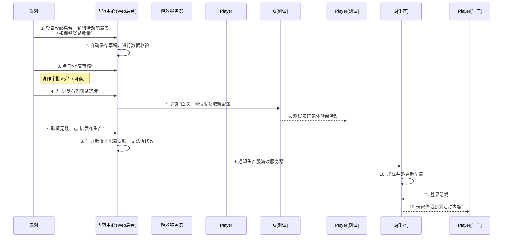

**内容与资产中心**。这个中心是游戏研发的“弹药库”和“后勤中心”，其核心目标是：**对游戏开发中的数字资产和配置内容进行全生命周期的统一管理，提升研发效率，降低协作成本，并赋能全球化和动态化运营。**

---

### 一、业务架构 (Business Architecture)

内容与资产中心的业务架构围绕数字资产的“生产 -> 管理 -> 分发 -> 运营”流水线展开。

#### 1. 核心业务模块

| 模块名称           | 核心功能描述                                                 | 业务价值                                                     |
| :----------------- | :----------------------------------------------------------- | :----------------------------------------------------------- |
| **资产仓库**       | **统一存储**：集中存储所有类型的游戏资产，包括程序代码、UI贴图、3D模型、动画、音频、配置文件、脚本、语言包等。 **版本管理**：基于Git或Perforce等理念，对二进制资产（如图片）进行版本控制，支持回滚、差异对比。 **元数据管理**：为每个资产打上丰富的标签（如创作者、创建时间、所属游戏、技能ID），实现强大的搜索和筛选。 | 解决资产分散、版本混乱、查找困难的问题，成为团队的**单一可信数据源**。 |
| **配置管理中心**   | **在线配置**：提供Web界面供策划和运营编辑游戏配置表（Excel/JSON格式），如角色数值、怪物属性、道具价格、活动时间表。  **版本与灰度**：支持配置的版本管理、多环境（开发/测试/生产）隔离、灰度发布和一键回滚。  **校验与预览**：提供配置校验规则（如数据格式、必填字段），并提供预览功能避免配错。 | 实现策划和运营对游戏内容的**动态调整**，无需程序重新打包客户端，极大加快迭代速度。 |
| **资源发布与热更** | **构建流水线**：与CI/CD（如Jenkins）工具集成，实现资产的自动打包、构建、生成版本清单。  **热更新管理**：管理增量热更包，支持按版本、渠道、地区发布不同的资源包。  **发布策略**：支持全量发布、灰度发布（推送给特定玩家）和紧急热修复。 | 实现游戏的**不停机更新**，快速修复线上问题，平滑发布新内容，提升玩家体验。 |
| **本地化中心**     | **翻译工作流**：管理多语言文本的提取、翻译、审核和集成流程。通常与第三方翻译平台集成。  **资产差异化管理**：管理不同地区/语言的特定资产（如符合当地文化的UI、图标）。  **上下文预览**：为翻译人员提供文本在游戏中的实际上下文截图，提高翻译准确性。 | 系统化地支撑游戏**全球化发行**，保证本地化质量和效率，降低跨区域运营成本。 |
| **权限与审计**     | **角色权限控制**：精细的权限管理（RBAC），控制不同角色（美术、策划、运营）对资产的查看、编辑、删除、发布权限。  **操作审计**：记录所有用户的增删改查和发布操作，便于追溯和定责。 | 保障资产安全，规范工作流程，避免误操作导致的生产事故。       |

#### 2. 核心业务流程：以“更新一个活动配置”为例

---

### 二、技术架构 (Technical Architecture)

内容与资产中心的技术挑战在于**海量小文件的高效存储、大规模文件的快速分发、版本管理的复杂性以及高并发下的可用性**。

#### 1. 分层架构

*   **接入层 (Web Portal & API Gateway)**：
    *   **Web管理后台**：提供丰富的Web界面，用于资产上传下载、配置编辑、发布管理等。通常是一个单页面应用（SPA）。
    *   **API网关**：统一入口，处理认证、鉴权、路由、限流。对外提供一套完整的RESTful API，供后台、CI/CD流水线、游戏客户端/服务器调用。

*   **业务逻辑层 (Microservices)**：
    *   `asset-service`（资产服务）：处理资产的元数据管理、增删改查、搜索、版本控制。
    *   `config-service`（配置服务）：提供配置表的在线编辑、版本管理、发布和校验能力。
    *   `build-service`（构建服务）：与CI/CD工具对接，负责资源的打包、构建、生成差异包。
    *   `distribution-service`（分发服务）：管理热更包的分发策略，与CDN对接。
    *   `i18n-service`（本地化服务）：管理多语言工作流和资源。

*   **数据持久层 (Data Storage)**：
    *   **对象存储 (OSS/S3)**：**存储海量原始资产的绝佳选择**。替代传统的NAS，具备无限扩展、高可靠、低成本的特点。存储图片、音频、预制体等二进制文件。
    *   **关系型数据库 (MySQL/PostgreSQL)**：存储**元数据**、**配置表内容**、**版本信息**、**发布日志**等结构化数据。需要分库分表。
    *   **缓存 (Redis)**：缓存热点资产信息、频繁访问的配置内容、发布状态，极大提升访问速度。
    *   **Elasticsearch**：提供强大的**元数据搜索**能力，用户可以通过各种标签快速定位资产。
    *   **大数据平台**：存储操作日志和访问日志，用于审计和分析。

*   **支撑组件层 (Supporting Components)**：
    *   **CI/CD流水线 (Jenkins/GitLab CI)**：与中心紧密集成，实现自动化构建和发布。
    *   **CDN网络**：用于**热更资源包**的全球分发，确保世界各地玩家都能高速下载更新。
    *   **权限系统 (RBAC)**：与公司统一权限系统打通，管理用户对功能的访问权限。
    *   **监控告警**：监控API性能、存储容量、CDN流量、发布成功率等关键指标。

#### 2. 核心技术点

*   **资产存储与加速**：
    *   使用**对象存储（OSS）** 作为源站，利用其高可用性和持久性。
    *   通过**CDN**对最终分发给玩家的热更包进行加速，大幅降低下载延迟。
    *   对于研发团队内部的高速上传下载，可以在公司机房部署**代理缓存**（如Nginx）来缓存OSS中的常用资产，避免公网带宽成为瓶颈。

*   **版本管理与差异提取**：
    *   对于代码和文本配置，直接使用Git进行版本管理。
    *   对于二进制文件（如纹理、模型），需要专门的**二进制版本管理工具**或**自研解决方案**。核心是每次上传计算文件哈希值，通过哈希值判断文件是否变化，从而实现**增量上传和下载**，节省带宽和存储。
    *   构建服务需要能生成**增量热更包**（Patch），通过对比新旧版本资源的哈希值列表，快速找出差异文件并打包。

*   **高可用与性能**：
    *   所有微服务**无状态化**设计，可以轻松水平扩展。
    *   数据库读写分离，读操作远多于写操作。
    *   大量的**缓存应用**，将元数据、配置数据、热门文件列表缓存到Redis中，应对高并发访问。

*   **安全与合规**：
    *   所有对外发布的资源包需要计算**哈希值**或进行**数字签名**，防止客户端被篡改。
    *   权限控制至关重要，防止未授权的用户访问甚至删除核心资产。
    *   操作日志必须详尽，满足审计和合规要求。

### 总结

内容与资产中心是游戏中台**提升研发效能**和**支撑敏捷运营**的核心支柱。

*   **业务上**，它统一了数字资产的管理范式，规范了从开发到上线的流程，实现了内容的动态化配置，为快速迭代和全球化运营提供了坚实基础。
*   **技术上**，它是一个融合了**云原生存储（OSS）、CDN、微服务、CI/CD和大数据**的复杂平台。其设计目标是成为整个公司游戏研发的“单一可信数据源”，并能够高效、可靠地将内容交付给全球的玩家。

建设好内容与资产中心，意味着公司将游戏研发的核心资产——代码和内容——真正地平台化和资产化，这是游戏研发走向工业化、标准化的重要一步。