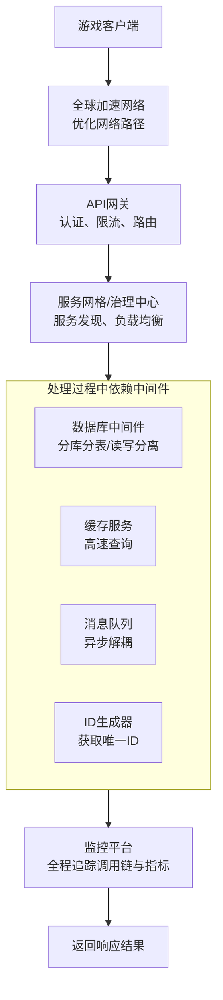

**技术中间件平台**。这个平台是中台的“技术底盘”和“动力系统”，它不直接处理业务逻辑，而是为所有业务中心和高频游戏业务提供**稳定、高效、可扩展**的基础技术能力。

其核心目标是：**通过技术赋能，让游戏业务开发团队能够专注于玩法创新，而无需重复解决底层技术难题。**

---

### 一、业务架构 (Business Architecture)

技术中间件平台的业务架构围绕“**提供通用技术能力**”展开，其“业务”就是为其他中心和高频游戏业务提供稳定可靠的技术服务。

#### 1. 核心业务模块（提供的服务）

| 模块名称               | 核心功能描述                                                 | 业务价值与解决的问题                                         |
| :--------------------- | :----------------------------------------------------------- | :----------------------------------------------------------- |
| **微服务治理中心**     | **服务注册与发现**：自动管理微服务的实例地址（上线、下线），服务消费者自动发现提供者。 **配置管理**：集中管理所有微服务的配置，支持动态刷新，无需重启服务。 **服务网关**：提供统一的API入口，负责路由、认证、鉴权、限流、熔断。 | 解决微服务架构下的“找得到”、“管得住”、“配得动”问题，是微服务体系的“大脑”。 |
| **持久化中间件**       | **数据库代理与分库分表**：提供数据库访问代理，透明地处理分库分表、读写分离、故障转移等复杂逻辑。 **统一缓存服务**：提供集群化的Redis缓存服务，支持多种数据结构，提供高可用的访问能力。 **全局唯一ID生成器**：提供分布式的、趋势递增的ID生成服务（如雪花算法），避免ID冲突。 | 解决海量数据下的数据库访问性能、扩展性和可用性问题。降低业务方直接操作数据库的复杂度。 |
| **消息中间件**         | **消息队列服务**：提供可靠的异步消息传递能力，支持解耦、削峰填谷、顺序消息、事务消息等。 **消息治理**：提供可视化的控制台，管理Topic、监控消息堆积、重发死信消息。 | 解决系统间的异步通信和解耦问题，是构建高弹性、高可靠系统的基础设施。 |
| **监控与可观测性平台** | **应用性能监控**：收集并可视化服务的调用链、耗时、QPS、错误率，快速定位性能瓶颈。 **日志中心**：集中采集、存储、检索和分析所有服务的日志数据。 **指标监控与告警**：监控系统指标（CPU、内存）和业务指标，并配置灵活的告警规则。 | 解决系统“黑盒”问题，提供“上帝视角”，保障系统稳定性的“眼睛”。 |
| **全局网络与通信**     | **长连接网关**：为游戏提供可支撑百万级甚至千万级并发长连接的管理能力，实现消息推送和实时通信。 **全球加速**：为全球同服的游戏提供低延迟、高可用的网络通道，优化跨地区访问体验。 | 解决游戏特有的高并发连接和全球网络延迟问题，是游戏业务的“神经网络”。 |
| **运维支撑平台**       | **容器化与编排**：基于Docker和Kubernetes，提供从代码到部署的自动化CI/CD流水线。 **资源调度**：自动化地部署、管理、伸缩应用实例。 | 解决部署效率、资源利用率和环境一致性问题，实现DevOps敏捷开发。 |

#### 2. “业务”流程：以“处理一次高并发请求”为例

技术中间件平台的“业务流”体现在它如何协同处理一次请求，如下图所示：

---

### 二、技术架构 (Technical Architecture)

技术中间件平台的技术架构本质上是**一系列成熟开源组件的选型、封装、增强和统一输出**。其挑战在于**稳定性、性能、规模化和易用性**。

#### 1. 分层架构

技术中间件平台本身的架构也是分布式的，其技术栈可划分为：

*   **基础设施层**：
    *   **计算资源**：物理机、虚拟机、以及当前主流的**Kubernetes容器平台**。K8s已成为部署和管理中间件及其应用的事实标准。
    *   **网络**：SDN（软件定义网络）保障网络性能和安全组隔离。

*   **中间件组件层**：
    *   **服务治理**：集成或自研基于**Spring Cloud Alibaba**、**Dubbo**、**gRPC**的微服务框架，并集成**Nacos**（服务发现/配置）、**Sentinel**（流量控制）。
    *   **数据库中间件**：使用 **ShardingSphere**（分库分表代理）、**MyCat** 或云厂商的RDS Proxy。
    *   **缓存与消息**：
        *   **Redis**：集群模式（Codis、Redis Cluster）或代理模式（Twemproxy）。
        *   **Kafka**：**大规模日志和消息的首选**，保障高吞吐和可靠性。**RocketMQ** 用于事务消息场景。
    *   **监控可观测性**：
        *   **调用链**：**SkyWalking**（国产优秀）、**Zipkin**、**Jaeger**。
        *   **日志**：**ELK**（Elasticsearch, Logstash, Kibana）或 **EFK**（Fluentd）技术栈。
        *   **指标**：**Prometheus**（监控数据采集和存储） + **Grafana**（数据可视化）。
    *   **长连接网关**：使用 **Netty** 框架自研，专注于高并发、低延迟、自定义协议。

*   **统一接入与管理层**：
    *   **控制台**：为所有中间件提供**统一的Web管理控制台**。这是提升易用性的关键，让开发运维人员可以在一个界面查看服务状态、Redis流量、Kafka堆积情况、配置告警等。
    *   **标准化SDK/Client**：为Java、Go、C++等语言提供**统一封制的客户端**，集成最佳实践（如连接池、负载均衡、容错策略），让业务方“开箱即用”，避免错误配置。

*   **运维与自动化层**：
    *   **CI/CD**：**Jenkins**、**GitLab CI** 或 **ArgoCD**，实现自动化部署和交付。
    *   **IaC**：使用 **Terraform**、**Ansible** 等工具实现基础设施即代码，自动化创建中间件集群。

#### 2. 核心技术点

*   **高可用设计**：
    *   **集群化**：所有中间件组件都**必须以集群方式部署**，避免单点故障。例如，Redis Cluster、Kafka集群、Nacos集群。
    *   **多可用区部署**：在云上，将中间件节点分散到不同可用区（AZ），实现机房级容灾。

*   **性能与扩展性**：
    *   **水平扩展**：所有组件都应支持通过增加节点来提升处理能力。例如，Kafka通过增加Partition来提升吞吐，无状态网关服务通过增加Pod数量来承接更多连接。
    *   **资源隔离**：为不同的业务或项目分配独立的中间件资源（如独立的Redis DB、Kafka Topic），避免相互影响。

*   **透明化与易用性**：
    *   **这是中台成功的关键**。技术复杂性必须被封装起来，对业务开发人员提供简单的API和控制台界面。例如，分库分表对业务代码应该是透明的，业务方像操作单库单表一样操作。

*   **监控全覆盖**：
    *   不仅监控业务应用，更要**深度监控中间件本身**。如监控Redis的内存使用率、Kafka的消息堆积数、Nacos的健康状态。只有中间件稳定，整个应用生态才稳定。

### 总结

技术中间件平台是游戏中台的**无声基石**和**效率引擎**。

*   **业务上**，它不直接产生价值，但它通过**赋能**所有业务团队，大幅降低其开发复杂度、提升研发效率、保障系统稳定性，从而间接创造了巨大的业务价值。它让游戏团队可以快速试错、敏捷迭代。
*   **技术上**，它是一个集大成的“**技术百货商店**”，集成了各类最优秀的开源组件，并通过**统一封装、统一管理、统一运维**，将其变成标准化的、可靠的、易用的技术服务。

建设一个好的技术中间件平台，意味着公司建立了强大的技术基础设施，为游戏的快速研发和稳定运营提供了坚实的后盾，是技术驱动业务发展的典型体现。