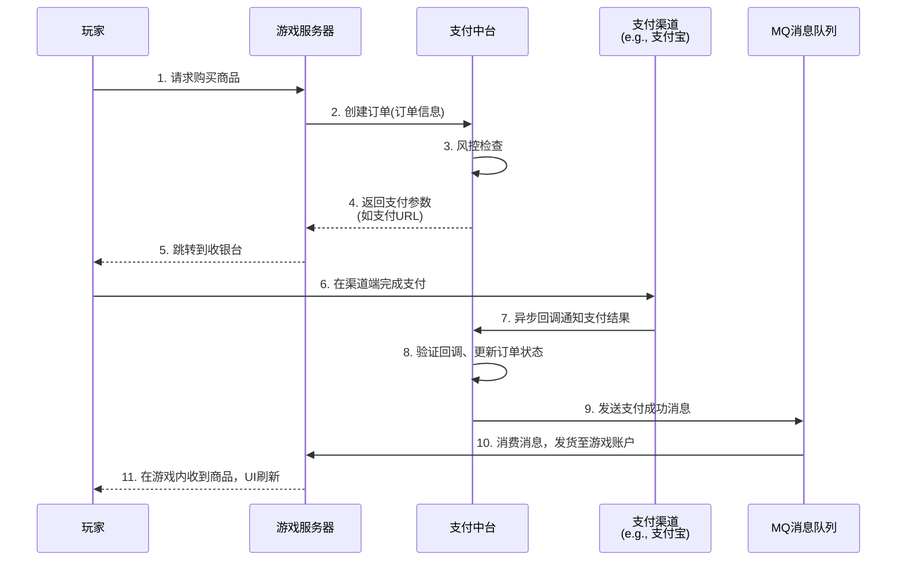

游戏软件中台的**支付与电商中心**的业务架构与技术架构。

这个中心是游戏中台的“现金流”核心，直接关系到公司的收入和玩家的消费体验。其设计目标是：**稳定、准确、高效、安全**。

---

### 一、业务架构 (Business Architecture)

支付与电商中心的业务架构围绕“交易”这一核心流程展开，主要包含以下核心模块和功能：

#### 1. 核心业务模块

| 模块名称                                            | 核心功能描述                                                 |
| :-------------------------------------------------- | :----------------------------------------------------------- |
| **支付网关 (Payment Gateway)**                      | **渠道聚合**：统一对接国内外各类支付渠道（支付宝、微信、App Store、Google Play、银联等）。 **订单路由**：根据策略（如费率、成功率）智能选择最优支付渠道。 **协议同步**：处理各渠道的异步支付回调通知，并转化为内部统一格式。 |
| **订单中心 (Order Center)**                         | **生命周期管理**：管理订单从创建、支付中、成功/失败、发货到完成的完整状态流。 **订单数据**：存储所有订单的核心信息（订单ID、用户ID、商品信息、金额、状态等）。 **幂等性控制**：确保订单不会被重复处理，关键接口支持重试。 |
| **商品与库存中心 (Item & Inventory Center)**        | **虚拟商品管理**：定义和配置商品（钻石、礼包、月卡等）的属性、价格、捆绑内容。 **库存管理**：虽然虚拟商品无限，但可用于限制活动商品、实物兑换商品的库存。 **定价策略**：支持不同区域、不同渠道的差异化定价（如美元区、欧元区）。 |
| **账务与会计中心 (Billing & Accounting Center)**    | **资金对账**：每日与支付渠道提供的对账单进行自动化对账，找出差异订单。 **会计分录**：根据交易生成内部的虚拟会计分录，方便财务核算。 **数据分析**：提供交易报表、收入分析、渠道成功率等数据。 |
| **风控与安全中心 (Risk Control & Security Center)** | **实时风控**：监控异常支付行为（如单账号高频支付、IP异常、金额异常）。  **黑名单管理**：禁用有欺诈行为的账户、设备或IP。  **防洗钱(AML)**：监控大额可疑交易。 |
| **履约与发货中心 (Fulfillment Center)**             | **发货代理**：在支付成功后，准确、及时地将虚拟商品发放到玩家游戏账户。  **发货重试与补偿**：处理因网络问题导致的发货失败，提供补发机制。  **与游戏服交互**：通过MQ或RPC调用游戏服务器的接口完成最终的商品发放。 |

#### 2. 核心业务流程

一个完整的支付流程涉及多个模块的协同，如下图所示，它清晰地展示了从玩家发起支付到最终收到商品的完整过程：

---

### 二、技术架构 (Technical Architecture)

为了支撑上述高并发、高可用的业务，技术架构通常采用分布式、微服务的设计模式。

#### 1. 分层架构

*   **接入层 (API Gateway)**：
    *   使用**API网关**（如Kong, Spring Cloud Gateway）作为所有流量的统一入口。
    *   负责负载均衡、路由、认证、鉴权、限流、熔断。例如，验证请求是否来自已注册的游戏服务器。
    *   对外提供一套**RESTful API**给游戏客户端和服务器调用。

*   **业务逻辑层 (Microservices)**：
    *   采用**微服务**架构，将业务模块拆分为独立的服务，如：
        *   `order-service` (订单服务)
        *   `payment-service` (支付服务)
        *   `item-service` (商品服务)
        *   `fulfillment-service` (履约服务)
        *   `accounting-service` (对账服务)
    *   每个服务独立开发、部署、扩容。例如，在版本更新或大促时，可以单独对 `payment-service` 进行扩容。

*   **数据持久层 (Data Storage)**：
    *   **核心交易数据**（订单、支付记录）：使用**关系型数据库**（如MySQL, PostgreSQL），保证事务（ACID）强一致性。通常采用分库分表（如ShardingSphere）来应对海量订单数据。
    *   **缓存**：大量使用 **Redis** 作为缓存，缓存商品信息、用户会话、临时订单状态等，降低数据库压力，提高响应速度。
    *   **异步消息**：使用 **MQ**（如Kafka, RocketMQ）进行服务间的异步解耦。**支付成功消息**通过MQ通知游戏服务器发货，确保最终一致性。
    *   **日志与数据**：使用 **Elasticsearch** 存储日志便于查询，使用 **Hadoop**/**数据仓库**（如ClickHouse）存储海量数据用于对账和分析。

*   **支撑组件层 (Supporting Components)**：
    *   **配置中心**（如Nacos, Apollo）：统一管理各服务的配置，如渠道开关、费率。
    *   **服务注册与发现**（如Nacos, Consul）：管理微服务的动态地址。
    *   **监控告警**（如Prometheus, Grafana, SkyWalking）：监控系统健康状况、API性能、业务指标（如支付成功率QPS），并及时告警。

#### 2. 核心技术点

*   **幂等性 (Idempotency)**：
    *   **原因**：网络超时可能导致客户端或渠道重复发送请求。
    *   **实现**：为每个订单生成唯一ID（订单号），在关键接口（如创建订单、支付回调）中检查该ID是否已被处理，避免重复创建订单或重复发货。

*   **分布式事务 (Distributed Transaction)**：
    *   **场景**：更新订单状态（数据库操作）和发送发货消息（MQ操作）需要保持一致性。
    *   **解决方案**：常用 **本地事务表 + 消息队列** 或 **Seata** 等框架来保证最终一致性。例如，先将消息和业务数据保存在同一个数据库事务中，再由一个定时任务轮询并投递消息。

*   **高可用与容灾 (High Availability & Disaster Recovery)**：
    *   **多可用区部署**：在云上跨多个可用区（AZ）部署服务，避免单点故障。
    *   **弹性伸缩**：根据监控指标（如CPU、QPS）自动扩容实例，以应对流量高峰。
    *   **渠道故障熔断与降级**：如果某个支付渠道频繁失败，系统自动将其熔断，并路由到其他备用渠道，保证整体支付功能可用。

*   **安全性 (Security)**：
    *   **通信加密**：全链路使用HTTPS（TLS）加密。
    *   **数据签名**：与游戏服务器、支付渠道的交互全部采用签名（如RSA）验证，防止数据篡改。
    *   **敏感信息保护**：数据库中的敏感信息（如用户身份证号）进行加密存储。

---

### 总结

游戏中台的支付与电商中心是一个极其复杂的系统，其业务架构围绕**交易流**和**资金流**展开，强调准确性、安全性和效率；其技术架构则基于**微服务**和**分布式**理念，通过解耦、异步、冗余等手段来满足高并发、高可用的苛刻要求。

建设一个好的支付中台，意味着能为公司所有游戏产品提供一个**稳定、可靠、可扩展**的 revenue engine（收入引擎），是游戏企业规模化、工业化发展的关键基础设施。