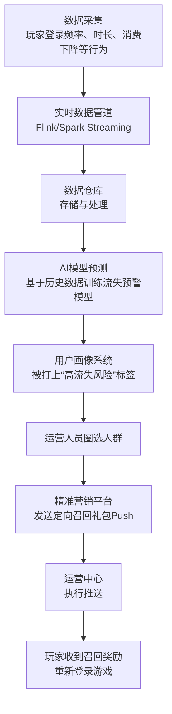

**数据与AI中心**。这个中心是游戏中台的“大脑”和“智慧引擎”，其核心目标是：**通过数据驱动决策，并通过人工智能技术创造智能化的游戏体验，从而提升用户留存、活跃度和收入。**

值得注意的是，您提到了两次“业务架构”，我将理解为希望深入了解其**业务架构**与**技术架构**。

---

### 一、业务架构 (Business Architecture)

数据与AI中心的业务架构围绕数据的“**采集 -> 治理 -> 应用 -> 赋能**”价值链展开，最终输出的是数据洞察和智能能力。

#### 1. 核心业务模块

| 模块名称               | 核心功能描述                                                 | 业务价值                                                     |
| :--------------------- | :----------------------------------------------------------- | :----------------------------------------------------------- |
| **数据平台**           | **统一数据采集**：制定埋点规范，通过SDK全自动采集游戏客户端、服务器端的用户行为日志、业务日志、性能日志。 **数据管道**：构建实时和离线数据管道，将海量日志数据清洗、转换、加载到数据仓库中。 **数据仓库/数据湖**：整合来自游戏、支付、社交等所有中台数据，形成统一、规范的数据资产体系。 | 奠定数据基石，解决数据孤岛问题，为全公司提供**唯一、可信的数据源**。 |
| **BI分析与可视化**     | **报表系统**：提供固定报表，每日自动生成核心指标报表（DAU、收入、留存、LTV、付费率）。  **即席查询**：允许运营、策划自主通过拖拽方式进行多维数据分析，快速验证假设。  **数据仪表盘**：构建可视化大屏，实时监控游戏健康度、活动效果等。 | **数据驱动决策**，让业务人员能够快速、直观地获取业务洞察，评估功能效果，指导运营策略。 |
| **用户画像与精准营销** | **标签体系**：基于用户行为数据，构建包含基础属性、行为偏好、消费能力、社交特征等的标签体系。  **用户分群**：允许运营基于标签组合，圈定特定的用户群体（如“近期流失的高付费用户”）。  **营销触达**：与运营中心联动，对分群用户进行精准的Push、邮件、游戏内广告推送。 | 实现**精细化运营**，从“运营游戏”到“运营用户”，提升营销效率和用户生命周期价值（LTV）。 |
| **AI赋能平台**         | **推荐系统**：为游戏内的商城、内容（如英雄、卡牌）提供个性化推荐，提升转化率和用户体验。  **反作弊系统**：利用机器学习模型实时检测游戏中的外挂、脚本、异常行为（如秒杀、自动寻路），保障游戏公平。  **AI创作辅助**：集成AIGC能力，为研发提供AI生成美术素材、剧情文案、配音等辅助功能。 | 将AI能力产品化，直接为游戏**赋能提效**，创造新的玩法体验，并守护游戏环境。 |
| **数据服务与API**      | **统一数据服务**：将清洗后的数据、用户标签、AI模型结果以API的形式提供给其他中台中心和游戏项目组。 | 打破数据壁垒，让数据和能力**安全、高效**地流动起来，赋能整个业务生态。 |

#### 2. 核心业务流程：以“识别流失风险并干预”为例

---

### 二、技术架构 (Technical Architecture)

数据与AI中心的技术架构是典型的**大数据+AI**技术栈，其挑战在于处理**海量数据**的**实时性**、**复杂性**以及**AI模型研发与部署的高效性**。

#### 1. 分层架构

*   **数据采集层**：
    *   **埋点SDK**：集成到游戏客户端和服务器，负责按照规范采集事件日志，并进行压缩、缓存和批量上报。
    *   **日志采集Agent**：通过Filebeat、Fluentd等工具采集服务器上的业务日志文件。
    *   **数据同步工具**：使用Sqoop、DataX等工具将业务数据库（如MySQL）中的数据同步到数据仓库。

*   **数据处理与存储层**：
    *   **实时计算引擎**：**Apache Flink**是当前主流选择，用于处理实时数据流，如实时指标计算、实时反作弊、实时用户画像更新。
    *   **离线计算引擎**：**Apache Spark**用于处理T+1的复杂ETL任务、大规模数据分析和模型训练。
    *   **数据仓库/数据湖**：
        *   **Hadoop HDFS**：存储海量原始日志和离线数据的低成本方案。
        *   **Apache Hive**：构建在HDFS之上的数据仓库工具，提供SQL查询能力。
        *   **ClickHouse**：**极其重要**！用于高性能的OLAP查询，支撑即席查询和实时报表，速度快是其最大优点。
        *   **云上数据湖**：如AWS S3 + Glue + Athena的组合，已成为流行趋势。

*   **数据服务与应用层**：
    *   **BI可视化工具**：集成**Superset**、**Tableau**或自研平台，提供报表和仪表盘功能。
    *   **用户画像平台**：通常自行开发，后端依赖HBase/ClickHouse存储标签数据，提供快速查询和分群服务。
    *   **机器学习平台**：
        *   **特征仓库**：管理模型训练所需的特征，保证线上线下特征一致性。
        *   **模型训练**：基于**Jupyter Notebook**、**Spark MLlib**、**TensorFlow/PyTorch**进行模型开发和训练。
        *   **模型部署与服务**：使用**Docker**和**Kubernetes**将模型部署为API服务（Online Serving），如使用**TF Serving**或**Triton Inference Server**，提供高并发低延迟的推理能力。

*   **支撑组件层**：
    *   **元数据管理**：如**Apache Atlas**，管理数据血缘、数据字典，确保数据可追溯、可理解。
    *   **任务调度**：使用**DolphinScheduler**、**Airflow**等调度和监控复杂的ETL任务流和机器学习 pipeline。
    *   **资源管理**：**YARN**或**Kubernetes**，用于统一管理集群的计算资源。
    *   **监控告警**：监控数据延迟、任务失败、API性能、模型指标（如准确率、响应时间）。

#### 2. 核心技术点

*   **Lambda架构与Kappa架构**：
    *   **Lambda架构**：同时维护实时和离线两套处理逻辑，最终合并得到全量数据视图。这是经典架构，但维护成本高。
    *   **Kappa架构**：主张全部通过实时流处理，需要查询历史数据时，重放历史日志流。架构更简洁，对消息队列（Kafka）的可靠性要求极高。

*   **特征工程与平台化**：
    *   AI模型的效果很大程度上依赖于特征。需要构建**特征平台**，对特征进行统一管理、计算和存储，确保模型训练（离线）和在线推理（在线）时使用的特征是完全一致的。

*   **模型部署的挑战**：
    *   游戏中的AI推理（如反作弊、实时推荐）要求**极低的延迟**（毫秒级）。
    *   需要高性能的推理服务框架（如TF Serving）和GPU资源。
    *   模型需要支持**灰度发布**和**AB测试**，以平稳上线并评估效果。

*   **数据治理**：
    *   随着数据量暴增，**数据质量**（准确性、及时性）、**数据成本**（存储和计算成本控制）、**数据安全**（脱敏、权限）变得至关重要，需要专门的工具和流程来保障。

### 总结

数据与AI中心是游戏中台从“自动化”走向“智能化”的关键。

*   **业务上**，它不再是简单的报表输出，而是深入到业务的每个环节，通过**数据分析**发现价值，通过**AI模型**创造价值，实现从“事后复盘”到“事前预测”和“事中干预”的转变。
*   **技术上**，它集成了当今最前沿的**大数据技术栈**和**AI技术栈**，是一个复杂而庞大的系统。其建设往往需要分阶段进行，先打好数据基础（数据平台），再实现数据应用（BI分析），最后攻克AI赋能（机器学习平台）。

一个强大的数据与AI中台，是现代游戏公司最核心的竞争力之一，它能让游戏运营和研发变得前所未有的精准和高效。