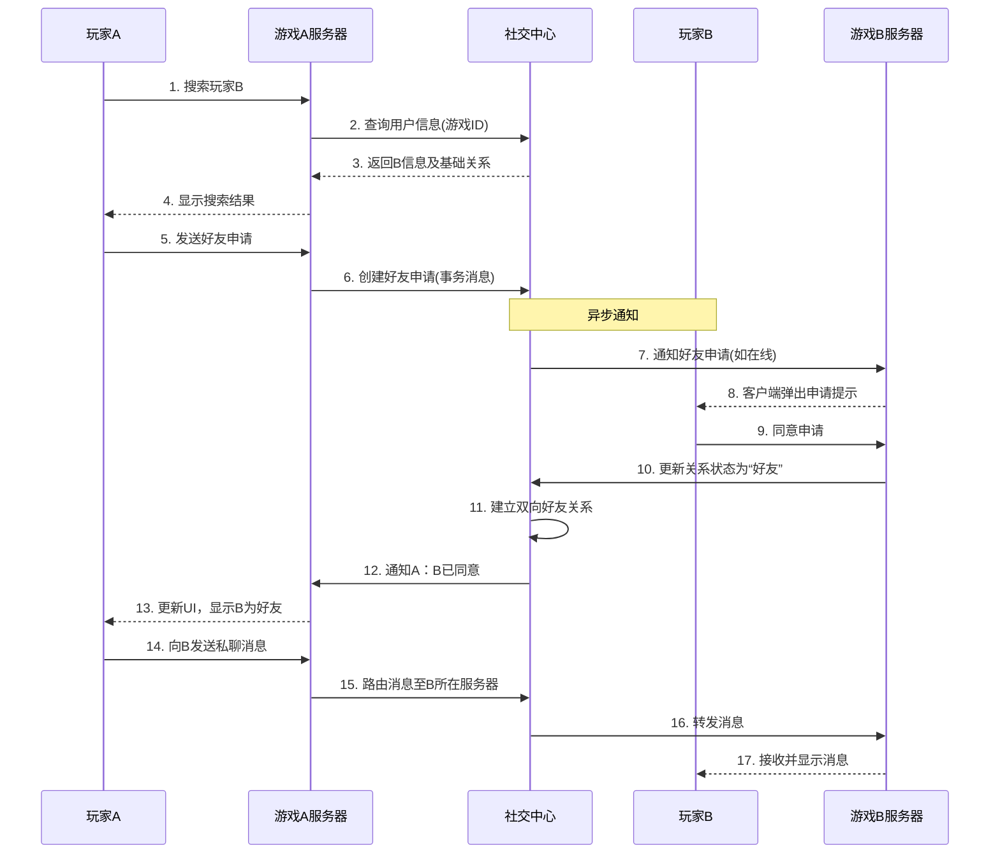

# 社交系统中的业务架构和技术架构

社交系统是游戏的“粘合剂”，它能极大提升用户留存和活跃度，构建游戏内的生态和社区。将其下沉到中台，可以实现公司内多款游戏的社交互通，形成强大的矩阵效应。

---

### 一、业务架构 (Business Architecture)

社交中心的业务架构围绕“关系”和“互动”两大核心构建，旨在为前台游戏提供一套完整、可插拔的社交能力。

#### 1. 核心业务模块

| 模块名称         | 核心功能描述                                                 | 业务价值                                                     |
| :--------------- | :----------------------------------------------------------- | :----------------------------------------------------------- |
| **关系链模块**   | **好友系统**：好友关系的建立（搜索、推荐、申请、同意）、删除、管理（分组、备注）、在线状态同步、亲密度管理。 **粉丝/关注系统**：支持不对称的社交关系，适用于MMORPG、SLG等游戏。 **黑名单**：屏蔽不受欢迎玩家的任何互动。 | 建立并维护玩家之间的核心社交图谱，是所有社交互动的基础。     |
| **实时通信模块** | **聊天系统**：支持私聊、世界频道、公会/战队频道、队伍频道、系统频道等。支持文本、表情、语音消息、快捷指令。 **实时语音**：提供游戏内的语音聊天（VoIP），支持队伍/团队语音、空间语音（如吃鸡游戏的附近频道）。 **推送通知**：当玩家离线时，将重要消息（如被@、好友申请）通过Push推送至手机。 | 满足玩家实时互动的需求，降低沟通成本，增强协作和沉浸感。     |
| **社区互动模块** | **玩家动态**：类似“游戏朋友圈”，玩家可以分享战绩、抽卡结果、珍贵道具等，支持点赞、评论。 **公会/战队系统**：提供创建、加入、退出、解散、管理（职位、审批）、公会仓库、公会活动等全套功能。 **排行榜**：提供全局和好友之间的各种排行榜（等级、战力、收藏等），激发竞争意识。 | 构建游戏内外的社区氛围，增加内容生产和消费，提升玩家粘性。   |
| **社交赋能模块** | **社交画像**：基于玩家的社交行为（活跃度、影响力、圈子）为其打上标签，用于个性化推荐（如推荐好友、推荐公会）。 **互动玩法支持**：为游戏提供通用的组队匹配、师徒系统、情侣系统等玩法的底层支持。 **跨游戏社交**：允许玩家在不同游戏之间互加好友、聊天、查看动态，实现真正的矩阵互联。 | 为游戏提供数据支持和高级社交功能，驱动精细化运营和跨游戏导流。 |

#### 2. 核心业务流程：以“添加好友并聊天”为例

---

### 二、技术架构 (Technical Architecture)

社交系统的技术挑战在于**高并发、低延迟、高可用**，尤其是实时通信部分。其技术架构通常采用微服务 + 分布式中间件的模式。

#### 1. 分层架构

*   **接入层 (API Gateway & Connection Layer)**：
    *   **API网关**：处理所有HTTP RESTful请求（如好友列表、动态发布、公会管理），负责鉴权、限流、路由。
    *   **长连接网关**：这是**最核心的组件**。使用**Netty**或**Go**等高性能框架自研，或使用**MQTT**等协议构建。每个玩家客户端都与一个网关实例保持长连接，用于实现实时消息推送、状态同步和语音通信。此层需要轻松支持百万甚至千万级并发连接。

*   **业务逻辑层 (Microservices)**：
    *   采用微服务设计，服务拆分与业务模块对应：
        *   `relationship-service`：负责所有关系链的增删改查逻辑。
        *   `chat-service`：负责消息的存储、分发、历史记录查询。
        *   `community-service`：负责动态、公会、排行榜等社区功能。
        *   `push-service`：负责离线消息的推送通知。
        *   `voice-service`：负责语音通信的调度和转发（可能对接第三方SFU方案如LiveKit、自研SFU或使用声网/腾讯云等服务）。

*   **数据持久层 (Data Storage)**：
    *   **关系型数据库 (MySQL/PostgreSQL)**：存储强关系型、事务性数据，如好友关系表、公会信息、聊天记录(也可用NoSQL)。对于海量数据需分库分表。
    *   **NoSQL数据库 (Redis)**：
        *   用作**缓存**：缓存玩家在线状态、好友列表、热门动态。
        *   用作**存储**：存储Session信息、临时会话消息、实时排行榜。
    *   **对象存储 (S3/OSS)**：存储玩家发布的图片、语音消息等富媒体内容。
    *   **时序数据库/列式存储 (ClickHouse)**：用于存储海量的聊天日志、社交行为日志，供后续数据分析使用。
    *   **消息队列 (Kafka/RocketMQ)**：用于服务间的异步解耦。例如，发布一条动态后，通过MQ通知粉丝的Feeds流进行更新。

*   **支撑组件层 (Supporting Components)**：
    *   **注册中心 (Nacos/Consul)**：管理所有微服务的实例和发现。
    *   **配置中心 (Apollo/Nacos)**：动态调整频道频率、聊天敏感词库等配置。
    *   **监控告警 (Prometheus/Grafana/SkyWalking)**：监控网关连接数、消息延迟、服务QPS等核心指标。

#### 2. 核心技术点

*   **状态与会话管理**：
    *   玩家登录后，需要被分配到一个**长连接网关**实例上。
    *   需要一个**全局的会话服务**或**Redis**来记录 `用户ID -> 网关实例ID` 的映射关系，以便将消息准确路由到正确的网关实例，再推送给客户端。

*   **消息路由与推送**：
    *   当玩家A给玩家B发消息时，`chat-service`会查询B的在线状态和所在网关。
    *   如果B在线，消息通过消息队列或RPC被立即推送到B所在的网关实例。
    *   如果B离线，消息持久化到DB，并通过`push-service`发送离线Push，等B上线后再拉取历史消息。

*   **实时语音方案**：
    *   **SFU (Selective Forwarding Unit)** 是主流方案。每个玩家将语音流上传到中心化的SFU服务器，SFU再根据房间关系分别下发给其他玩家。这种方案带宽利用效率高，延迟低。
    *   中台可以自研SFU（技术门槛高），也可以集成第三方专业SDK（开发快，成本高），形成统一的语音服务。

*   **Feeds流设计（玩家动态）**：
    *   **写扩散 (Push模式)**：发布者发布动态后，主动将动态推送到所有粉丝的“收件箱”（Timeline）。适合粉丝数不多的场景（如普通玩家）。
    *   **读扩散 (Pull模式)**：发布者发布动态后，只存入自己的“发件箱”（Feed）。粉丝查看动态时，系统将关注的所有人的发件箱拉取合并。适合粉丝数极多的场景（如明星玩家）。
    *   **混合模式**：通常结合两者。对普通用户用写扩散，对大V用户用读扩散，系统根据策略灵活切换。

*   **数据一致性**：
    *   社交系统对**最终一致性**容忍度较高。例如，好友状态、排行榜的轻微延迟更新是可以接受的。
    *   但对于核心操作（如创建公会、重要道具交易），可能需要使用分布式事务（如TCC、Seata）来保证强一致性。

### 总结

游戏中台的社交中心是一个技术深度与业务广度并存的复杂系统。

*   **业务上**，它通过标准化、模块化的服务，为各类游戏快速注入社交能力，甚至创造“1+1>2”的跨游戏社交生态，成为提升用户留存和LTV（生命周期总价值）的关键。
*   **技术上**，它挑战着后端架构的极限，尤其是在**高并发连接管理**、**低延迟消息路由**和**海量数据存储与访问**方面。一个稳健的社交中台技术架构，必须做到水平扩展、容错能力强，并能平滑应对突发流量。

建设好社交中台，意味着公司不仅拥有了“游戏研发能力”，更拥有了构建“游戏社区生态”的基础设施。