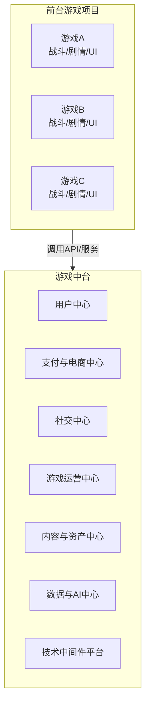

游戏行业中台的核心理念是**“解耦、复用、赋能”**。它将游戏研发和运营中那些通用、重复的业务能力“沉淀”下来，形成一个统一的共享服务平台，从而让前台游戏项目组能够更快速、更灵活地响应市场变化，专注于核心玩法创新和内容制作。

一个成熟的游戏中台业务架构通常包含以下几大核心中心：

---

### 一、核心中台业务架构图

首先，我们可以通过一张图来概览整个架构：

---

### 二、各中心详细解析

#### 1. 用户中心 (Account Center)
这是最基础、最核心的中台组件，负责所有用户相关的身份管理。
*   **核心功能**：
    *   **统一账户体系**：提供注册、登录、登出、Token管理等功能。支持手机号、邮箱、第三方（微信、QQ、Facebook、Google、Apple ID等）等多种登录方式。
    *   **用户画像**：基础标签管理（如设备、地域、性别等）。
    *   **防沉迷系统**：对接国家政策要求，实现实名认证、时间与消费管理。
    *   **隐私合规**：统一管理用户协议、隐私政策的同意状态。
*   **价值**：避免每个游戏重复开发登录模块，实现公司账户体系互通，为跨游戏导流和统一营销打下基础。

#### 2. 支付与电商中心 (Payment & E-commerce Center)
负责处理所有虚拟交易的闭环，直接关系到公司的收入。
*   **核心功能**：
    *   **支付网关**：聚合国内外众多支付渠道（支付宝、微信支付、银联、App Store、Google Play等），提供统一的下单、回调、对账接口。
    *   **订单系统**：管理交易订单状态、虚拟商品发放与校验（防发重、防漏发）。
    *   **商城系统**：提供虚拟商品（钻石、月卡、礼包）的配置、上架、购买和发放能力。
    *   **风控系统**：实时监控异常支付行为，防止盗刷、洗钱等。
*   **价值**：降低每个游戏对接支付渠道的成本和复杂度，提升支付成功率，保障资金安全。

#### 3. 社交中心 (Social Center)
为游戏提供“血肉”，增强用户粘性和社区活力。
*   **核心功能**：
    *   **好友系统**：好友关系链、增删改查、在线状态、亲密度等。
    *   **聊天系统**：支持世界、公会、私聊、组队等频道，提供文本、语音、表情消息。
    *   **社区系统**：玩家动态（如战绩分享、抽卡炫耀）、点赞评论、公会/战队管理。
    *   **实时交互**：提供语音聊天（VoIP）、组队匹配等实时服务。
*   **价值**：快速为任何游戏注入社交能力，打造游戏矩阵生态，让不同游戏的玩家可以互联互通。

#### 4. 游戏运营中心 (Game Operation Center)
这是游戏运营人员的“武器库”，支撑游戏上线后的日常运营活动。
*   **核心功能**：
    *   **活动配置**：可视化配置工具，快速上线登录活动、充值活动、消耗活动等，支持A/B测试。
    *   **公告与邮件**：全服/定向公告推送、游戏内邮件发放（附件奖励）。
    *   **客服系统**：对接第三方客服平台，提供玩家数据查询和操作接口（如补发道具）。
    *   **封禁管理**：统一管理账号封禁、禁言等操作。
*   **价值**：让运营人员无需程序开发即可快速上线活动，大幅提升运营效率和灵活性。

#### 5. 内容与资产中心 (Content & Asset Center)
管理游戏的核心数字资产，提升研发效率。
*   **核心功能**：
    *   **资源更新**：热更新包管理（增量更新、强制更新）、资源CDN分发。
    *   **配置管理中心**：游戏配置（如怪物数值、活动时间表）的在线管理和下发。
    *   **资产库**：统一的角色、音效、UI元件素材库，促进跨项目复用。
    *   **版本管理**：管理游戏客户端的版本发布和灰度策略。
*   **价值**：加速游戏开发迭代，规范资产管理，减少包体大小。

#### 6. 数据与AI中心 (Data & AI Center)
游戏的“大脑”，负责数据的采集、分析和智能化应用。
*   **核心功能**：
    *   **数据平台**：统一数据埋点规范、数据采集、ETL处理和数据仓库。
    *   **BI分析**：提供报表、Dashboard、用户行为分析、流失预测等。
    *   **推荐系统**：为游戏内的商品、内容提供个性化推荐。
    *   **反作弊**：通过AI算法识别外挂、脚本、工作室等异常行为。
    *   **AI赋能**：提供AI NPC、AI作图等能力。
*   **价值**：数据驱动决策，实现精细化运营，并通过AI提升游戏体验和安全性。

#### 7. 技术中间件平台 (Technical Middleware Platform)
提供底层技术支持，确保游戏稳定、高性能运行。
*   **核心功能**：
    *   **服务器引擎**：通用的游戏服务器框架，支持分布式部署和弹性伸缩。
    *   **网络通信**：长连接网关、全球加速、抗DDoS攻击。
    *   **数据库服务**：提供统一的数据库读写、缓存（Redis）服务。
    *   **监控与运维**：APM（应用性能监控）、日志服务、报警系统。
*   **价值**：让开发团队无需从零搭建技术基础设施，专注于业务逻辑，保障服务高可用。

---

### 三、建设中台的挑战与建议

1.  **组织架构挑战**：中台需要强有力的顶层设计和支持，可能会与项目组的“自治”文化冲突。需要建立良好的内部结算和赋能机制。
2.  **技术挑战**：要求极高的稳定性、性能和扩展性。API设计必须通用、灵活，版本管理要清晰。
3.  **演进路径**：不建议一开始就打造大而全的中台。应从最通用、最痛苦的业务（如账户、支付）开始，逐步孵化，由“共享库”演进为“共享服务”。
4.  **避免过度抽象**：中台是为业务赋能的，不能为了技术而技术。要紧密围绕业务场景进行设计，避免做出过于臃肿、难用的“怪兽中台”。

总结来说，游戏中台是企业级游戏研发的必然趋势，它将通用的业务能力从具体的游戏中剥离出来，形成标准化的“乐高积木”，从而支撑快速创新、试错和规模化运营，最终构建起一个强大的游戏生态体系。