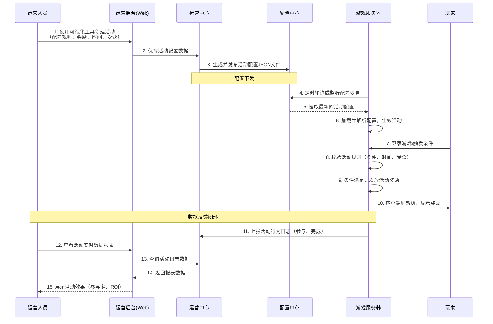

**游戏运营中心**。这个中心是运营团队的“作战指挥室”，其核心目标是：**通过对游戏内容的动态调整和玩家干预，最大化游戏的生命周期价值（LTV）**，并实现精细化、数据驱动的运营。

---

### 一、业务架构 (Business Architecture)

游戏运营中心的业务架构围绕游戏**上线后**的日常运营全生命周期展开，旨在为运营人员提供一套强大、灵活、可视化的工具集。

#### 1. 核心业务模块

| 模块名称           | 核心功能描述                                                 | 业务价值                                                     |
| :----------------- | :----------------------------------------------------------- | :----------------------------------------------------------- |
| **活动管理中心**   | **可视化活动配置**：通过GUI界面（如拖拽式），无需开发即可配置各类活动（登录、充值、消耗、任务等）。 **规则引擎**：定义活动条件（如“累计充值满100元”）、奖励内容（如“发放200钻石”）。 **A/B测试**：为不同玩家分组配置不同的活动参数，快速试错，验证最优方案。 **活动模拟与预览**：运营人员可预览活动界面和测试奖励发放流程。 | **核心价值**：极大缩短活动上线周期（从天/小时级到分钟级），让运营策略快速落地和迭代，提升运营效率。 |
| **公告与邮件系统** | **全服/定向公告**：向全服或特定区服、特定玩家（如VIP）发送实时跑马灯、弹窗公告。 **邮件管理**：批量或精准地向玩家发送带附件（游戏道具）的邮件。支持定时发送。 | 实现与玩家的精准信息触达，用于更新通知、活动预告、补偿发放、玩家召回等。 |
| **资源配置中心**   | **热更配置管理**：管理游戏中的数值表、文案、客户端配置（如活动开关）。支持灰度发布和版本回滚。 **资源热更新**：管理客户端AB包的热更新流程，上传新资源并下发更新指令。 | 实现“不停机更新”，快速修复线上问题、调整游戏平衡性、开启新内容。 |
| **玩家管理模块**   | **玩家数据查询**：根据ID、昵称、属性查询玩家详细信息（角色、装备、日志）。  **实时干预**：手动为玩家补发道具、封禁/解封账号、手动调账（充值问题）。  **客服工单对接**：与第三方客服系统打通，为客服人员提供数据和支持接口。 | 提供对单个玩家的精细化管理和服务支持能力，处理异常情况，提升玩家体验。 |
| **数据与报表中心** | **运营仪表盘**：可视化展示核心指标（DAU、收入、留存、LTV）。  **活动报表**：监控特定活动的参与率、完成率、付费转化率、ROI。  **自定义报表**：允许运营人员自定义维度拖拽分析。 | 数据驱动决策，快速评估运营活动效果，为下一步策略提供数据洞察。 |

#### 2. 核心业务流程：以“创建一个新活动”为例

---

### 二、技术架构 (Technical Architecture)

运营中心的技术挑战在于**高灵活性、高可靠性、高实时性**。它需要将一个看似是“业务需求”的活动，转化为对游戏客户端和服务器的“配置指令”，并确保整个过程稳定、准确。

#### 1. 分层架构

*   **接入层 (Web Portal & API Gateway)**：
    *   **运营后台 (Web Portal)**：一个强大的单页面应用（SPA），使用Vue/React等框架构建，提供可视化、可交互的操作界面。
    *   **API网关**：隔离后台与内部微服务，处理认证（运营人员登录鉴权）、授权（RBAC权限控制）、审计（记录操作日志）和限流。

*   **业务逻辑层 (Microservices)**：
    *   `activity-service`（活动服务）：核心服务，负责活动模板的定义、活动的创建、版本管理和状态管理（上线、下线）。
    *   `announcement-service`（公告服务）：处理公告和邮件的创建、定时、定向发送和状态跟踪。
    *   `resource-service`（资源配置服务）：管理热更配置和资源文件，负责版本控制和发布流程。
    *   `player-management-service`（玩家管理服务）：提供玩家数据查询和实时操作接口（如补发道具）。
    *   `report-service`（报表服务）：聚合和分析活动日志，生成实时和离线报表。

*   **数据持久层 (Data Storage)**：
    *   **关系型数据库 (MySQL/PostgreSQL)**：存储结构化数据，如活动配置元信息、公告/邮件内容、操作日志。需要分库分表。
    *   **NoSQL数据库 (MongoDB)**：**一个非常好的选择**。用于存储灵活的、JSON格式的**活动配置内容**。这些配置经常变化，且模式不固定，非常适合用文档数据库存储。
    *   **缓存 (Redis)**：
        *   缓存活动配置、公告信息，减少对数据库的频繁读取。
        *   存储活动实时计数（如限时礼包已购买数量）。
        *   用作发布/订阅（Pub/Sub）模式，向游戏服务器推送配置更新通知。
    *   **对象存储 (OSS/S3)**：存储热更的资源文件、运营上传的图片等。
    *   **大数据平台 (Kafka + Hadoop/ClickHouse)**：
        *   活动进行中，游戏服务器会将玩家的活动行为日志（`act_log`) 实时写入Kafka。
        *   下游的Flink/Spark作业进行实时计算，结果存入Redis供仪表盘展示。
        *   原始日志最终落入数据仓库（如ClickHouse），用于离线深度分析和报表生成。

*   **支撑组件层 (Supporting Components)**：
    *   **RBAC权限系统**：**至关重要**。严格管理不同运营人员的操作权限（如实习生只能看数据，策划只能配置活动，运维才能发布配置）。
    *   **流程引擎**：对于复杂的发布流程（如灰度发布），可以使用流程引擎驱动，确保过程规范。
    *   **监控告警**：监控配置发布的成功率、活动接口的延迟、奖励发放的错误率。一旦出错，立即告警。

#### 2. 核心技术点

*   **灵活性设计：抽象与模板化**
    *   将常见活动类型（7日登录、累计充值）**模板化**。运营人员填写参数即可，无需从零开始。
    *   使用**脚本引擎（如Lua、Groovy）** 或 **规则引擎（如Drools）** 来解析复杂的活动条件。这样可以在不发布游戏版本的情况下，实现非常灵活的活动逻辑。

*   **配置下发机制**
    *   **推模式**：运营中心通过MQ向所有游戏服务器广播配置变更消息，服务器收到后主动拉取最新配置。**实时性最好**。
    *   **拉模式**：游戏服务器定时（如每分钟）轮询运营中心，检查配置是否有更新。实现简单，但有延迟。
    *   **结合使用**：通常采用“推拉结合”，用MQ通知变化，服务器再主动拉取完整配置，兼顾实时性和可靠性。

*   **奖励发放的可靠性**
    *   奖励发放接口必须具有**幂等性**（`activity_id + player_id`作为唯一键），防止网络超时等原因导致重复发放。
    *   发放过程通常通过MQ异步进行，避免阻塞主流程。同时要有补偿机制，对发放失败的玩家进行重试或记录。

*   **沙箱与审计**
    *   **沙箱环境**：重要的配置发布应先在一个与生产环境隔离的沙箱中进行测试，验证无误后再正式发布。
    *   **操作审计**：所有运营人员的后台操作（谁、在何时、对什么、做了什么修改）必须全程记录，便于追溯和定责。

### 总结

游戏运营中心是游戏中台从“技术支撑”迈向**“业务赋能”**的关键体现。

*   **业务上**，它将运营人员从对开发团队的依赖中解放出来，赋予了其直接改变游戏世界的能力，实现了运营策略的**快速迭代**和**数据驱动**。
*   **技术上**，它是一个复杂的、高度产品化的系统，融合了**可视化界面、微服务、规则引擎、大数据和大规模配置管理**等多种技术。其设计核心是在赋予极大灵活性的同时，通过流程、权限和监控来保障线上环境的**绝对稳定**。

一个成熟的运营中台，是游戏项目实现长期稳定运营和持续商业成功的核心基础设施，也是游戏公司研发和运营实力工业化的集中体现。