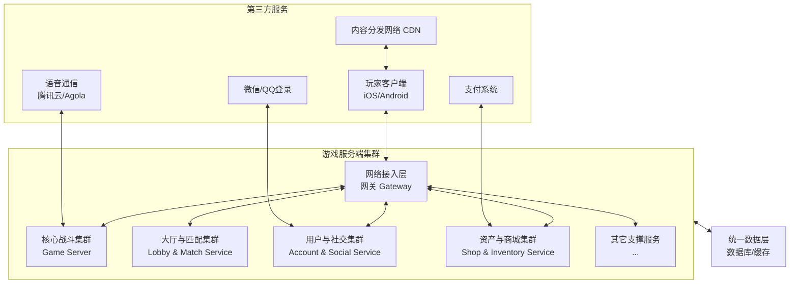

《王者荣耀》这类超大型、高并发、实时要求极高的游戏为例，来深入介绍其业务架构，会非常具有代表性。这类架构是**面向服务（SOA）** 和 **微服务架构（Microservices）** 的经典实践。

其核心设计哲学是：**“分而治之”**。将庞大的系统拆分成一系列小而专的服务，每个服务独立部署、扩展和维护，通过高效的通信协议进行协作。

下图展示了《王者荣耀》业务架构的核心服务模块及其协作关系：

---

### 核心业务域与微服务划分

《王者荣耀》的业务架构可以划分为以下几个核心域，每个域都由一个或多个微服务集群支撑：

#### 1. 网络接入与网关域
*   **服务：** **网关（Gateway）**
*   **职责：** 这是客户端连接服务器的**唯一入口**，是所有请求的“流量枢纽”。
*   **功能：**
    *   **认证与路由：** 验证玩家登录态（QQ/微信Token），并将请求转发到后方正确的业务服务（如匹配请求去匹配服务，购买请求去商城服务）。
    *   **协议转换：** 处理客户端与服务器之间不同的通信协议（如TCP/UDP/WebSocket）。
    *   **负载均衡：** 将海量玩家连接分散到后端的多个游戏逻辑服务器上，避免单点过载。
    *   **安全防护：** 抵御DDoS攻击、消息洪水等网络安全威胁。

#### 2. 用户与社交域
*   **服务：** **用户服务（Account Service）、好友服务（Friend Service）、战队服务（Guild Service）**
*   **职责：** 管理玩家数字身份和社交关系。
*   **功能：**
    *   **用户档案：** 存储和管理玩家的基础数据（昵称、头像、等级、经验）。
    *   **好友系统：** 处理好友添加、删除、状态同步（在线、离线、游戏中）、聊天。
    *   **战队系统：** 管理战队的创建、加入、退出、战队聊天、战队积分等。
    *   **排行榜：** 计算和更新全区、好友之间的各种排名数据。

#### 3. 大厅与匹配域
*   **服务：** **大厅服务（Lobby Service）、匹配服务（Matchmaking Service）**
*   **职责：** 负责将分散的玩家组织成一局可以开始的游戏。
*   **功能：**
    *   **房间管理：** 玩家组队、准备、切换英雄和铭文（这实际上是在一个“虚拟房间”里进行的）。
    *   **匹配算法：** 根据玩家的ELO机制（隐藏分）、位置、当前段位等因素，在极短时间内为10个玩家找到实力相近的对手和队友。这是一个计算密集型服务。
    *   **匹配成功后的移交：** 匹配成功后，匹配服务会创建或选择一台可用的**战斗服（Game Server）**，并将这10个玩家的信息移交过去，通知客户端连接新的战斗服地址。

#### 4. 核心战斗域
*   **服务：** **战斗服务器（Game Server / Instance）**
*   **职责：** 这是游戏最核心、技术挑战最高的部分，负责一局游戏内的所有实时逻辑。
*   **功能：**
    *   **权威运算（Authoritative Simulation）：** 服务器是游戏状态的“唯一真理源”。所有关键操作（移动、放技能、购买装备）都必须由服务器进行校验和执行，防止客户端作弊。
    *   **状态同步：** 采用 **帧同步（Lockstep）** 或 **状态同步（State Sync）** 技术，以极高的频率（如《王者荣耀》可能是每秒15-20帧）将整个战场的状态同步给所有客户端，保证所有玩家看到的画面一致。
    *   **碰撞检测、技能逻辑、胜负判定**等全部在这里完成。

#### 5. 资产与经济域
*   **服务：** **商城服务（Shop Service）、库存服务（Inventory Service）、订单服务（Order Service）**
*   **职责：** 管理游戏的虚拟经济和资产流通。
*   **功能：**
    *   **商品管理：** 展示英雄、皮肤、道具等商品。
    *   **交易与支付：** 处理应用内购买（IAP）请求，与苹果、谷歌或微信、QQ的支付渠道对接，验证支付凭证，最后发放商品到玩家仓库。
    *   **库存管理：** 管理玩家拥有的英雄、皮肤、铭文、道具等资产。

#### 6. 数据与支撑域
*   **服务：** **战斗记录服务（Record Service）、监控告警服务（Monitor Service）、配置中心（Config Service）**
*   **职责：** 为整个游戏提供数据支持和运维保障。
*   **功能：**
    *   **数据采集：** 记录每一局游戏的详细数据（KDA、输出、经济）、玩家行为日志。
    *   **实时监控：** 监控所有服务的健康状态（CPU、内存、延迟），出现异常时自动告警。
    *   **全局配置：** 动态下发游戏配置，如活动开关、英雄数值调整，无需重启服务器。

---

### 关键技术支持

1.  **高可用与负载均衡：** 每个服务都是集群部署，不存在单点故障。通过负载均衡器将请求分散到多个实例上。
2.  **统一的数据层：** 后方使用高性能的分布式数据库（如TDSQL）、缓存（如Redis）和对象存储（如COS）来存储数据，确保数据一致性和访问速度。
3.  **高效的通信机制：** 内部服务之间通过 **RPC（远程过程调用，如gRPC、Thrift）** 进行通信，效率远高于HTTP。
4.  **容器化与编排：** 很可能使用 **Kubernetes（K8s）** 和 **Docker** 来部署和管理这些微服务，实现快速扩缩容。战斗服这类需要常驻的实例可能采用虚拟机或裸金属服务器以保证绝对性能。
5.  **全球同服与地域部署：** 为了应对全球玩家，腾讯会在世界各地建立多个数据中心（机房）。通过智能DNS解析，让玩家连接到最近、最流畅的机房。跨机房的数据同步是巨大挑战。

### 总结

《王者荣耀》的业务架构是一个极其复杂的分布式系统，其精髓在于：
*   **解耦：** 通过微服务将不同的业务能力彻底分离。
*   **专精：** 每个服务只做好一件事，并做到极致（例如匹配服务只管高效匹配，战斗服务只管公平运算）。
*   **弹性：** 可以根据业务压力独立扩展某个服务（例如周末玩的人多，就动态增加更多战斗服实例）。
*   **容错：** 一个服务的故障不会导致整个游戏宕机。

这种架构使得《王者荣耀》能够稳定支撑超过 **1亿** 的日活跃用户，同时进行数千万场实时对战，代表了当今世界移动游戏技术的最高水平。