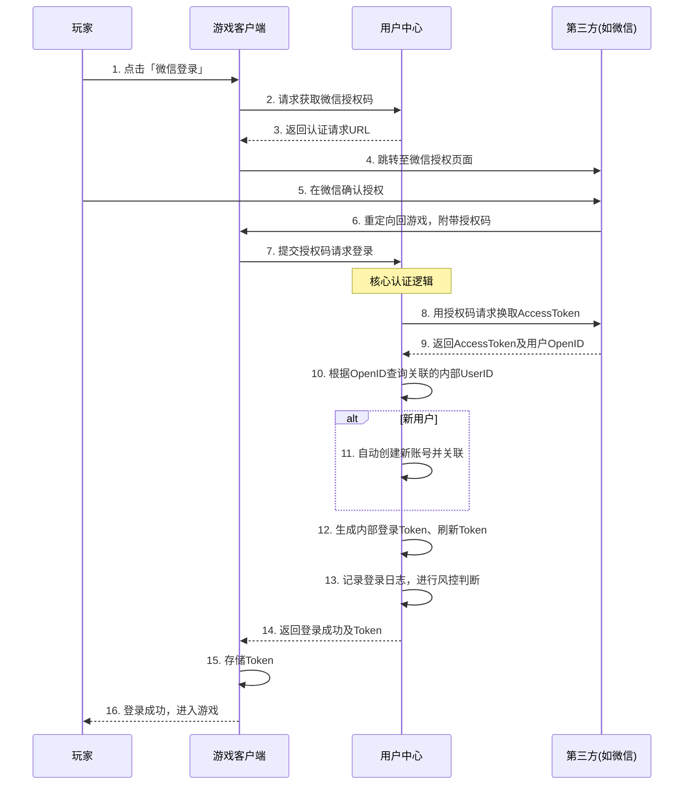

游戏中台的**用户中心**。用户中心是整个中台体系的基石和门户，它管理着玩家的数字身份，是所有业务系统（支付、社交、数据等）的数据源头和依赖核心。

---

### 一、业务架构 (Business Architecture)

用户中心的业务核心是围绕用户**身份生命周期**进行管理，旨在为所有游戏提供统一、安全、合规的用户账户体系。

#### 1. 核心业务模块

| 模块名称         | 核心功能描述                                                 | 业务价值                                                     |
| :--------------- | :----------------------------------------------------------- | :----------------------------------------------------------- |
| **账户管理**     | **账户生命周期管理**：提供注册（手机号、邮箱、游客）、登录（多方式认证）、账号合并（如游客转正）、销户等全流程功能。 **凭证管理**：安全地管理密码、Token（访问令牌）、Session（会话）的签发与验证。 | 建立玩家的唯一数字身份标识（UserID），是所有业务系统关联用户的基石。 |
| **授权与认证**   | **统一登录 (SSO)**：实现中台内所有应用（游戏、官网、后台）的单点登录。 **第三方授权**：无缝集成第三方登录（微信、QQ、Apple、Facebook等），处理复杂的OAuth/OpenID流程。 **多因子认证(MFA)**：为高安全需求场景提供二次验证（如邮箱/手机验证码）。 | 降低用户登录门槛，提升账户安全性，实现生态内通行无阻。       |
| **用户画像**     | **基础标签**：收集和管理用户的基础属性，如设备、地域、性别、年龄段等。 **行为收集**：记录用户的登录、付费等关键行为，为其他系统提供数据。 **开放接口**：为游戏、运营平台提供用户画像查询服务。 | 形成统一的用户基础画像，为个性化推荐、精准运营和数据分析提供支持。 |
| **合规与风控**   | **实名认证**：对接公安部数据源，强制对国内用户进行实名验证，并据此实现防沉迷逻辑（时长、消费限制）。 **隐私合规**：统一管理用户协议、隐私政策的版本和用户同意状态（GDPR/CCPA合规）。 **安全风控**：实时检测异常登录（异地登录、陌生设备）、批量注册（机器人账号）等行为。 | 确保业务符合法律法规要求，保护未成年人，保障用户账户安全，避免业务风险。 |
| **用户信息服务** | **统一查询**：提供高性能的UserID查询服务（通过手机号、第三方OpenID反查UserID）。 **信息更新**：提供个人资料（头像、昵称）的管理与查询，支持跨游戏同步。 | 为其他中台中心（如社交、支付）提供基础的用户信息查询能力。   |

#### 2. 核心业务流程：以“用户登录”为例

---

### 二、技术架构 (Technical Architecture)

用户中心的技术架构必须满足**高性能、高可用、高安全性**的要求，因为它会被所有游戏频繁调用。

#### 1. 分层架构

*   **接入层 (API Gateway)**：
    *   使用 **API网关**（如Kong, Spring Cloud Gateway）作为所有流量入口。
    *   负责**全局限流**（防止登录接口被爆破）、**路由**、**SSL终结**、**黑白名单**过滤。
    *   对外提供一套**定义清晰、版本化**的RESTful API。

*   **业务逻辑层 (Microservices)**：
    *   采用微服务架构，按功能拆分：
        *   `auth-service`（认证服务）：专负责登录、Token签发与验证、第三方认证流程。这是最核心的服务。
        *   `user-service`（用户服务）：负责用户资料的增删改查、账户管理（注册、销户）。
        *   `risk-service`（风控服务）：实时处理登录风控、注册风控，对接规则引擎。
        *   `compliance-service`（合规服务）：处理实名认证、防沉迷逻辑计算、隐私协议管理。

*   **数据持久层 (Data Storage)**：
    *   **核心用户数据库 (MySQL/PostgreSQL)**：
        *   存储用户核心信息（UserID、密码哈希、手机号、邮箱等）。**需分库分表**以应对亿级用户。
        *   设计上常采用**垂直拆分**，将基础信息与频繁更新的信息（如登录时间）分开。
    *   **缓存 (Redis)**：
        *   **Session存储**：存储用户的登录状态（Token与UserID的映射关系），实现快速验证和集群共享。
        *   **高频查询缓存**：缓存用户基础信息，抵御数据库查询风暴。
        *   **风控缓存**：存储临时计数器（如某IP登录失败次数），用于实时风控判断。
    *   **Elasticsearch**：
        *   用于存储和检索大量的**登录日志**、**操作日志**，便于后期审计和查询。
    *   **对象存储 (OSS/S3)**：用于存储用户上传的头像等文件。

*   **支撑组件层 (Supporting Components)**：
    *   **注册中心 (Nacos/Consul)**：实现微服务之间的动态发现和调用。
    *   **配置中心 (Apollo/Nacos)**：动态管理第三方认证参数、风控规则阈值、Token过期时间等。
    *   **监控告警 (Prometheus/Grafana)**：监控QPS、延迟、成功率（尤其登录和认证）。监控风控事件波动。
    *   **密钥管理服务 (KMS)**：**极其重要**！用于安全地管理数据库加密密钥、Token签名密钥（JWT Secret）、第三方API密钥等敏感信息，避免硬编码在代码中。

#### 2. 核心技术点

*   **安全性与密码学**：
    *   **密码存储**：使用**Bcrypt**或**Argon2**等抗GPU/ASIC的算法进行哈希加密，绝对禁止明文存储。
    *   **Token管理**：普遍采用**JWT (JSON Web Token)** 作为无状态Token。但需注意JWT的失效问题，通常结合Redis黑名单解决。Token应设置较短的过期时间，并提供Refresh Token机制。
    *   **通信安全**：全链路HTTPS。敏感接口（如登录、修改密码）增加图形验证码或人机验证（Captcha）以防暴力破解。

*   **高可用与性能**：
    *   **读写分离**：用户读请求（查询信息、验证Token）远高于写请求（注册、更新）。数据库采用一主多从，读操作分流到从库。
    *   **缓存策略**：所有用户基础信息在Redis中有缓存，采用Cache-Aside模式。同时要处理好缓存与数据库的一致性。
    *   **水平扩展**：无状态的`auth-service`和`user-service`可以轻松水平扩展，通过负载均衡应对高并发登录请求。

*   **数据一致性**：
    *   用户核心数据对一致性要求高。更新操作（如换绑手机号）需保证原子性，可能涉及数据库事务和缓存失效的协同。
    *   对于最终一致性场景（如用户昵称更新后同步到其他系统），通过发布**事件消息**（如用Kafka）通知社交、支付等中心，它们异步更新自己的数据。

*   **合规性实现**：
    *   **防沉迷**：在用户完成实名认证后，`compliance-service`会根据年龄计算其游戏时长和消费限制。这些规则会写入数据库，并在玩家登录时由网关或游戏服务器查询并执行。
    *   **隐私合规**：用户对协议的同意状态会作为一条重要记录存入数据库。所有数据导出、删除请求都需要通过工作流引擎严格处理。

### 总结

用户中心远不止一个简单的“登录注册”模块，它是游戏中台的**身份基石**和**安全守门员**。

*   **业务上**，它统一了生态内的用户身份，实现了便捷的SSO和第三方登录，并确保了业务的合规安全。
*   **技术上**，它是一个对**安全性**、**性能**和**稳定性**要求极高的分布式系统。其设计需要精心考虑密码学、缓存、数据库分片、微服务治理和监控告警等各个方面。

一个健壮的用户中心中台，能够为公司所有游戏产品提供一个安全、可靠、高效的用户管理基础，避免每个项目重复“造轮子”，并统一提升整个产品矩阵的安全水位和用户体验。