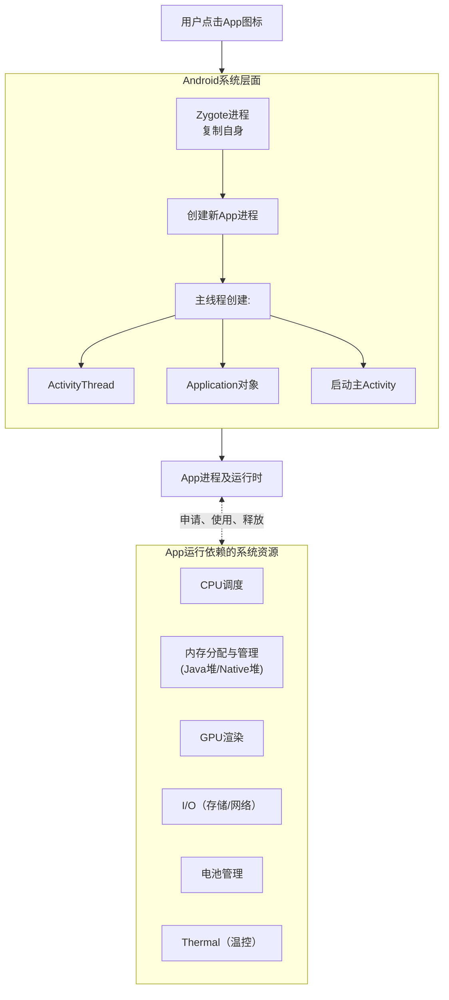

# APP的运行原理及其性能测试

### 一、App在手机端运行的系统原理

要理解性能测试，首先必须了解App是如何在移动操作系统（以Android为例）这个“小电脑”上运行的。它的运行是系统多个子系统协同工作的结果。

下图概括了App启动及运行时与手机系统核心子系统的交互原理：

其核心交互过程如下：

1.  **进程创建与初始化**：
    *   当你点击图标时，系统首先通过 **Zygote** 进程孵化出一个全新的、专属的App进程。
    *   系统随后在这个进程里创建**主线程（也叫UI线程）**，并初始化 **ActivityThread**、**Application** 对象等核心组件，**此时对应的就是应用启动阶段**。

2.  **运行时的资源调度**：
    *   **CPU调度**： App进程中的多个线程（UI线程、网络线程、游戏逻辑线程等）会由系统调度器分配CPU时间片。线程过多或主线程阻塞（16ms内未完成绘制）会导致卡顿。
    *   **内存管理**：
        *   **Java堆内存**： 存储Java对象，由垃圾回收器（GC）自动管理。频繁GC会导致线程暂停，引起卡顿。
        *   **Native内存**： 通常由游戏引擎（Unity、Unreal）、图片处理等底层库使用。泄漏难以察觉，会导致App因“内存不足”被系统杀死。
    *   **GPU渲染**： App将UI指令（View绘制、游戏画面）提交给 **SurfaceFlinger** 服务，由GPU合成并最终显示到屏幕上。渲染复杂或帧率（FPS）不稳定会导致掉帧、卡顿。
    *   **I/O（存储与网络）**： 频繁读写磁盘或网络请求延迟会阻塞线程，影响性能。
    *   **电源管理与温控**： 当CPU/GPU持续高负载运行时，设备会发热。系统会**降频（Throttling）** 以保护硬件，导致性能下降（游戏掉帧）。高性能需求App（如游戏）必须高效使用资源以避免触发温控。

---

### 二、性能测试如何开展（测试方法论）

性能测试不是简单跑个分，而是一个系统的工程。

1.  **定义性能指标与标准（What）**：
    *   与产品、开发团队共识哪些指标是关键，以及它们的**通过标准**（例如：冷启动时间 < 800ms，平均帧率 > 55 FPS，内存峰值 < 400MB）。

2.  **选择测试场景（When）**：
    *   **基准测试**： 在标准环境下（如特定机型、系统版本）跑典型用户操作路径，建立性能基线。
    *   **压力测试/极限测试**： 在复杂场景下（如游戏团战、大量怪物特效）测试性能极限。
    *   **竞品对比测试**： 在相同条件下，与竞品进行性能对比。
    *   **长时间稳定性测试**： 游戏挂机数小时，监控内存泄漏和帧率稳定性。

3.  **控制测试环境（Where）**：
    *   **固定环境**： 使用**同一台物理设备**（防止硬件差异），开启飞行模式（防止网络干扰），亮度固定，电量充足。
    *   **监控环境**： 清理后台，禁用无关通知。

4.  **自动化与重复（How）**：
    *   性能测试需要多次执行取平均值，以消除随机误差。因此，**自动化**是核心。

---

### 三、测试工具（Tools）

工具分为两类：**系统原生工具**和**第三方商业/开源工具**。

| 工具类型            | 代表工具                              | 说明                                                         |
| :------------------ | :------------------------------------ | :----------------------------------------------------------- |
| **Android原生工具** | **Android Profiler** (Android Studio) | **开发调试首选**。可实时查看CPU、内存、网络、GPU使用详情，支持方法级CPU跟踪和堆转储分析。 |
|                     | **Perfetto**                          | **Android官方系统性能追踪工具**。功能强大，可录制系统级、App级的详细轨迹（Trace），用于深度分析卡顿、掉帧、功耗问题。 |
|                     | **Battery Historian**                 | 谷歌推出的分析耗电情况的专业工具。                           |
| **iOS原生工具**     | **Instruments** (Xcode)               | iOS/macOS开发的**权威性能分析工具套件**。包含Time Profiler（CPU）、Core Animation（FPS）、Leaks（内存泄漏）、Energy Log（能耗）等。 |
| **第三方工具**      | **GT** (腾讯)                         | 开源、免ROOT的移动端性能测试平台，可采集性能数据。           |
|                     | **WeTest PerfDog** (腾讯)             | **跨平台（iOS/Android）性能测试工具**。无需ROOT/越狱，提供云端分析，在游戏行业应用广泛。 |
|                     | **Emagee** (网易)                     | 开源工具，适用于Android App的性能测试。                      |
|                     | **Solopi** (阿里)                     | 自动化流式的性能测试工具。                                   |
| **硬件工具**        | **功率计**                            | 精确测量手机整机功耗的**黄金标准**。                         |

---

### 四、核心性能关注点（Metrics）

1.  **启动时间**
    *   **冷启动**： 进程完全不存在到首帧显示。**最关键的指标**。
    *   **热启动**： App仍在后台到重回前台。
    *   **关注点**： 总耗时、各阶段耗时（如Application创建、首屏Activity渲染）。

2.  **CPU占用率**
    *   **关注点**： 总占用率、**主线程占用率**（是否过忙）、核心是否被充分优化利用（避免核间迁移）。

3.  **内存**
    *   **关注点**： **PSS内存**（实际使用的物理内存）、Java堆内存、Native内存、**内存泄漏**（长时间运行后内存只增不减）、GC频率。

4.  **图形与渲染（FPS - Frames Per Second）**
    *   **关注点**： **平均FPS**（如60帧满帧）、**帧率稳定性**（Jank / Stutter，掉帧次数）、**帧耗时**（每帧绘制时间是否超过16.67ms）。

5.  **功耗（Power Consumption）**
    *   **关注点**： 单位时间内的耗电量（mA）、**异常唤醒**（防止CPU无法休眠）、发热情况。

6.  **网络（Network）**
    *   **关注点**： 流量消耗、网络请求延迟、成功率。

7.  **I/O（存储读写）**
    *   **关注点**： 主线程是否有频繁的I/O操作（导致卡顿）。

### 总结：一次典型的App启动性能测试流程

1.  **准备**： 选择一台**小米14**（性能基线设备），安装待测App，开启开发者选项中的**“GPU呈现模式分析”** 和 **充电状态监控**。
2.  **冷启动测试**：
    *   使用ADB命令强制停止App：`adb shell am force-stop com.xxx.game`
    *   使用ADB命令录制启动Trace：`adb shell perfetto -o /data/misc/perfetto-traces/trace_file.pftrace -t 10s sched freq idle am wm gfx view binder_driver hal dalvik res memory`
    *   使用ADB命令启动App并计时：`adb shell am start -W -n com.xxx.game/.MainActivity`
    *   **重复10次**，剔除异常值后取平均。
3.  **数据分析**：
    *   将 **perfetto trace文件** 导出到电脑，在 **ui.perfetto.dev** 中打开。
    *   分析启动时间线，找到耗时最长的函数或系统调用。
    *   查看 **Android Profiler** 中启动时的CPU和内存曲线。
4.  **输出报告**：
    *   冷启动平均耗时：**1200ms**（**不达标**，目标800ms）。
    *   主要问题：在**主线程**中发现了同步网络请求和大量磁盘I/O操作，阻塞了UI绘制。
    *   优化建议：将网络和I/O操作移至子线程，采用异步初始化方案。

通过这种系统性的方法，你可以准确地定位性能瓶颈，并为开发团队提供明确的优化方向，从而最终提升用户的游戏体验。