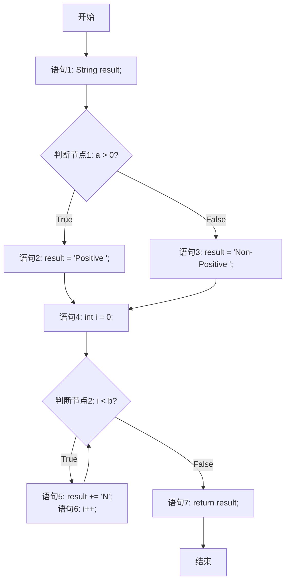

**基本路径测试**。这是一种非常重要的白盒测试方法，由Tom McCabe提出，旨在确保测试覆盖一个程序模块中的所有**独立路径**。

### 基本路径测试的核心步骤

1.  **绘制程序的控制流图（Control Flow Graph, CFG）**
2.  **计算环形复杂度（Cyclomatic Complexity）**
3. 确定**基本路径集合**
4.  根据基本路径**设计测试用例**

---

### 第一步：待测试的代码示例

我们使用一个经典的函数，它包含判断和循环逻辑：

```java
public String classify(int a, int b) {
    String result; // 语句1
    if (a > 0) {   // 判断节点1
        result = "Positive "; // 语句2
    } else {
        result = "Non-Positive "; // 语句3
    }

    int i = 0; // 语句4
    while (i < b) { // 判断节点2
        result += "N"; // 语句5
        i++;         // 语句6
    }
    return result; // 语句7
}
```

### 第二步：绘制控制流图（CFG）

控制流图是一种由**节点**和**边**组成的图形化表示，用于描述程序的执行流程。

*   **节点**：代表一个或多个顺序执行的语句（一个语句块）。
*   **边**：代表控制流的转向。

下图是上述代码对应的控制流图，它清晰地展示了所有可能的执行路径：



### 第三步：计算环形复杂度 V(G)

环形复杂度定义了程序逻辑的复杂性，并给出了**基本路径集合**中独立路径的数量。

**有三种常用方法计算：**

1.  **V(G) = 区域数量**：数一下控制流图中有多少由边围成的封闭区域 + 1（外部区域）。上图中有区域 R1, R2, R3，所以 V(G) = 3 + 1 = **4**。
2.  **V(G) = E - N + 2**：其中 E 是边数，N 是节点数。
    *   上图中，E = 10, N = 8。
    *   V(G) = 10 - 8 + 2 = **4**。
3.  **V(G) = P + 1**：其中 P 是判断节点（谓词节点）的数量。上图中有 2 个判断节点（`if` 和 `while`）。
    *   V(G) = 2 + 1 = **4**。

三种方法都得出环形复杂度 **V(G) = 4**。这意味着我们需要找出 **4 条独立的基本路径**。

### 第四步：确定基本路径集合

基本路径是指至少引入一条新边的路径。我们从最简单的路径开始，逐步变化。

| 路径编号   | 描述                                                         | 路径 (节点序列)                                              |
| :--------- | :----------------------------------------------------------- | :----------------------------------------------------------- |
| **Path 1** | 最简单路径：不进入if真分支，也不进入循环。                   | Start -> 1 -> 2(F) -> 3 -> 4 -> 5(F) -> 7 -> End             |
| **Path 2** | 在 Path 1 基础上，**改变第一个判断**（进入if真分支）。       | Start -> 1 -> 2(T) -> 4 -> 5(F) -> 7 -> End                  |
| **Path 3** | 在 Path 1 基础上，**改变第二个判断**（进入循环一次）。       | Start -> 1 -> 2(F) -> 3 -> 4 -> 5(T) -> 6 -> 5(F) -> 7 -> End |
| **Path 4** | 在 Path 3 基础上，**再次改变第一个判断**（进入if真分支并进入循环）。 | Start -> 1 -> 2(T) -> 4 -> 5(T) -> 6 -> 5(F) -> 7 -> End     |

**为什么是这4条？**
*   Path 1 是最基础路径。
*   Path 2 引入了新边 `2(T)`。
*   Path 3 引入了新边 `5(T) -> 6`。
*   Path 4 组合了之前的变化。虽然节点序列和 Path 3 类似，但它覆盖了 `2(T)` 和循环的组合情况，这也是一个独立路径。

### 第五步：根据基本路径设计测试用例

现在，我们为每一条基本路径设计输入数据，确保程序能沿着该路径执行。

| 路径编号        | 输入 (a, b) | 预期输出         | 覆盖路径说明                                   |
| :-------------- | :---------- | :--------------- | :--------------------------------------------- |
| **Test Case 1** | ( -1, 0 )   | "Non-Positive "  | 对应 **Path 1**: `a<=0` -> 不进入循环 (`b=0`)  |
| **Test Case 2** | ( 1, 0 )    | "Positive "      | 对应 **Path 2**: `a>0` -> 不进入循环 (`b=0`)   |
| **Test Case 3** | ( -1, 1 )   | "Non-Positive N" | 对应 **Path 3**: `a<=0` -> 进入循环1次 (`b=1`) |
| **Test Case 4** | ( 1, 2 )    | "Positive NN"    | 对应 **Path 4**: `a>0` -> 进入循环2次 (`b=2`)  |

### 总结与特点

通过这个例子，我们可以看到基本路径测试的**优点**：

1.  **系统性**：提供了一个清晰、可量化的方法来设计测试用例。
2.  **全面性**：保证了程序中的所有独立路径至少被执行一次，这比单纯的“语句覆盖”或“分支覆盖”更强（例如，它覆盖了循环体）。
3.  **缺陷发现**：能有效地发现因条件判断错误、循环次数错误等导致的缺陷。

它的**缺点**是对于非常复杂的程序，基本路径的数量（环形复杂度）可能会很大，导致测试用例数量增多。但尽管如此，它仍然是测试复杂逻辑代码段（如航天软件、安全关键系统）的黄金标准。