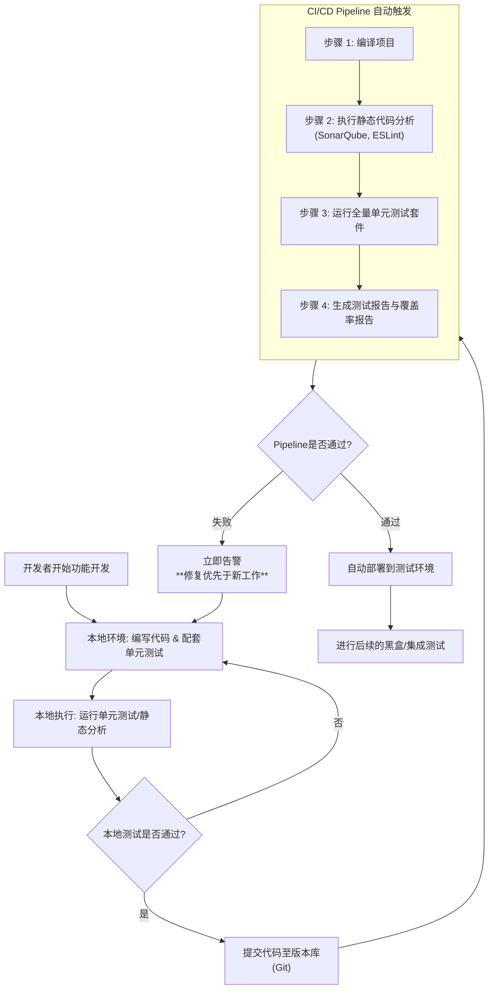

在敏捷开发中，白盒测试不再是传统瀑布模型中的一个独立阶段，而是**持续集成和交付（CI/CD） pipeline 中不可或缺的、高度自动化的活动**。

其核心思想是：**将测试“左移”（Shift-Left），让开发人员成为白盒测试的主力，并通过自动化工具快速反馈**。

以下是敏捷开发中进行白盒测试的具体实践和策略：

---

### 一、核心原则：测试左移（Shift-Left Testing）

在敏捷中，质量是所有人的责任，而不是等到最后才由测试人员来验证。白盒测试活动被融入到开发过程的早期和整个周期中。

| 传统 vs. 敏捷 | 传统开发                 | 敏捷开发                                   |
| :------------ | :----------------------- | :----------------------------------------- |
| **执行者**    | 专门的测试团队           | **开发者是首要责任人**，测试人员辅助       |
| **时机**      | 编码完成后的一个独立阶段 | **编码过程中、提交前、集成后**（持续进行） |
| **目标**      | 发现缺陷                 | **预防缺陷**、快速反馈、保障持续交付质量   |

---

### 二、具体实践与实施流程

下图清晰地展示了白盒测试活动如何嵌入到敏捷开发的整个工作流中，体现了“测试左移”和“自动化”的核心思想：

下面我们对图中的关键环节进行详细说明：

#### 实践一：本地开发环节（提交前）
*   **编写单元测试 (Unit Testing)**：这是敏捷白盒测试的**基石**。开发者使用TDD（测试驱动开发）或测试紧随的方式，为每个函数、方法编写单元测试。
    *   **工具**：JUnit (Java), pytest (Python), Jest (JavaScript), NUnit (.NET)
    *   **时机**：在编写业务代码之前或之后立即编写。
*   **本地静态分析**：在提交代码前，在本地IDE中运行静态代码分析工具，快速发现低级错误和风格问题。
    *   **工具**：IDE插件（如SonarLint）、ESLint、Checkstyle

#### 实践二：代码集成环节（CI Pipeline）
*   **自动化代码质量门禁**：当代码被push到Git仓库后，CI/CD工具（如Jenkins, GitLab CI, GitHub Actions）自动触发流水线。
*   **关键流水线任务**：
    1.  **编译与打包**。
    2.  **运行全量静态代码分析**：使用SonarQube等工具进行深度扫描，并将结果报告到平台。**可以将质量指标（如代码覆盖率、坏味道数量、漏洞数）作为门禁**，不达标则流水线失败。
    3.  **运行全量单元测试套件**：这是最核心的白盒测试活动。必须保证所有已有测试用例快速运行（通常要求几分钟内完成）。
    4.  **生成测试覆盖率报告**：使用JaCoCo (Java), Istanbul (JS) 等工具生成报告，并直观地展示哪些代码被测试覆盖。

#### 实践三：代码审查环节
*   **Pull Request (PR) / Merge Request (MR)**：这是**最重要的白盒测试形式**。在代码合并前，由其他开发者对代码进行审查。
*   **审查内容**：
    *   **业务逻辑正确性**：算法、逻辑是否正确。
    *   **代码设计与可读性**：结构是否清晰，命名是否规范。
    *   **潜在缺陷**：是否有边界条件、并发问题、安全漏洞。
    *   **测试用例质量**：是否覆盖了各种场景（正常、异常、边界）。
*   **工具**：GitHub, GitLab, Bitbucket等提供的PR/MR界面。

---

### 三、敏捷中白盒测试的衡量标准

在敏捷中，度量的目的是为了改进，而不是惩罚。

1.  **单元测试覆盖率**：
    *   **关注重点**：不要只追求**行覆盖率（Line Coverage）**，更要关注**分支覆盖率（Branch Coverage）**。100%的行覆盖率可能只覆盖了50%的分支。
    *   **合理目标**：通常建议**核心业务模块达到80%以上的分支覆盖率**。非核心或简单工具类可以适当降低要求。

2.  **静态代码分析指标**：
    *   **Bug**：必须为0。
    *   **漏洞**：必须为0。
    *   **坏味道**：尽量消除，设定一个团队同意的阈值。
    *   **技术债**：管理和跟踪，并定期分配时间偿还。

3.  **构建状态**：
    *   **CI Pipeline 的成功率**：应保持在95%以上。一旦失败，团队应**立即修复**，将其视为最高优先级任务。

---

### 四、测试人员（QA）的角色演变

在敏捷的白盒测试中，QA的角色发生了变化：
*   **从执行者到赋能者**：QA不再亲自编写大量的白盒测试代码，而是：
    *   帮助开发团队提高**单元测试的技能**。
    *   设计复杂的**集成测试场景**，供开发人员实现。
    *   分析和解释**代码覆盖率报告**，识别未被覆盖的薄弱环节。
    *   在代码评审中，从**测试视角**提供反馈（例如：“这个异常分支有测试用例吗？”）。

### 总结

在敏捷开发中实施白盒测试，关键在于：

1.  **文化上**：树立“质量是构建出来的，不是测试出来的” mindset，开发人员对质量负责。
2.  **流程上**：将白盒测试活动（代码评审、单元测试、静态分析）**固化到开发流水线**中，并通过**自动化**强制执行。
3.  **工具上**：搭建高效的CI/CD工具链，提供快速反馈。
4.  **度量上**：关注有意义的活动（如代码评审）和指标（如分支覆盖率），并用于持续改进。

通过这种方式，白盒测试不再是项目的瓶颈，而是保障敏捷团队能够**快速、安全、高质量**交付价值的强大引擎。