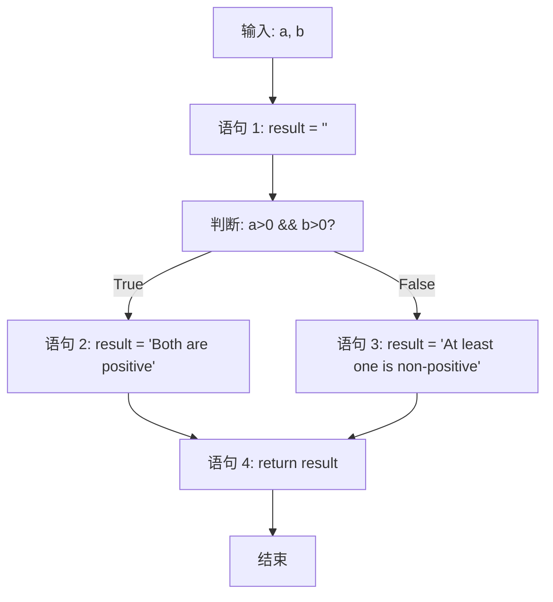

# 语句覆盖和分支覆盖和条件覆盖的区别

**语句覆盖（Statement Coverage）**、**分支覆盖（Branch/Condition Coverage）** 和**条件覆盖（Condition Coverage）** 的区别。

### 示例代码

我们来看一个简单的函数，它有两个条件：

```java
public String evaluate(int a, int b) {
    String result = ""; // 语句 1
    if (a > 0 && b > 0) { // 条件判断
        result = "Both are positive"; // 语句 2
    } else {
        result = "At least one is non-positive"; // 语句 3
    }
    return result; // 语句 4
}
```

为了更清晰地分析，我们通常会先画出其**控制流图（Control Flow Graph）**。下图展示了这段代码的所有执行路径，其中节点代表代码语句，边代表执行流向：



现在，我们来看如何设计测试用例来实现不同级别的覆盖。

---

### 1. 语句覆盖 (Statement Coverage)

**目标**：设计最少的测试用例，使得程序中的**每条语句至少被执行一次**。
**分析**：从控制流图看，只要执行一次 `if` 为 `True` 的路径（即 `a>0 && b>0` 为真），就能覆盖所有语句（语句1, 2, 4）。执行 `else` 路径（语句3）也能覆盖所有语句，但需要确保条件为假。

| 测试用例编号 | 输入 (a, b) | 预期输出                       | 覆盖的路径  | 覆盖的语句  |
| :----------- | :---------- | :----------------------------- | :---------- | :---------- |
| SC1          | (5, 10)     | "Both are positive"            | 1 -> 2 -> 4 | **1, 2, 4** |
| SC2          | (-5, 10)    | "At least one is non-positive" | 1 -> 3 -> 4 | **1, 3, 4** |

**结论**：需要**至少1个**测试用例（如 `SC1`）即可实现100%语句覆盖（因为 `SC1` 已经覆盖了1,2,4，但严格来说需要两条才能覆盖3，所以通常需要2个）。但它**只关心语句是否被执行，不关心条件如何组合**。

---

### 2. 分支（判定）覆盖 (Branch Coverage)

**目标**：设计测试用例，使得程序中的**每个判断的真（True）和假（False）分支至少都执行一次**。
**分析**：这里的判断是 `(a > 0 && b > 0)`。它有两个分支：`True` 分支（执行语句2）和 `False` 分支（执行语句3）。

| 测试用例编号 | 输入 (a, b) | 预期输出                       | 覆盖的分支     | 覆盖的语句 |
| :----------- | :---------- | :----------------------------- | :------------- | :--------- |
| BC1          | (5, 10)     | "Both are positive"            | **True 分支**  | 1, 2, 4    |
| BC2          | (-5, 0)     | "At least one is non-positive" | **False 分支** | 1, 3, 4    |

**结论**：需要**至少2个**测试用例（`BC1` 和 `BC2`）来实现100%分支覆盖。它比语句覆盖更强，因为它保证了两个分支都被测试到。**注意：它关注的是整个判断表达式（a>0 && b>0）的最终结果（真或假），而不关心表达式内部的各个条件（a>0, b>0）的取值**。

---

### 3. 条件覆盖 (Condition Coverage)

**目标**：设计测试用例，使得程序中**每个判断中的每个条件的可能取值（真/假）至少满足一次**。
**分析**：判断 `(a > 0 && b > 0)` 包含两个条件：
- 条件1: `a > 0`
- 条件2: `b > 0`
我们需要让条件1为真和为假各至少一次，条件2为真和为假也各至少一次。

| 测试用例编号 | 输入 (a, b) | 条件1 (a>0) | 条件2 (b>0) | 覆盖的条件 | 覆盖的分支/语句   |
| :----------- | :---------- | :---------- | :---------- | :--------- | :---------------- |
| CC1          | (5, 10)     | True        | True        | C1-T, C2-T | True分支 (1,2,4)  |
| CC2          | (-5, 0)     | False       | False       | C1-F, C2-F | False分支 (1,3,4) |

**结论**：需要**至少2个**测试用例（`CC1` 和 `CC2`）来实现100%条件覆盖。我们让每个条件都取遍了True和False。

---

### 关键区别与总结

| 覆盖标准     | 关注点                                            | 示例所需用例数 | 示例用例           | 优点                               | 缺点                                                |
| :----------- | :------------------------------------------------ | :------------- | :----------------- | :--------------------------------- | :-------------------------------------------------- |
| **语句覆盖** | 每条**语句**是否被执行                            | 1 (或2)        | (5, 10)            | 用例数最少，最弱的标准             | **最弱**，无法发现逻辑错误（如把 `&&` 错写成 `||`） |
| **分支覆盖** | 每个**判断**的**整体结果**（真/假分支）是否被测试 | 2              | (5, 10) 和 (-5, 0) | 比语句覆盖强，保证了不同路径的执行 | 未考虑**条件内部的组合**，可能遗漏问题              |
| **条件覆盖** | 每个**条件**的**取值**（真/假）是否被测试         | 2              | (5, 10) 和 (-5, 0) | 比分支覆盖更细致，检查了每个条件   | **可能无法满足分支覆盖**（见下文）                  |

#### 最重要的洞见：条件覆盖不一定能保证分支覆盖

这是一个常见的面试陷阱。我们上面设计的用例巧合地同时满足了条件覆盖和分支覆盖。但如果我设计另一组满足条件覆盖的用例：

| 测试用例 | 输入 (a, b) | 条件1 (a>0) | 条件2 (b>0) | 整个判断 (a>0 && b>0) |
| :------- | :---------- | :---------- | :---------- | :-------------------- |
| CC3      | (5, 0)      | **True**    | **False**   | **False**             |
| CC4      | (-5, 10)    | **False**   | **True**    | **False**             |

这组用例也达到了100%**条件覆盖**（条件1和条件2都分别取到了True和False）。但是，这两个用例都只走了判断的 **`False`分支**！**`True`分支（语句2）根本就没有被执行**。

所以，**100%的条件覆盖并不能保证100%的分支覆盖**。条件覆盖是更细粒度的标准，但它和分支覆盖的目标不同。这就引出了更强的覆盖标准，如**判定-条件覆盖**（要求同时满足两者）和**条件组合覆盖**（要求测试所有条件的组合）。