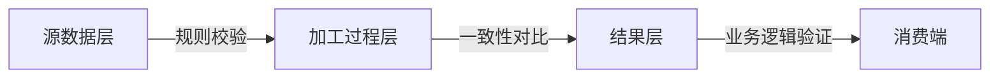
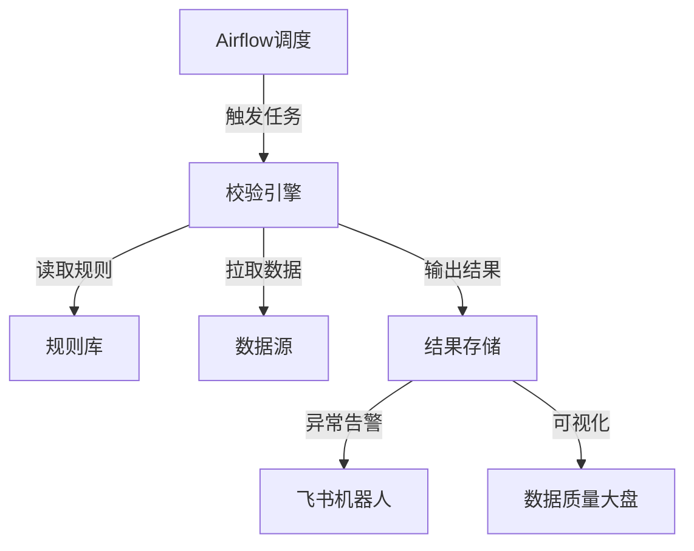

数据正确性巡检是数据质量保障的核心环节，需构建覆盖**数据生产→加工→消费**全链路的验证体系。以下是系统化的实施框架（附具体操作指南）：

---

### 一、数据正确性巡检框架设计
#### **三层验证体系**


---

### 二、核心检查项与实施方法
#### **1. 源数据质量扫描**
| **问题类型** | **检测方法**                                      | **工具示例**       |
| ------------ | ------------------------------------------------- | ------------------ |
| 数据缺失     | 统计空值率：`COUNT(NULL)/COUNT(*)`                | Great Expectations |
| 数据格式异常 | 正则匹配：`PHONE_NUM NOT REGEXP '^1[3-9]\\d{9}$'` | Deequ (AWS)        |
| 数值越界     | 范围检测：`AGE NOT BETWEEN 0 AND 120`             | Apache Griffin     |
| 枚举值违规   | 值域检查：`STATUS NOT IN ('SUCCESS','FAIL')`      | SQL CHECK 约束     |

**自动化脚本示例**（PySpark）：
```python
from pyspark.sql.functions import col

# 定义源数据校验规则
rules = {
    "user_id_not_null": col("user_id").isNotNull(), 
    "amount_range": (col("amount") > 0) & (col("amount") <= 1000000),
    "date_format": col("order_date").rlike("\\d{4}-\\d{2}-\\d{2}")
}

# 执行校验并输出报告
for rule_name, expr in rules.items():
    error_count = df.filter(~expr).count()
    print(f"规则 {rule_name} 违反数量: {error_count}")
```

#### **2. 加工过程正确性验证**
| **验证类型** | **实现方案**                                      | **关键指标**        |
| ------------ | ------------------------------------------------- | ------------------- |
| 数据一致性   | 主键唯一性检查：`COUNT(DISTINCT id) = COUNT(*)`   | 重复值比例 < 0.001% |
| 计算逻辑正确 | 关键指标对比：`Hive结果 vs Spark结果 vs 手工计算` | 差异容忍度 ±0.01%   |
| 数据血缘追踪 | 逐层字段级数据溯源（如Apache Atlas）              | 中断链路数 = 0      |
| 数据快照对比 | 每日全量MD5校验（仅小表适用）                     | MD5一致性100%       |

**数据一致性校验SQL**：
```sql
-- 订单总金额跨层验证
WITH dw_result AS (
  SELECT SUM(amount) AS total FROM dw_orders WHERE dt='2023-10-01'
),
ods_source AS (
  SELECT SUM(price*quantity) AS total FROM ods_orders WHERE dt='2023-10-01'
)
SELECT 
  ABS(dw.total - ods.total) AS diff,
  ABS(dw.total - ods.total)/dw.total AS diff_rate 
FROM dw_result dw, ods_source ods
WHERE ABS(dw.total - ods.total) > 1000; -- 差异超过1000元触发告警
```

#### **3. 消费端业务逻辑验证**
| **场景**     | **验证方法**                         | **断言示例**                     |
| ------------ | ------------------------------------ | -------------------------------- |
| 指标逻辑正确 | 对比BI报表 vs 数据库直接查询         | `report_value - db_value < 0.5%` |
| 数据时效性   | 监控分区数据到达时间                 | `last_partition_time > NOW()-1h` |
| 业务规则映射 | 验证标签规则：`VIP用户订单量突降50%` | 波动率 < 阈值                    |
| 敏感数据合规 | 身份证/手机号脱敏检查                | `phone LIKE '138****5678'`       |

---

### 三、工程化落地步骤
#### **1. 规则配置中心（示例YAML）**
```yaml
# 订单表校验规则
table: orders
rules:
  - type: null_check
    columns: [id, user_id]
    threshold: 0  # 不允许空值
  - type: range_check
    column: amount
    min: 0.01
    max: 1000000
  - type: set_check
    column: status
    allowed_values: ["PAID", "UNPAID", "CANCELED"]
```

#### **2. 自动化巡检架构**


#### **3. 智能分析进阶功能**
- **动态基线预警**：  
  ```python
  # 基于历史7天数据计算波动阈值
  threshold = historical_mean + 3 * historical_std 
  if current_value > threshold:
      alert("数据异常波动!")
  ```
- **根因定位引擎**：
  - 自动关联变更：代码发布/数据源切换/业务活动
  - 影响面分析：下钻到分区/业务线/用户群

---

### 四、关键注意事项
1. **性能优化**  
   - 分区增量校验：只扫描当日新增分区  
   - 抽样检测：对大表使用`TABLESAMPLE BERNOULLI(1)`  
   - 结果缓存：相同规则24小时内不重复执行  

2. **报警分级策略**  
   | 级别 | 条件                   | 响应方式          |
   | ---- | ---------------------- | ----------------- |
   | P0   | 核心指标错误 > 1%      | 电话呼叫+自动熔断 |
   | P1   | 非核心字段错误率 > 10% | 企业微信立即通知  |
   | P2   | 数据延迟 > 2小时       | 每日汇总报告      |

3. **闭环治理流程**  
   ```mermaid
   graph LR
   发现异常 --> 自动提单 --> 分配责任人 --> 修复验证 --> 规则优化
   ```

---

### 五、推荐技术栈组合
| **功能**   | **开源方案**         | **商业方案**         |
| ---------- | -------------------- | -------------------- |
| 规则引擎   | Great Expectations   | Informatica DQ       |
| 调度平台   | Apache Airflow       | Alibaba DataWorks    |
| 可视化监控 | Grafana + Prometheus | Tableau Data Quality |
| 数据血缘   | Apache Atlas         | Collibra Lineage     |

> 💡 **最佳实践**：  
> 1. 优先保障**核心交易**、**财务结算**相关数据  
> 2. 建立**数据质量分**体系：`得分 = 100 - (错误记录数/总量)*100`  
> 3. 每月发布《数据健康度报告》驱动改进  

通过此方案，可将数据错误导致的线上事故降低90%以上。建议从**关键业务表**入手逐步铺开，初期投入资源聚焦P0级数据校验。