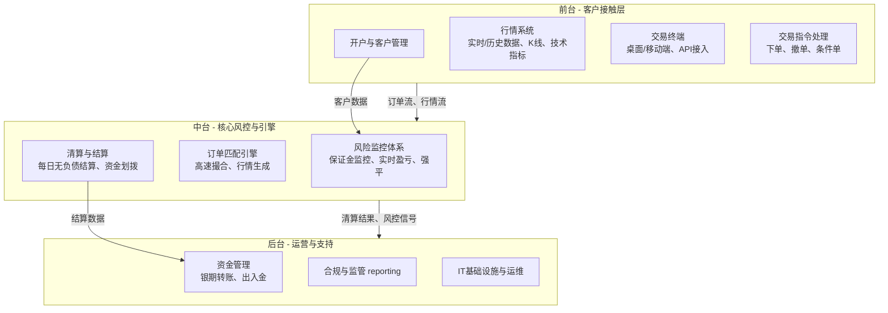

期货交易平台是一个复杂且高度规范的系统，涉及金融、技术和监管多个层面。下面我为你详细拆解其业务体系，并列出你需要学习的知识。

### 第一部分：期货交易平台的业务体系

一个成熟的期货交易平台业务体系可以看作是**前、中、后台**的协同运作。

#### 一、前台（Front Office）- 客户接触层
这是用户直接交互的部分，核心是**吸引客户、提供工具、方便交易**。
1.  **开户与客户管理**：
    *   **线上开户系统**：实名认证、风险承受能力测评、视频见证、协议签署（电子合同）。
    *   **客户信息系统（CRM）**：管理客户资料、交易权限、费率等。
2.  **行情系统**：
    *   提供**实时**的市场行情数据（买价、卖价、最新价、成交量、持仓量等）。
    *   提供**历史**数据查询和K线图、技术指标（MACD, KDJ, RSI等）分析工具。
3.  **交易终端**：
    *   **PC客户端**、**手机APP**、**Web端**：提供下单界面。
    *   **API接口**：为专业投资者、量化交易团队提供程序化交易接口。
4.  **交易指令处理**：
    *   接收客户的下单、撤单、条件单（止损、止盈）等指令，并传递到中台的核心系统。

#### 二、中台（Middle Office）- 核心风控与引擎
这是平台的**大脑和心脏**，确保交易稳定、公平、风险可控。
1.  **风险监控体系**：
    *   **保证金监控**：实时计算每个客户持仓的保证金占用和动态权益。
    *   **实时盈亏计算**：根据最新价格计算客户浮动盈亏。
    *   **强平机制**：当客户可用资金为负时，系统自动执行强行平仓。
2.  **订单匹配引擎**：
    *   这是**技术核心**，负责接收所有订单，并按照 **“价格优先、时间优先”** 的原则进行撮合成交。
    *   要求极高的**低延迟**和**高并发**性能。
3.  **清算与结算**：
    *   **每日无负债结算**：每天收盘后，根据结算价对所有客户的持仓和资金进行清算，划转盈亏、手续费等。
    *   生成每日的结算单。

#### 三、后台（Back Office）- 运营与支持
保障平台稳定运行和合规的支撑部门。
1.  **资金管理**：
    *   **银期转账系统**：与银行系统对接，处理客户的入金和出金。
2.  **合规与监管**：
    *   严格执行反洗钱（AML）、了解你的客户（KYC）等规定。
    *   向证监会、期货保证金监控中心等监管机构报送数据。
3.  **IT与运维**：
    *   保障服务器、网络、数据库的稳定运行（高可用、灾备）。
    *   网络安全防护，防止DDoS攻击、黑客入侵。

---

### 第二部分：你需要学习什么知识？

要深入理解或参与构建这样一个平台，你需要复合型的知识体系。可以从以下三个维度入手：

#### 一、金融知识（业务本质）
这是理解“在交易什么”和“规则是什么”的基础。
1.  **期货与衍生品基础**：
    *   合约要素：标的物、合约乘数、报价单位、最小变动价位、交割月份、保证金制度。
    *   交易机制：T+0、双向交易（做多/做空）、杠杆、交割与平仓。
    *   基本概念：开盘价、收盘价、结算价、成交量、持仓量、基差、价差。
2.  **市场分析与交易策略**：
    *   **基本面分析**：研究影响商品供求关系的宏观政策、产业链、库存、天气等。
    *   **技术分析**：K线形态、技术指标、趋势理论、波浪理论等。
    *   **量化交易入门**：了解阿尔法（Alpha）策略、套利策略、做市商策略等。
3.  **风险控制**：
    *   理解保证金计算、盈亏计算、强行平仓流程。
    *   了解市场风险、信用风险、流动性风险。

#### 二、技术知识（实现手段）
这是构建平台的“硬技能”。
1.  **后端开发**：
    *   **语言**：**Java** (高并发社区成熟)、**C++** (追求极致性能的交易引擎和行情系统)、**Python** (广泛应用于量化、数据分析、后台管理)、**Golang** (高并发网络服务)。
    *   **框架**：Spring Cloud (微服务治理)、Netty (高性能网络通信)。
    *   **数据库**：**MySQL** (业务数据)、**Redis** (缓存、行情)、**时序数据库** (存储海量行情数据)。
2.  **高并发与低延迟技术**：
    *   **核心**：多线程、锁优化、无锁数据结构、零拷贝、内存管理。
    *   **网络**：TCP/UDP、WebSocket (实时推送行情)。
3.  **系统架构**：
    *   **微服务架构**：将开户、行情、交易、风控、清算等拆分成独立服务。
    *   **分布式系统**：消息队列（Kafka/RocketMQ）解耦服务，弹性扩容。
4.  **运维与基础设施**：
    *   **Linux**：必须精通。
    *   **容器化**：**Docker**、**Kubernetes** (实现自动化部署和运维)。
    *   **DevOps**：CI/CD流水线。

#### 三、合规与业务知识（游戏规则）
1.  **监管框架**：了解中国证监会（CSRC）、期货业协会、期货交易所（上期所、郑商所、大商所、中金所）的规章制度。
2.  **业务流程**：深刻理解从开户、交易、结算到风控的每一个业务环节。

### 学习路径建议

1.  **第一步：打牢金融基础**
    *   **读书**：《期货及衍生品基础》（期货从业资格考试教材）。《日本蜡烛图技术》。
    *   **实践**：下载一个**模拟交易软件**（文华财经、博易大师等都有），亲自体验交易全过程，理解合约、保证金、盈亏计算、平仓等概念。

2.  **第二步：强化技术深度**
    *   根据你的方向选择一门主力语言（Java或C++）深入钻研，并学习其高性能编程技巧。
    *   学习分布式系统理论，并动手用Spring Cloud + Docker搭建一个简单的微服务demo。

3.  **第三步：结合实践**
    *   尝试用**Python**的`pandas`、`numpy`库处理一些历史行情数据，进行简单的回测分析。
    *   关注**开源项目**：例如一些简单的交易系统、行情回放系统，看看别人的代码实现。

这个领域是“金融”和“技术”的十字路口，博大精深。你可以根据自己的兴趣，选择成为更偏向业务的**金融技术专家**，或者更偏向技术的**量化系统开发者**。希望这个梳理对你有所帮助！