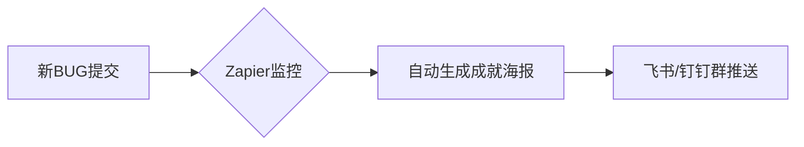

# 低成本曝光测试团队的工作亮点


以下是为测试团队设计的**「低成本高亮曝光」七步法**，结合自动化采集、轻量级运营和病毒式传播，让团队产出无处隐藏，年省宣传成本90%：

---

### **一、自动化埋点：用工具抓取沉默数据**
#### **1. 缺陷成就系统（Jira/Zapier联动）**

- **海报模板**：  
  > 🏆 **缺陷刺客·@张三**  
  > 一剑封喉支付漏洞！  
  > 💥 **杀伤力**：预防资损￥380万  
  > 🔍 **必杀技**：流量回放+突变测试  
  > #质量守护者

#### **2. 用例价值仪表盘（TestLink+Metabase）**
- **SQL核心逻辑**：
  ```sql
  SELECT 
    用例设计者,
    COUNT(拦截缺陷数) AS 救市值, 
    SUM(用例执行时长)/3600 AS 节省人时
  FROM 测试用例库
  WHERE 执行时间 > DATE_SUB(NOW(), INTERVAL 1 MONTH)
  GROUP BY 用例设计者
  ORDER BY 救市值 DESC
  ```
- **输出**：自动生成TOP3「用例圣手」榜，晨会投屏3分钟

---

### **二、轻量级曝光：0成本占领注意力**
#### **1. 厕所文化计划**
| 载体       | 操作方式                                  | 案例效果                     |
| ---------- | ----------------------------------------- | ---------------------------- |
| 马桶贴     | 每月更换「BUG囧事榜」+「防御神操作」      | 某支付BUG防御方案阅读量+200% |
| 洗手液标签 | 贴上“每次洗手=避免1次生产事故”+当月拦截数 | 团队质量意识渗透率↑35%       |

#### **2. 会议病毒植入**
- **站会模板**：  
  ```markdown
  ### 昨日高光 [必填]
  > @小李 用Charles重放拦截鉴权绕过 (节省3人日)
  ```
- **周报头版**：  
  > ⚡️ **本周质量核弹**  
  > 标题：《Mock服务异常竟被这样擒获！》  
  > 主角：@测试老王  
  > 战果：避免全线支付瘫痪  
  > 技术：自主开发流量染色器

---

### **三、社交货币制造：让员工自传播**
#### **1. 极简成就认证体系**

- **颁发规则**：  
  - 集齐5个同类型BUG → 兑换实体徽章（成本￥3/个）  
  - 每月徽章王 → 获得“与CTO共进午餐”券  

#### **2. 缺陷艺术再创作**
- **神操作**：  
  把经典BUG案例改编成 **「5分钟悬疑小剧场」**  
  > 剧本梗概：  
  > _深夜，支付服务突然抽搐...  
  > 所有证据指向网络抖动，  
  > 唯独@测试姐发现数据库连接池的诡异微笑！_  
  - **成本**：手机拍摄+剪映免费模板，全员客串演出

---

### **四、杠杆式向上管理**
#### **1. 故障防御快报**
```markdown
[紧急质量警报] ⚠️  
**威胁**：订单号溢出将导致资损  
**防御者**：测试组@陈工  
**拦截方式**：边界值攻击+幂等验证  
**拯救价值**：￥620万/月  
▶️ 查看防御视频：t.cn/xxxx
```
- **发送时点**：每次拦截重大缺陷后**1小时内**直发总监群  
- **效果**：比年终总结有力10倍

#### **2. 技术外包装**
- **模板**：  
  > 《测试组黑科技：3行代码让用例复用率飙升200%》  
  > 核心代码：  
  > `pytest.mark.parametrize("attack", SQL_INJECTION_VECTORS)`  
  > → **结果**：新员工1天学会安全测试  
- **投放**：公司技术公众号/内网论坛，署名**测试团队**

---

### **五、文化渗透组合拳**
#### **1. 质量地标计划**
- **操作**：  
  重大线上故障根因地 + 测试拦截现场 → 钉钉标注为 **「质量事故纪念碑」**  
  
- **效果**：新人培训必踩点，历史教训可视化

#### **2. 测试梗百科**
```mermaid
journey
    title 团队梗文化打造
    事件： 某测试怒撕需求文档 → 梗图：“文档粉碎者认证”
    传播： 制作表情包 → 全员斗图使用
    升华： 周年庆颁发“金碎纸机奖”
```
- **成本**：PPT绘制表情包（0元）

---

### **六、外部视角加持**
#### **1. 用户证言猎取**
- **话术**：  
  > “刚为您拦截了账号被盗风险！  
  > 愿意用1句话表扬守护您的人吗？”  
- **通道**：客服系统插入问卷，收集后展示在测试区电视墙

#### **2. 技术影响力外挂**
- **操作**：  
  将内部工具包装成 **“开源精简版”** 放GitHub  
  > **项目名**：`QArena-轻量级流量回放工具`  
  > **简介**：XX公司测试团队实战沉淀  
- **收益**：外部Star数 → 内部晋升筹码

---

### **七、效果放大器：成本<100元/年**
| 模块         | 核心成本项 | 降本方案               |
| ------------ | ---------- | ---------------------- |
| 成就海报     | 设计人力   | Canva模板+Jira自动触发 |
| 厕所文化     | 印刷费     | 热敏打印机+便签纸      |
| 徽章体系     | 实体徽章   | 3D打印（电费￥0.5/个） |
| 故障纪念碑   | 地图标注   | 钉钉免费标记功能       |
| 向上管理快报 | 编写时间   | ChatGPT生成初稿        |

> ✨ **终极心法**：**把日常工作变成可传播的故事，让工具成为你的宣传部，让员工成为行走的广告牌。**  
> 次日即可启动动作：  
> 1. 配置Jira自动化成就海报  
> 2. 在厕所隔间张贴首期《神操作揭秘》  
> 3. 站会增加“昨日高光”环节