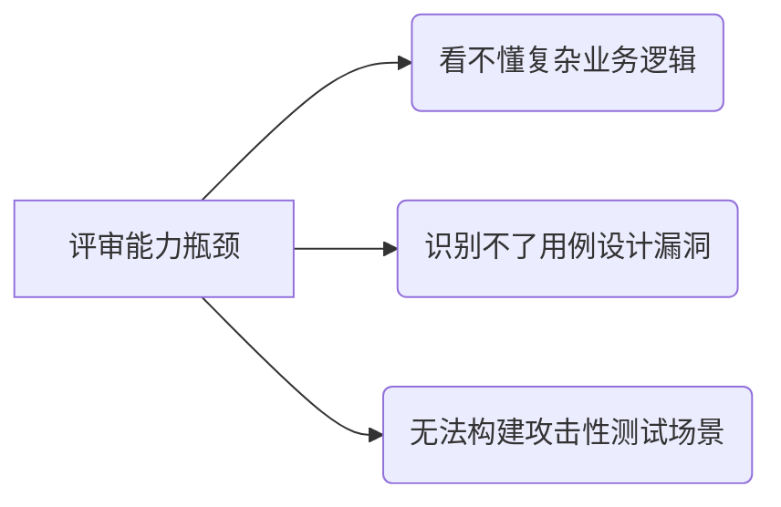
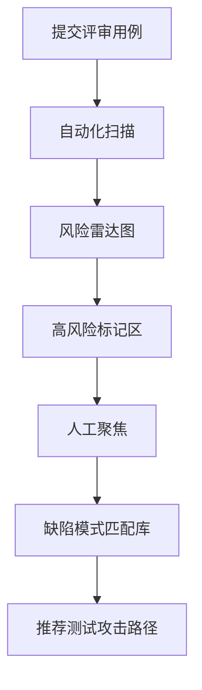

## 测试审计工作中的避重就轻


## 背景

对外包同事的测试用例进行评审验收的时候, 有些同事他确实去做了这件事情了, 也努力去找出问题点, 但是问题点出在于, 他可能发现了少量的1-2个问题之后, 就不不太想去继续挖掘问题了. 


以下是针对**内部测试同事在验收外包测试用例时浅尝辄止**问题的深度分析与解决方案，聚焦管理机制与技术工具双轨并进：

---

### 一、根本原因拆解
#### 1. **动机缺失层**
| 问题类型         | 具体表现                         | 影响               |
| ---------------- | -------------------------------- | ------------------ |
| **价值感知薄弱** | 认为验收是"合规流程"而非质量防线 | 仅完成最低标准检查 |
| **激励错位**     | 发现缺陷无奖励，漏检无惩罚       | 选择风险最低路径   |
| **责任分散**     | 认为"外包为主责，验收为形式"     | 降低投入深度       |

#### 2. **能力制约层**


#### 3. **流程失效层**
- **无标准武器库**：缺乏检查清单/自动化工具辅助深度挖掘
- **验收闭环缺失**：未建立"评审问题→整改验证→效果量化"机制
- **时间挤压**：评审任务与其他工作并行，默认快速通过

---

### 二、系统性解决方案
#### ▶ 阶段1：重构验收价值体系（1周内落地）
**1.1 缺陷价值可视化看板**
```python
# 评审价值量化算法（示例）
def calculate_review_score(found_issues):
    critical = len([i for i in found_issues if i.level == 'CRITICAL'])
    high = len([i for i in found_issues if i.level == 'HIGH'])
    # 权重分配：致命缺陷=50分，高危=30分
    return critical*50 + high*30 

# 接入团队大屏实时排名
```
**效果**：将评审深度转化为可竞争的数值指标

**1.2 经济杠杆调节**
| 行为             | 奖励机制               | 惩罚机制           |
| ---------------- | ---------------------- | ------------------ |
| 发现深层设计缺陷 | 每例奖励X元 + 公开表彰 | -                  |
| 漏检线上故障     | -                      | 按故障损失比例担责 |
| 提出工具优化     | 采纳即奖Y元            | -                  |

#### ▶ 阶段2：武装评审"武器库"（2周内上线）
**2.1 智能辅助工具链**


**2.2 轻量级深度检查表**
```markdown
## 用例评审必杀三连问：
1. [穿透性] 此用例能否触发系统异常状态？  
   - 尝试补充：断电/网络抖动/并发冲突场景
2. [破坏性] 如何用此功能制造业务损失？  
   - 示例：重复提交订单是否产生资金漏洞
3. [隐蔽性] 缺陷需什么条件才会暴露？  
   - 检查：日志埋点/监控覆盖是否充足
```

#### ▶ 阶段3：流程强制深度穿透（即时执行）
**3.1 三轮增压评审法**
```rust
// 伪代码实现评审流程迭代
fn deep_review(case) -> Vec<Defect> {
    let mut defects = vec![];
    
    // 第一轮：基础校验 (外包自检)
    defects.extend(basic_check(case)); 
    
    // 第二轮：交叉攻击 (内部评审)
    defects.extend(attack_simulation(case));
    
    // 第三轮：混沌验证 (专家组)
    if case.risk_level > 3 {
        defects.extend(chaos_engineering(case));
    }
    
    defects
}
```

**3.2 缺陷树溯源机制**
发现表面问题 → **强制溯源** → 生成深度测试链  
> **示例**：  
> 发现"分页查询未校验最大值"  
> → 溯源要求补充：  
>   - [ ] 百万级数据压测  
>   - [ ] 高频翻页内存监控  
>   - [ ] 恶意爬虫防护验证

---

### 三、快速见效组合拳
#### 1. **建立"1+1+3"验收制**
- **1** 个基础问题 → 必须找出  
- **1** 个业务逻辑缺陷 → 教会方法  
- **3** 个深度追问 → 强制执行  
> *"为什么这个边界值选100？"  
> "如果两个用户同时操作会怎样？"  
> "黑客会如何利用这个输入框？"*

#### 2. **实施"评审红蓝对抗"**
```mermaid
journey
    title 每月深度评审日流程
    section 蓝军(评审组)
      拆解用例 --> 设计攻击方案
    section 红军(外包组)
      执行攻击方案 --> 记录防御缺口
    section 裁判组
      计算漏洞伤害值 --> 发布对抗报告
```

#### 3. **缺陷价值排行榜**
| 漏洞深度等级 | 特征                      | 基准分 |
| ------------ | ------------------------- | ------ |
| L1 表面缺陷  | 错别字/简单边界值缺失     | 10     |
| L2 功能漏洞  | 正常流程异常/基础校验失效 | 30     |
| L3 业务风险  | 可造成数据错乱/资金损失   | 60     |
| L4 系统崩溃  | 导致服务不可用/数据损坏   | 100    |
| L5 安全事件  | 可被外部攻击利用          | 200    |

> **公示公式**：  
> 个人月度价值 = ∑(漏洞等级分 × 发现难度系数)  
> **难度系数** = 该模块历史缺陷密度倒数 × 2

---

### 四、避坑指南
1. **警惕工具依赖**：  
   自动化扫描仅能发现30%问题，需与人工深度结合
   
2. **防御评审疲劳**：  
   - 采用**番茄工作法**：25分钟深度评审+5分钟休息  
   - 每模块评审≤2小时，超时强制轮换人员

3. **规避对抗情绪**：  
   - 对外包团队：强调"发现问题=帮助他们提升专业度"  
   - 对内：建立"漏检案例库"，展示问题逃逸后果

> **落地监测指标**：  
> - 评审缺陷率 = 评审发现问题数 / 总缺陷数 → 目标>40%  
> - 缺陷穿透深度 = L3以上缺陷占比 → 目标>35%  
> - 用例整改率 = 外包修复问题数 / 提出问题数 → 目标100%  

通过将**评审深度量化**、**价值可视化**、**过程游戏化**，将被动审查转化为专业竞技，从根本上解决"浅尝辄止"问题。