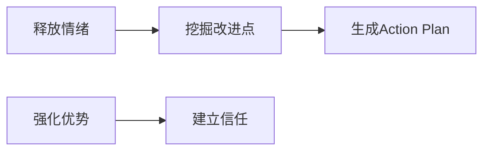

以下是为您设计的**「测试团队亮点 & 吐槽大会」** 会议方案，融合了高效议程设计、心理安全建设和成果转化机制，确保会议既有趣又有产出：

---

### **一、会议核心目标**


---

### **二、会前关键准备（成败核心）**
1. **匿名收集槽点**  
   - 工具：腾讯问卷/金数据  
   - 问题设计：  
     > _“如果给测试流程一个吐槽超能力，你最想消灭的痛点是什么？”_  
     > _“遇到最想暴打的BUG类型是？”_  
     > _“哪个环节让你感觉在重复造轮子？”_
2. **亮点案例预征集**  
   - 模板：  
     ```markdown
     ## 我的高光时刻 [姓名可选填]
     - **场景**：线上支付漏测风险  
     - **神操作**：用流量录制回放覆盖了0.1%概率的银行通道超时  
     - **价值**：拦截了可能损失￥200W+的资损故障
     ```
3. **物理环境布置**  
   - 设置 **「彩虹屁区」**（贴便利贴夸同事）  
   - 放置 **「压力发泄球」**（传递发言权道具）  
   - 准备 **「犀利金句」** 白板（记录经典吐槽）

---

### **三、会议议程设计（90分钟高效版）**
#### **Phase 1：点燃气氛（15min）**
| 环节               | 操作要点                                                     |
| ------------------ | ------------------------------------------------------------ |
| **神吐槽热榜公布** | 展示会前匿名问卷结果TOP3，用梗图呈现（如“环境不稳定”配断网表情包） |
| **彩虹破冰**       | 每人用1句话夸左侧伙伴的工作习惯（例：“感谢小王总在深夜陪我复现BUG”） |

#### **Phase 2：亮点轰炸（30min）**


#### **Phase 3：吐槽攻坚战（35min）**
| 形式             | 规则                                                         | 引导话术                          |
| ---------------- | ------------------------------------------------------------ | --------------------------------- |
| **BOSS直聘**     | 每组写1个最痛槽点贴白板 → 全员投票选TOP3攻坚                 | “现在你是CEO，优先解决哪个痛点？” |
| **疯狂解决方案** | 针对TOP3槽点脑暴 → 要求方案必须含1个离谱点子（如“给PM装代码编译器”） | “越荒诞的方案越可能藏着黄金！”    |
| **责任认领**     | 现场志愿者认领改进项 → 签署《军令状》拍照（模板见后）        | “谁敢为这个改变扛大旗？”          |

#### **Phase 4：闭环行动（10min）**
1. **公示作战地图**  
   ```mermaid
   gantt
       title 吐槽歼灭作战表
       dateFormat  YYYY-MM-DD
       section 环境不稳定
       自动巡检脚本开发   ：a1, 2023-10-15, 7d
       容器化部署推进     ：a2, after a1, 5d
       section 需求变更频繁
       可测试性checklist ：b1, 2023-10-20, 3d
   ```
2. **建立追踪机制**  
   - 作战表上墙 + 每日站会同步进度  
   - 下次会议优先验收成果

---

### **四、心理安全关键控制点**
1. **吐槽免责三原则**  
   > 🔹 对事不对人（例：“需求评审总跳过测试环节”  vs  “产品经理不尊重我们”）  
   > 🔹 提案必须带解法  
   > 🔹 禁止会后翻旧账  
2. **管理者自黑示范**  
   - 主动暴露自己的糗事：_“上次我拍胸脯说环境没问题，结果当天崩了，该骂！”_  
3. **设立树洞委员**  
   - 指定1名情商高的成员负责打断人身攻击、化解冲突

---

### **五、成果转化利器**
#### 《军令状》模板
```markdown
## ⚔️ 痛点歼灭军令状
**我要消灭**：[环境配置超30分钟]  
**执行人**：@张三 @李四  
**必杀技**：编写Docker-Compose一键部署脚本  
**交付日**：2023-11-30  
**失败惩罚**：请全组喝奶茶（备注：50元封顶）  

[手写签名]____________  
```
> 📢 将签署的军令状拍照发群，既是承诺也是公开监督

#### 吐槽能量转化表
| 原始吐槽                | 转化行动项                  | 价值类型        |
| ----------------------- | --------------------------- | --------------- |
| “每天手工部署环境1小时” | 搭建Jenkins自动化部署流水线 | 年节省150人时   |
| “BUG描述总被开发怼”     | 编写《缺陷写作指南》        | 减少60%沟通成本 |

---

### **六、避坑指南**
1. **避免变成批斗会**  
   - 当吐槽聚焦到具体人时，立即用话术扭转：_“我们思考系统如何避免这类问题？”_  
2. **防止过度娱乐化**  
   - 在脑暴离谱方案后必须追问：_“这个点子背后合理的核心诉求是什么？”_  
3. **杜绝议而不决**  
   - 每个被选中的槽点必须有：**负责人+交付物+Deadline**

> **会议金句储备**：  
> - “吐槽是爱的另一种表达”  
> - “把后背交给队友的前提，是敢于亮出伤疤”  
> - **结束语**：_“今天吐的槽，明天就会变成护城河！”_

通过此会议，您将获得：**3份可落地的改进方案** + **5+个团队亮点案例库** + **飙升的心理安全感**。关键在于让吐槽产生建设性价值，让亮点被看见后引发链式反应。