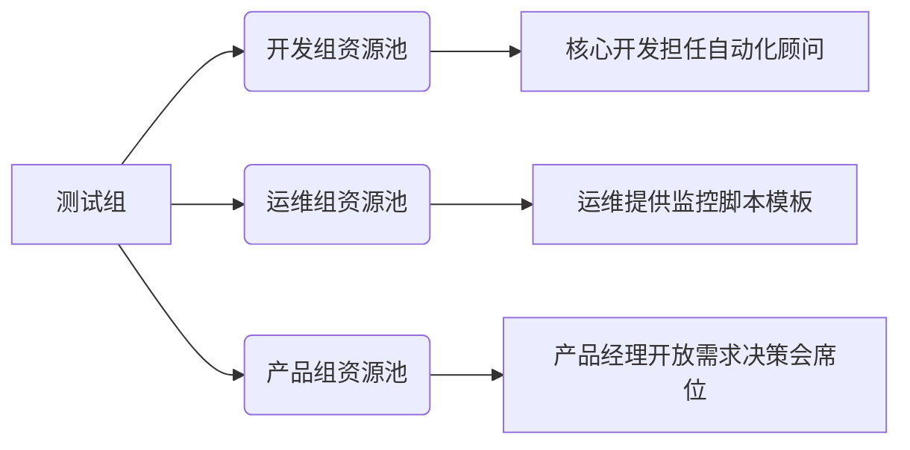

# 测试组长对团队影响力的建设

主要有三大方面

1. 通过技术来建设影响力
2. 通过自身的资源或者借用上级领导的权力来建设影响力
3. 通过沟通协作时给予充分情绪价值和工作动力

以下是为测试组长打造的**团队影响力建设体系**，涵盖技术赋能、资源整合、情绪驱动三大维度，结合具体场景和可执行策略：

---

### **一、技术影响力建设：用专业赢得话语权**
#### **1. 技术攻坚与标准化**
| **策略**       | **执行方法**                                                 | **影响力效果**                         |
| -------------- | ------------------------------------------------------------ | -------------------------------------- |
| **痛点攻关**   | 主动解决团队技术瓶颈（如搭建自动化巡检脚本、优化CI/CD流水线） | 成为团队“技术灯塔”，建立问题终结者形象 |
| **标准化输出** | 编写《测试技术手册》《常见缺陷库》《环境配置SOP》            | 统一团队工作语言，降低新人学习成本     |
| **技术沙盒**   | 每月组织技术实验（如API测试工具链对比、精准测试落地实践）    | 激发团队技术好奇心，推动技术迭代       |

#### **2. 质量赋能开发**
| **策略**         | **执行方法**                                                 | **影响力效果**                         |
| ---------------- | ------------------------------------------------------------ | -------------------------------------- |
| **左移实践**     | 在需求评审阶段输出《可测试性检查表》，提前拦截设计缺陷       | 赢得开发/产品尊重，从源头提升质量      |
| **质量数据驱动** | 用可视化看板展示缺陷预防效果（如需求阶段拦截缺陷数 vs 线上缺陷数对比） | 用数据证明测试价值，改变“事后救火”认知 |

---

### **二、资源整合影响力：借势成事**
#### **1. 向上管理：把领导支持转化为团队弹药**
| **资源类型**   | **获取与转化策略**                                           | **团队获得感**               |
| -------------- | ------------------------------------------------------------ | ---------------------------- |
| **硬件资源**   | 向领导论证测试环境不稳定的损失，申请专属服务器并命名为“XX质量堡垒” | 提升测试效率，减少环境扯皮   |
| **培训预算**   | 捆绑业务目标申请认证培训（如ISTQB认证、性能测试专家课）      | 成员能力提升+离职率下降      |
| **话语权资源** | 推动建立“质量一票否决制”（需用历史故障数据支撑提案）         | 测试从被动验收转为质量守门人 |

#### **2. 横向资源池搭建**

**操作要点**：  
- 与开发Leader达成**缺陷预防KPI互换**（如测试组提供自动化脚本，开发组承诺单元测试覆盖率提升）  
- 建立**跨组问题响应SLA**（例如P1级缺陷必须2小时修复）

---

### **三、情绪价值赋能：让团队愿意追随**
#### **1. 沟通场景化情绪激励**
| **场景**         | **情绪价值策略**                                             | **关键话术示例**                          |
| ---------------- | ------------------------------------------------------------ | ----------------------------------------- |
| **需求变更风暴** | 先认同压力：“这次改动确实打乱计划了”，再引导聚焦解法：“我们分三步控损...” | “你的排查思路很精准！第3点建议特别有价值” |
| **线上故障复盘** | 用“我们”代替“你”：“**我们**漏掉了这个场景，下次**我们**这样改进...” | “这次应急响应中，你处理的XX环节救了全队”  |
| **个人成长卡点** | 提供定制化成长路径图（如性能测试技能树），定期1v1跟踪进展    | “你上次提出的压测方案，客户特别认可！”    |

#### **2. 动机激活三板斧**
| **动机类型** | **激活策略**                                                 | **落地动作**                        |
| ------------ | ------------------------------------------------------------ | ----------------------------------- |
| **成就动机** | 设立“质量勋章”体系（如“缺陷猎人”“流程优化之星”），每月颁发实体勋章 | 仪式感颁奖+公司大群通报表扬         |
| **掌控动机** | 开放测试技术选型决策权（如由团队投票选择自动化工具）         | 组织技术民主会，执行多数决议        |
| **归属动机** | 创建“质量文化日”：每月1天分享故障故事/质量金句，定制团队文化衫 | “还记得当年那个史诗级BUG吗？”故事会 |

---

### **四、影响力效果检验指标**

**解读**：  
- 技术求助频率上升 → 技术权威建立成功  
- 离职率下降+创新提案增加 → 情绪价值有效转化  
- 领导反向求助（如“这个方案测试角度怎么看”）→ 决策影响力突破  

---

### **五、避坑指南**
1. **技术影响力≠个人英雄主义**  
   - 避免：“这个脚本只有我能写” → 改为：“我教你核心逻辑，你来实现”  
2. **资源整合忌零和博弈**  
   - 错误：“从开发组抢服务器” → 正确：“联合开发申请测试-开发共享集群”  
3. **情绪价值拒绝讨好型沟通**  
   - 警惕：“你说的都对” → 坚守：“我理解你的诉求，但质量红线不能妥协，我们可以这样折中...”  

> **影响力本质**：让团队因你的存在而**有能力成事、有动力想事、有魄力扛事**。三大维度需同步发力，技术是根基，资源是杠杆，情绪是催化剂。