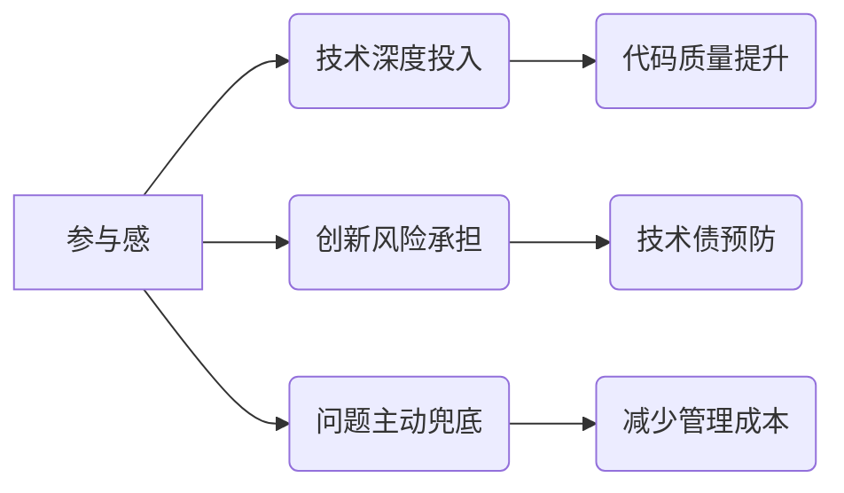

软件研发中团队动力学的核心矛盾——**自主性与效率的平衡**。以下从心理学、管理学和工程实践三个维度为您分析，并提供可落地的解决方案：

---

### 一、**“参与感缺失”的本质原因**
#### 1. **自主权被剥夺（关键痛点）**
   - **案例**：领导直接指定技术方案（如“用Redis做缓存”），剥夺了工程师的技术决策权。
   - **心理机制**：自我决定理论（Self-Determination Theory）指出，人类天生需要 **自主性（Autonomy）** 和 **掌控感（Mastery）**。当任务被过度定义时，工程师沦为“执行机器”。

#### 2. **意义感断裂**
   - **现象**：工程师不清楚任务与产品目标的关联（如“为什么要做这个功能？”）。
   - **后果**：哈佛商学院实验表明，明确任务意义可使工作效率提升 **31%**；反之则引发应付心态。

#### 3. **认知参与不足**
   - **技术人特质**：工程师享受 **解决问题的探索过程**（如架构设计、技术选型）。跳过研究环节直接执行，等同于剥夺其职业乐趣。

#### 4. **协作中的权力失衡**
   - **隐性对抗**：当成员认为某方案是“别人的想法”而非集体产出时，会通过拖延、消极反馈等方式争夺话语权。

---

### 二、**参与感的价值链（为什么必须解决？）**


---

### 三、**工程实践中的解决方案**
#### 1. **重构任务分配机制**
   - **问题招标制**：将需求转化为开放问题（例：  
     ❌ “用Kafka实现消息队列”  
     ✅ “如何保证订单状态变更时库存同步的可靠性？预算<3人日”）
   - **技术方案擂台**：针对复杂问题，鼓励提交多套方案并组织可行性辩论。

#### 2. **设计参与感“钩子”**
| 参与环节     | 实施方法                  | 案例                              |
| ------------ | ------------------------- | --------------------------------- |
| **问题定义** | 让工程师参与用户访谈      | 某团队修复BUG前先观看用户投诉视频 |
| **技术预研** | 预留15%工时用于探索性验证 | 允许用1天对比WebSocket vs SSE     |
| **决策锚点** | 提供约束框架而非具体方案  | “数据库必须兼容云托管，其他自决”  |

#### 3. **建立反馈增强回路**
   ```mermaid
   flowchart LR
   A[工程师建议] --> B(48小时内回应)
   B --> C{采纳与否}
   C -->|采纳| D[公开归属+奖励]
   C -->|未采纳| E[书面解释+替代方案]
   E --> F(存入决策知识库)
   ```

#### 4. **对抗“旁观者效应”**
   - **责任具象化**：在任务看板标注**个人印记**（例：  
     “API超时优化 @张三方案”）
   - **小闭环自治**：3人小组制，赋予特性从设计到上线的完整权限。

---

### 四、**管理者自检清单**
当工程师缺乏参与感时，请核查：
1. [ ] 任务描述是否包含“为什么做”（背景/用户价值）？
2. [ ] 技术方案是否有 ≥2 个可选路径？
3. [ ] 工程师能否修改需求优先级？
4. [ ] 决策过程是否有可追溯的记录？
5. [ ] 是否定期展示工作成果（如用户好评截图）？

---

### 五、**经典误区警示**
- **虚假参与**：名义上征求意见，实则早有内定方案（比不询问更破坏信任）
- **过度民主**：技术决策陷入无休止讨论（需设置决策截止日）
- **激励错配**：仅奖励“执行效率”忽视“探索贡献”（需单独设立创新积分）

> **关键洞见**：工程师的参与感不是“额外福利”，而是**高质量产出的前提**。正如Linux之父Linus Torvalds所言：“技术领导者的核心能力，是把问题转化为让人跃跃欲试的挑战”。