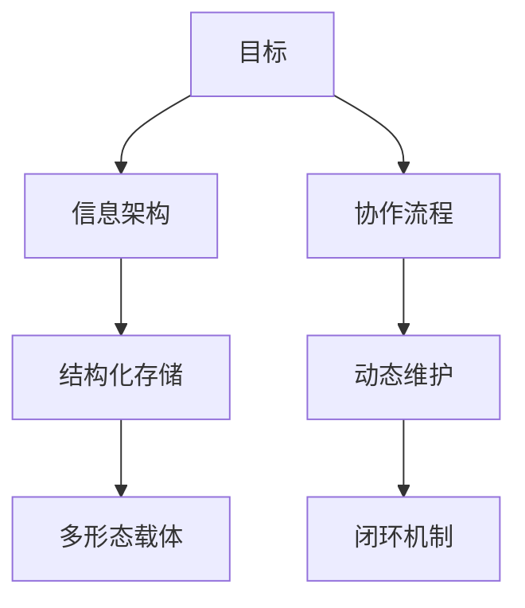

以下是针对企业软件功能梳理与知识管理的系统化方案，结合飞书工具特性设计，兼顾高效协作与长期可维护性：

---

### **一、知识管理体系规划框架**


---

### **二、具体实施步骤**

#### **1. 信息架构设计**
**（1）核心层级**
```markdown
公司知识库/
├── 产品中心/
│   └── [软件名称]/
│       ├── 01-功能模块树（思维导图）
│       ├── 02-功能卡片库（多维表格）
│       ├── 03-用户场景映射（流程图）
│       └── 04-版本迭代记录（时间轴）
├── 流程规范/
│   └── 功能梳理SOP（文档+检查表）
└── 外部参考/
    └── 竞品分析库（多维表格+链接）
```

**（2）飞书对应工具**
- **思维导图** → 飞书思维笔记（可嵌入文档）
- **功能卡片** → 飞书多维表格（字段示例）：
  | 功能ID | 功能名称 | 所属模块 | 用户价值        | 关联API         | 负责人 | 最后更新   |
  | ------ | -------- | -------- | --------------- | --------------- | ------ | ---------- |
  | F-1024 | 智能批注 | 文档协作 | 减少60%人工标注 | v3/doc/annotate | @张三  | 2024-05-20 |

#### **2. 内容生产流程**
**（1）四阶工作法**
```mermaid
journey
    title 功能梳理工作流
    section 采集
        访谈记录 --> 原始录音
        产品文档 --> 截图标注
    section 解构
        功能拆解 --> 思维导图
        流程分析 --> 泳道图
    section 验证
        开发确认 --> 评注修订
        用户测试 --> 案例补充
    section 归档
        版本快照 --> 知识图谱
        权限分配 --> 全员可见/部分可见
```

**（2）飞书协作组合**
- **即时沟通**：功能讨论用飞书群（关联文档）
- **任务跟踪**：创建飞书项目（甘特图视图）
- **评审会议**：飞书日历预约（自动生成纪要）

#### **3. 知识载体选择指南**
| **信息类型** | **推荐形式** | **飞书工具**            | **优势**            |
| ------------ | ------------ | ----------------------- | ------------------- |
| 功能全景     | 思维导图     | 飞书思维笔记            | 可视化层级关系      |
| 功能详细说明 | 结构化文档   | 飞书文档（模板库）      | 支持@关联任务/人员  |
| 参数配置     | 多维表格     | 飞书多维表格            | 可筛选/关联其他系统 |
| 交互流程     | 流程图       | 飞书白板/Lucidchart插件 | 动态呈现用户路径    |
| 问题追踪     | 看板         | 飞书项目管理            | 状态可视化          |

#### **4. 持续运营机制**
**（1）更新策略**
- 每周二「知识库日」：责任人更新标注内容
- 版本更新触发：自动创建副本存档（飞书文档历史版本）

**（2）质量检查**
```excel
检查项,标准,频率,工具
完整性,所有功能模块均有对应卡片,月度,多维表格筛选
准确性,参数与最新版本一致,双周,文档版本对比
可读性,流程图均有文字说明,随时,随机抽查
```

---

### **三、飞书功能高阶应用**
1. **智能检索**：
   - 为所有文档添加 #功能梳理 #核心模块 等标签
   - 通过飞书搜索语法：`label:功能梳理 after:2024-01-01`

2. **自动化关联**：
   ```python
   # 示例：当多维表格功能状态变更为「已下线」时
   if 状态 == "已下线":
       自动移动文档到「历史版本」文件夹
       发送飞书提醒给相关成员
   ```

3. **数据看板**：
   - 用飞书仪表盘展示：
     - 功能覆盖率 = 已归档功能/总功能数
     - 知识库活跃度 = 周编辑人数/总人数

---

### **四、避坑指南**
1. **避免形式化归档**：
   - 错误做法：仅上传产品说明书PDF
   - 正确做法：拆解为可检索的原子化知识卡片

2. **权限管理原则**：
   - 基础信息：全员可读
   - 技术细节：仅产研团队可编辑

3. **新旧版本处理**：
   - 保留历史版本但标记 deprecated
   - 用飞书文档「关联内容」功能提示新版位置

---

### **五、效果评估指标**
1. 新员工功能学习时长缩短30%+
2. 跨部门需求沟通会议减少50%
3. 功能重复开发率降至5%以下

通过这套体系，你们不仅能系统化梳理当前软件功能，还能形成可持续演进的知识资产。建议先用2周时间建立最小可行框架（如核心功能树+20张关键卡片），再逐步扩展。