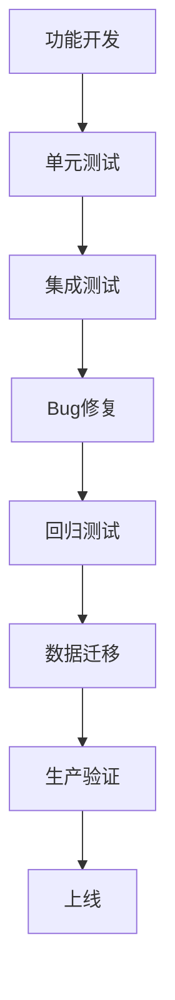

## 需求迭代中忽略BUG修复和数据处理时间的原因分析

### 常见原因：
1. **乐观偏差陷阱**：
   - 开发团队倾向于乐观估计，只考虑"理想路径"时间
   - 忽略历史教训（如上次迭代BUG修复实际耗时）

2. **任务分解不充分**：
   - 只分解主要开发任务，忽略配套工作
   - 未将BUG修复和数据处理视为独立任务项

3. **责任归属模糊**：
   - 认为"BUG是测试阶段的事"
   - 数据操作被看作"上线前的临时任务"

4. **经验数据缺失**：
   - 缺乏历史迭代的BUG率统计数据
   - 没有记录过往数据处理耗时

5. **流程缺陷**：
   - 时间估算模板缺少专门字段
   - 评审会议未强制要求评估这些因素

### 针对性解决方案：

#### 1. 建立科学的估算框架


**估算公式**：
```
总时间 = (功能开发时间 × 1.3) + 
        (历史平均BUG修复率 × 功能点数) + 
        (数据操作基准时间 × 复杂度系数)
```

#### 2. 实施结构化时间估算表

| 任务类型   | 估算方法                     | 示例基准值    |
| ---------- | ---------------------------- | ------------- |
| 新功能开发 | 功能点 × 人均效率            | 5功能点/人日  |
| BUG修复    | 历史BUG率 × 风险系数         | 15%开发时间   |
| 数据迁移   | 数据量/迁移速度 × 复杂度系数 | 1h/10万条记录 |
| 配置变更   | 变更项数 × 单次耗时          | 0.5h/项       |
| 上线验证   | 验证点 × 单点耗时            | 0.2h/验证点   |

#### 3. 引入预防性措施

**在迭代计划阶段：**
1. 强制要求填写"风险时间"字段
   - BUG修复预算 = 开发时间 × 历史BUG率（默认20%）
   - 数据操作预算 = 按数据量表计算

2. 建立检查清单：
   ```markdown
   - [ ] 是否包含BUG修复缓冲时间？
   - [ ] 是否评估数据迁移/清洗需求？
   - [ ] 是否包含配置变更时间？
   - [ ] 是否包含上线验证时间？
   ```

3. 实施"三次估算"法：
   - 乐观时间（无任何问题）
   - 最可能时间
   - 悲观时间（含最大风险）
   ```python
   # 使用PERT公式计算
   expected_time = (optimistic + 4*most_likely + pessimistic) / 6
   ```

#### 4. 建立历史知识库

维护迭代数据看板：


关键指标跟踪：
- 每功能点平均BUG数
- 数据迁移效率趋势
- 配置变更出错率

#### 5. 流程优化建议

1. **预上线清单制度**：
   ```mermaid
   graph LR
      需求冻结 --> 技术方案评审 --> 数据影响分析 --> 时间估算确认 --> 开发启动
   ```

2. **设立专项时间池**：
   - 每个迭代保留15%的"风险应对时间"
   - 按需分配给BUG修复或数据操作

3. **明确责任矩阵**：
   | 任务类型     | 责任人     | 交付物                 |
   | ------------ | ---------- | ---------------------- |
   | BUG修复估算  | 测试负责人 | 历史BUG分析报告        |
   | 数据操作估算 | DBA/架构师 | 数据迁移方案及耗时评估 |

#### 6. 实用工具推荐

1. **估算辅助工具**：
```python
def estimate(dev_hours, bug_rate=0.2, data_ops=2):
    """
    dev_hours: 功能开发小时数
    bug_rate: 历史BUG率（默认20%）
    data_ops: 数据操作基准小时数
    """
    bug_hours = dev_hours * bug_rate
    contingency = (dev_hours + bug_hours) * 0.15
    return {
        "开发": dev_hours,
        "BUG修复": bug_hours,
        "数据操作": data_ops,
        "应急缓冲": contingency,
        "总计": dev_hours + bug_hours + data_ops + contingency
    }

# 示例：估算需要40小时开发的功能
print(estimate(40))
# 输出: {'开发':40, 'BUG修复':8, '数据操作':2, '应急缓冲':7.2, '总计':57.2}
```

2. **Jira模板字段**：
   - 添加必填字段：
     - 预估BUG修复时间
     - 数据迁移影响评估
     - 配置变更需求

## 实施关键点

1. **文化转变**：
   - 将BUG修复和数据操作视为价值活动，而非"计划外工作"
   - 领导层公开承认这些工作的重要性

2. **持续改进**：
   - 每个迭代后分析时间估算偏差
   - 每月校准基准参数（BUG率、数据操作效率）

3. **可视化反馈**：
   ```mermaid
   gantt
       title 迭代时间实际分布
       dateFormat  HH:mm
       section 计划
       开发           ：a1, 08:00, 12h
       BUG修复        ：a2, after a1, 3h
       数据操作       ：a3, after a2, 2h
       
       section 实际
       开发           ：08:00, 14h
       BUG修复        ：22:00, 6h
       数据操作       ：28:00, 3h
   ```

通过系统化方法转变"只估开发"的思维定式，将BUG修复和数据操作纳入正式估算流程，可显著提高计划准确性。关键在于：
1. 建立量化基准
2. 强制流程检查
3. 持续反馈优化
4. 工具辅助执行

最终形成"开发+BUG+数据"三位一体的完整时间评估体系，避免上线前的紧急救火。