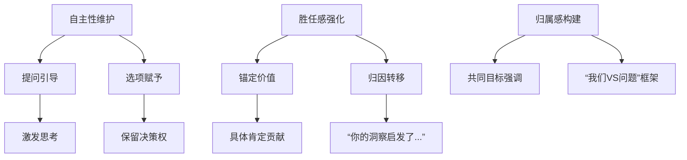
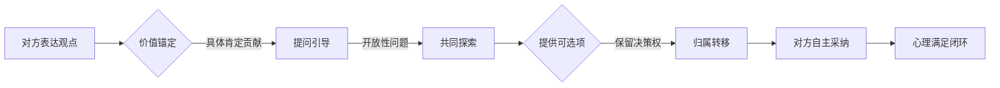

沟通策略的上层理论体系融合了心理学、行为科学和社会学等多学科原理，以下是核心理论框架的体系化总结：

---

### **一、底层理论支柱**
#### **1. 自我决定理论（Self-Determination Theory, SDT）**
- **核心主张**：人类行为受三大心理需求驱动  
  - **自主性（Autonomy）**：控制自身行为的渴望  
  - **胜任感（Competence）**：有效应对挑战的需求  
  - **归属感（Relatedness）**：与他人建立联结的愿望  
- **应用逻辑**：  
  → 沟通中侵犯自主性（如强加方案）会触发心理抗拒  
  → 通过提问赋予选择权（*“你觉得哪个路径更合适？”*）满足自主需求  

#### **2. 认知失调理论（Cognitive Dissonance Theory）**
- **核心机制**：当行为与自我认知冲突时（如“我被证明错了”），会产生心理不适并触发防御  
- **应用逻辑**：  
  → 直接否定他人逻辑会加剧失调（*“我能力不足”*的自我怀疑）  
  → 将新方案关联对方原有观点（*“这其实是您之前XX思路的延伸”*）减少认知冲突  

#### **3. 建构主义学习理论（Constructivism）**
- **核心原则**：知识在对话中共同建构，而非单向传递  
- **应用逻辑**：  
  → 用提问（*“如果加入Y因素会怎样？”*）引导对方自主发现最优解  
  → 避免成为“真理宣告者”，转为“思维协作者”  

---

### **二、方法论框架**
#### **沟通策略三维模型**

#### **四大操作法则**
| **法则**         | **理论依据**          | **实践示例**                                    |
| ---------------- | --------------------- | ----------------------------------------------- |
| **归属转移法则** | 认知失调理论          | “这个优化方案其实源于您上周提出的X想法”         |
| **脚手架法则**   | 最近发展区理论（ZPD） | 提供比对方当前认知略高一级的引导性问题          |
| **心理账户法则** | 行为经济学            | 将建议包装为“对原有方案的补充”而非“推翻”        |
| **防御卸载法则** | 心理安全机制          | 批评前先自我披露不足（*“我最初也忽略这点...”*） |

---

### **三、东西方文化适配理论**
#### **1. 西方个人主义文化**
- **侧重**：自主性强化（*独立决策权神圣不可侵犯*）  
- **策略**：  
  → 明确区分“你的领域/我的建议”  
  → 使用授权性语言（*“You own this decision”*）  

#### **2. 东亚集体主义文化**
- **侧重**：和谐与面子维护（*公开纠错=羞辱*）  
- **策略**：  
  → 采用“我们”代替“你”（*“我们可能需要考虑...”*）  
  → 私下沟通敏感纠错，公开场合强调集体智慧  

---

### **四、神经科学验证**
#### **大脑抗拒机制与破解**
| **脑区**         | 抗拒行为         | 破解方案                                       |
| ---------------- | ---------------- | ---------------------------------------------- |
| **前扣带回**     | 感知威胁时激活   | 用肯定话语降低威胁感（*“这思路很有突破性”*）   |
| **背外侧前额叶** | 被否定时触发防御 | 提供选择激活决策功能（*“A或B您更倾向哪个？”*） |
| **镜像神经元**   | 本能抵触指令语气 | 示范替代方案而非口头指正（*可视化推演过程*）   |

> **实证**：fMRI研究显示，当人自主发现答案时，纹状体（奖励中枢）活跃度比接受指令高300%

---

### **五、理论应用图谱**

---

### **终极沟通心法**
> **“让人自行摘下思想的果实，你只需悄悄摇晃树枝”**  
> - 通过**价值锚定**满足胜任感  
> - 通过**选项赋予**保障自主性  
> - 通过**归属转移**构建共同体  
> - 所有动作旨在激活对方的**自我说服机制**，而非外部灌输

这一理论体系在谷歌Project Aristotle（高绩效团队研究）及微软心理安全实践中均获验证，本质是将沟通转化为**隐形的认知引导艺术**。