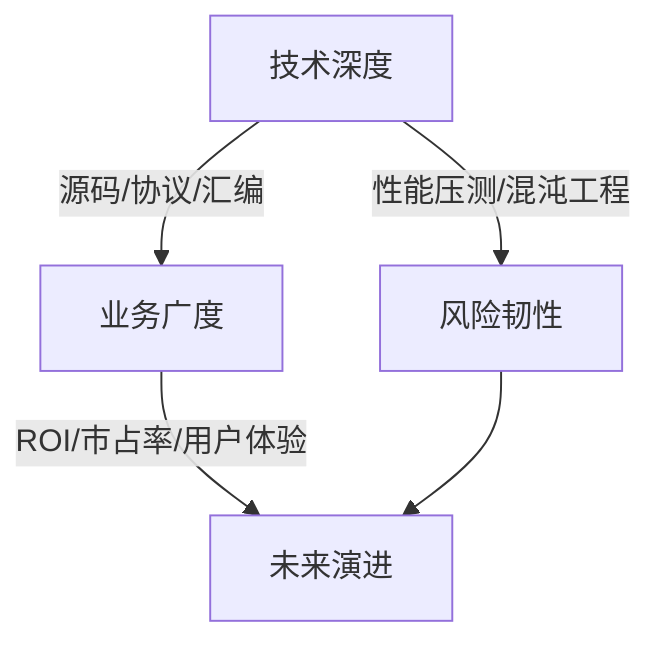

以下是**8类技术面试官的核心特征与精准应对策略**的全景总结，助您针对性破局：

---

### **面试官类型全景作战表**
| 类型                                 | 核心特征                                 | 典型问题举例                               | 应对策略                                     | 必杀金句模板                                                 |
| ------------------------------------ | ---------------------------------------- | ------------------------------------------ | -------------------------------------------- | ------------------------------------------------------------ |
| **细节深究型** (常见于测试专家)   | 追问技术实现颗粒度 要求白盒级原理解释 | “你用的哈希算法碰撞率多少？ 如何证明？” | 预埋技术钩子+分层拆解 (从API到底层字节码) | “该问题涉及三层： 1. 应用层... 2. 协议层... 3. 内核层...” |
| **价值落地型** (技术负责人)       | 聚焦商业结果转化 关注资源投入产出比   | “这个优化带来多少 GMV提升？成本多少？”  | GPDC模型应答 (目标-路径-决策-闭环)        | “投入3人月，节省运维成本42万/年， 故障率下降90%”          |
| **架构视野型** (CTO/架构师)       | 专注系统扩展性 评估技术选型哲学       | “千万QPS下当前架构 哪里会先崩？”        | 绘制分层架构图+ 引入可逆决策原则          | “遵循AWS三支柱原则： 弹性 > 效率 > 成本”                  |
| **压力测试型** (渗透测试背景)     | 制造极端故障场景 测试抗压能力         | “数据库断电后如何 保证订单零丢失？”     | 三级防御模型： 熔断→补偿→逃生             | “假设发生X灾难： 第1分钟启动...第5分钟切换...”            |
| **方法论信徒型** (咨询背景)       | 要求标准化分析框架 痴迷流程图解       | “用FMEA分析这个 接口的风险”             | 预装方法论武器库 (SWOT/5Whys/决策矩阵)    | “按RACI矩阵分工： 我负责A(执行)，架构师负责C(咨询)”       |
| **跨界整合型** (产品技术双修)     | 考察技术商业赋能 追问跨部门价值       | “这个监控系统对 销售团队有什么用？”     | 构建价值传导链： 技术指标→业务指标        | “埋点准确率提升30%→ 推荐GMV增加18%”                       |
| **文化布道者型** (工程文化倡导者) | 关注知识沉淀 警惕“独狼”倾向           | “如何让新人三天 掌握测试框架？”         | 展示协同工具链+ 设计文化符号              | “所有文档代码化， PR触发自动化知识体检”                   |
| **未来押注型** (创新实验室)       | 预测技术趋势 轻视既有经验             | “三年后手工测试 会消失吗？”             | 技术成熟度曲线分析+ 激进学习计划          | “参照Gartner曲线， 2025年将进入泡沫破裂期”                |

---

### **通杀心法：钻石应答模型** 💎
应对任意类型面试官，用**四维穿透法**组织答案：

**示例应用**（被问及自动化框架）：  
- **深度**：_“用字节码增强技术解决PageObject动态代理问题”_  
- **广度**：_“支撑售前团队POC演示，缩短签单周期40%”_  
- **风险**：_“内置熔断机制防止错误用例阻塞流水线”_  
- **未来**：_“预留AI接口适配GPT-4生成测试脚本”_  

