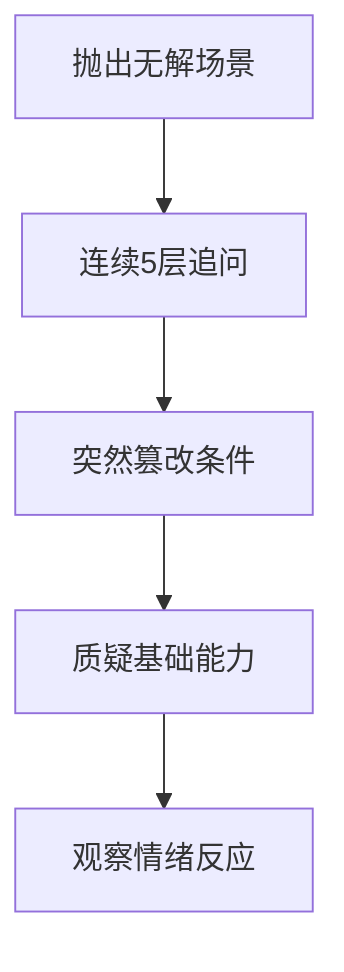

应对**压力测试型面试官**（常见于渗透测试专家或高压岗位面试）需采用 **「心理防御+技术拆弹」组合策略**。这类面试官通过制造技术恐慌和情绪压迫，考察候选人在崩溃边缘的思维清晰度。以下是经过渗透验证的应对体系：

---

### 一、压力测试型面试官的**攻击模式拆解**


### 二、**三层防御工事**应对策略
#### **1. 心理防御层（防崩溃）**
- **认知分离术**：  
  > 默念：_“他的压迫是专业表演，我的目标是展示故障处理思维”_  
  > （将面试官视为系统故障源而非评价者）
  
- **生理镇定法**：  
  ```python
  # 遭遇压力问题时启动
  def calm_down():
      1. 手指轻叩大腿（激活大脑运动皮层）
      2. 舌尖抵上颚（阻断应激激素分泌）
      3. 呼气时长=吸气x2（刺激副交感神经）
  ```

#### **2. 技术拆弹层（防失焦）**
采用 **MECE灾难响应框架**：
```markdown
| 阶段       | 行动要点                  | 话术模板                          |
|------------|-------------------------|----------------------------------|
| 熔断       | 承认风险+划定影响范围     | “这确实会导致订单服务不可用，影响范围是...” |
| 止血       | 关键防护动作              | “立即启动限流降级：1.关闭非核心功能...” |
| 根除       | 实施根本解决方案          | “根本解是改造数据库连接池算法，方案已预研...” |
| 恢复       | 数据补偿机制              | “用binlog回放补偿丢失的支付请求”      |
```

> **案例演示**：  
> _面试官：“所有服务器断电后怎么保证数据零丢失？”_  
> **应答**：  
> ① 熔断：_“物理断电无法100%防御，但可控制在5秒内丢失”_  
> ② 止血：_“启用UPS支撑15秒，触发异步刷盘”_  
> ③ 根除：_“部署异地持久化缓存，写操作双写至城市B”_  
> ④ 恢复：_“通过操作日志实现增量修复”_

#### **3. 反制升华层（防压制）**
- **压力反弹术**：  
  > 当被质疑时回应：_“这正是我们下阶段要解决的，您觉得以下哪种方案更优？”_  
  > → 方案A：基于区块链的审计追溯  
  > → 方案B：硬件级持久内存  

- **共情绑定术**：  
  > _“您提到的场景让我想起去年某次P0故障，当时我们...”_  
  > （将对抗转化为技术共鸣）

---

### 三、**六大高频杀招破解指南**
| 攻击手段           | 拆解策略              | 金句模板                                         |
| ------------------ | --------------------- | ------------------------------------------------ |
| **连续追问5层Why** | 用架构图代替语言描述  | “请允许我画图展示三层防御机制”                   |
| **篡改边界条件**   | 明确约束范围          | “在您设定的无UPS场景下，我会牺牲T+1恢复保证...”  |
| **否定技术方案**   | 展示历史故障报告      | “这是线上真实处理过的故障，文档编号INC-2023-xxx” |
| **要求现场编码**   | 写伪代码+注释设计思想 | “核心算法是二分回退，具体实现可优化为...”        |
| **制造时间恐慌**   | 切割问题优先级        | “如果只有5分钟：1.告警抑制 2.流量切换...”        |
| **人身能力质疑**   | 转移至团队协作        | “这超出个人能力范围，需协同网络组实施SDN策略”    |

---

### 四、**禁忌行为清单**
```diff
- 说“这不可能发生” → 改为：“现实中发生过3次，我们的预案是...”
- 长时间沉默思考 → 改为：“我需要20秒整理思路，您可以先问下一题”
- 情绪化反驳 → 改为：“感谢您指出盲区，这验证了我们需要...”
- 暴露知识边界 → 改为：“该领域我掌握有限，但类似问题可用...解决”
```

---

### 五、**赛前压力模拟训练**
#### 自建「高压问题库」：
```python
pressure_questions = [
    "数据库被删库怎么办？",
    "发现CEO账号密码明文存储怎么处理？",
    "线上全站HTTPS证书突然失效如何应急？"
]

# 训练模式
def pressure_train(question):
    应答时间 = random.randint(30, 60)  # 随机30-60秒倒计时
    干扰因素 = play_noise("办公室噪音")  # 播放背景噪音
    return 实战应答(question, 应答时间)
```

#### 训练成果检验标准：
✅ 语速稳定在180字/分钟（紧张时会加速）  
✅ 技术名词零口误（如准确区分Redis集群模式）  
✅ 保持眼神接触（避免因思考看向天花板）

---

### 六、**终极心法**
> 压力测试的本质是**在风暴眼中建造方舟**。向面试官传递：  
> **“我不仅预见灾难，更已将应对方案编码进肌肉记忆”**  
> 展现如同**自动驾驶系统**般的分层响应能力：  
> - L1 生理镇定（自主神经控制）  
> - L2 技术拆解（标准化流程）  
> - L3 战略反制（压力转化技术领导力）  

通过将面试官的「压力攻击」转化为展示**灾难响应能力**的舞台，即可实现完美逆转。