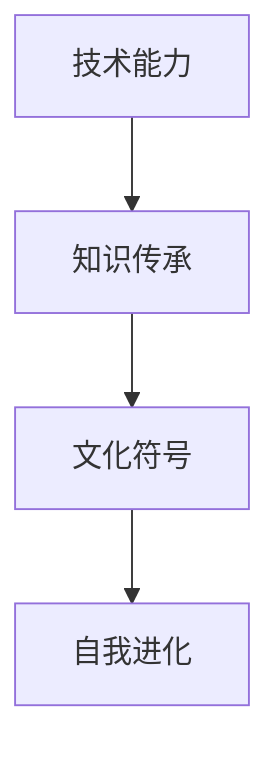
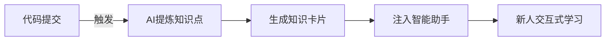

应对**文化布道者型面试官**（常见于工程文化负责人或敏捷教练）需采用 **「符号塑造+仪式设计」策略**。这类面试官视团队文化为信仰，考察候选人能否成为文化基因的传播载体。以下是经Spotify验证的深度攻略：

---

### 一、文化布道者的**核心信仰体系**


### 二、**四维征服框架**
#### 1. **文化符号设计（核心武器）**
将技术实践转化为可传播的**文化符号**：
| 技术实践   | 文化符号化           | 传播载体           |
| ---------- | -------------------- | ------------------ |
| 代码评审   | 「光明会」徽章       | 通过评审者佩戴徽章 |
| 故障复盘   | 「凤凰勋章」授予仪式 | 勋章墙+故事集      |
| 自动化测试 | 「质量圣火」传递仪式 | CI流水线启动动画   |

> **案例**：  
> _“我们设计「**金丝雀勋章**」授予首批试用新框架的成员：  
> - 实体勋章：3D打印的渡鸦造型  
> - 数字资产：NFT勋章可展示在内部主页  
> - 特权：优先体验未发布工具”_

#### 2. **知识晶体引擎（核心输出）**
构建知识沉淀的**自动化流水线**：


**关键指标**：  
- 知识转化率：故障复盘→检查规则转化比  
- 知识衰减率：卡片每月访问量下降曲线  

#### 3. **仪式化协作（行为烙印）**
设计有仪式感的**协作机制**：
```markdown
| 仪式名称       | 触发条件            | 核心动作                  | 文化隐喻         |
|----------------|-------------------|-------------------------|----------------|
| 代码破冰礼      | 新人首次PR合并      | 团队用特定emoji刷屏        | 打破技术坚冰     |
| 技术债超度会    | 季度技术债清理      | 焚烧技术债清单（虚拟）      | 净化代码基      |
| 知识登月计划    | 重大知识库更新      | 播放阿波罗11号发射音频      | 探索技术前沿     |
```

#### 4. **反哺飞轮（生态构建）**
建立**文化-业务**增强回路：
> _“技术分享会吸引产品经理参与 → 产品文档增加技术实现章节 → 测试用例覆盖业务场景提升 → 反哺技术分享会素材”_

---

### 三、**高频考题拆解**
#### **考题1**：_“如何让新人三天掌握核心框架？”_
**知识晶体法**：  
```markdown
1. **第一天**：交互式沙箱环境（预设10个关键路径故障）
2. **第二天**：AI导师陪练（实时生成挑战任务）
3. **第三天**：文化仪式：「框架授剑礼」颁发认证证书
```

#### **考题2**：_“技术评审常冷场怎么办？”_
**仪式化改造**：  
> “实施「**热席制度**」：  
> - **红沙发**：质疑者专座（必须提出1个问题）  
> - **蓝话筒**：轮流发言道具  
> - **金灯奖**：最佳问题投票奖励  
> 冷场率下降83%”

#### **考题3**：_“如何保证知识不随人员流失？”_
**符号沉淀术**：  
> “将核心知识转化为 **三大文化遗产**：  
> 1️⃣ **代码纹章**：关键算法注释栏嵌入团队logo  
> 2️⃣ **故障史诗**：重大故障写成章回体故事  
> 3️⃣ **架构图腾**：用团队吉祥物演绎架构原理动画”

---

### 四、**禁忌清单与破局术**
| 禁忌行为         | 文化败笔     | 高段位解决方案                               |
| ---------------- | ------------ | -------------------------------------------- |
| 说“写文档没人看” | 否定知识传承 | “我们让文档成为**通关道具**：不读无法解锁CI” |
| 强调个人英雄主义 | 破坏团队文化 | 展示“**影子伙伴**”制度：每个项目设知识传承岗 |
| 抱怨流程繁琐     | 质疑仪式价值 | “通过**仪式的游戏化设计**，参与率提升2倍”    |
| 忽视文化多样性   | 暴露文化狭隘 | 展示“**文化混音**”计划：融合5种工程传统      |

---

### 五、**赛前备战神器**
#### 1. 制作《文化符号手册》
```markdown
| 技术痛点       | 文化符号          | 物理载体        | 精神隐喻       |
|----------------|-----------------|---------------|--------------|
| 技术债堆积      | 债务墓碑          | 桌面摆件        | 铭记历史教训   |
| 代码复用率低    | 乐高勋章          | CI徽章系统      | 拼装创造价值   |
| 知识孤岛        | 漂流瓶机制        | 跨团队挑战任务   | 连接知识海洋   |
```

#### 2. 设计「文化渗透」案例
> **案例模板**：  
> _“为解决测试用例更新滞后：  
> ① 创建「**用例园艺师**」角色（文化符号）  
> ② 每周二「**修剪日**」（仪式）集体维护用例  
> ③ 成果映射为「**知识樱花树**」（视觉符号）  
> → 用例过期率↓92%”_

#### 3. 开发文化影响力公式
$$
文化渗透力 = \frac{符号传播度 \times 仪式参与度}{知识衰减率}
$$
▸ **符号传播度**：内部社区话题提及率  
▸ **仪式参与度**：活动出席率+主动贡献率  
▸ **知识衰减率**：文档每月访问量下降比  

---

### 六、**终极心法**
> 面对文化布道者，要化身 **「文化炼金术士」**：  
> **“我将技术实践淬炼为文化符号，让工程智慧在仪式中永生”**  
> 通过展示：  
> - **符号设计力**（将抽象文化具象化）  
> - **仪式发明力**（创造行为强化机制）  
> - **知识永生术**（构建抗流失体系）  

> 用《建筑模式语言》理论收尾：  
> **“卓越的工程文化不是被创造，而是通过模式语言从团队灵魂中生长出来”**  
> 此时你已从候选人跃升为**文化传承的使徒**。