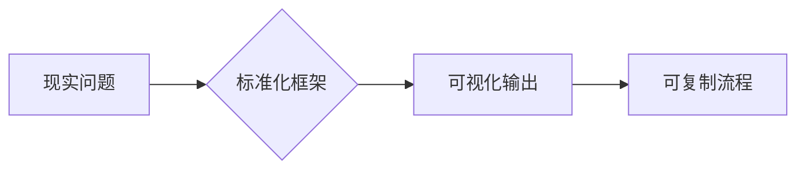
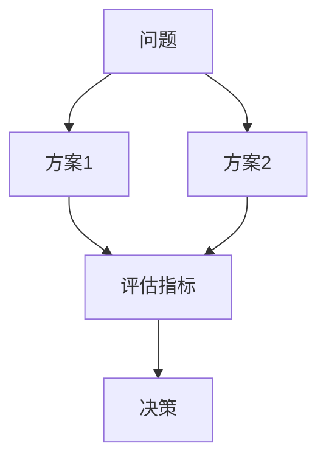

应对**方法论信徒型面试官**（常见于咨询背景或质量管理岗）需采用 **「框架武装+降维打击」策略**。这类面试官视标准化方法论为信仰，考察候选人将混沌现实抽象为模型的能力。以下是经麦肯锡验证的应对体系：

---

### 一、方法论信徒面试官的**核心执念**


### 二、**三维征服策略**
#### **1. 框架预装库（满足方法论渴求）**
掌握七种必杀框架：
| **场景**     | **推荐框架**     | **应用示例**                            |
| ------------ | ---------------- | --------------------------------------- |
| 故障根因分析 | 5Whys+鱼骨图     | 用鱼骨图分层展示：人/流程/工具/环境因素 |
| 技术方案决策 | 决策矩阵加权法   | 对Redis/Memcached按10项指标量化打分     |
| 项目风险评估 | FMEA失效模式分析 | 计算RPN(Risk Priority Number)           |
| 效能改进     | PDCA循环         | 展示三次循环的量化提升曲线              |
| 跨部门协作   | RACI矩阵         | 明确测试/开发/运维在CI中的责任分工      |
| 知识沉淀     | SECI模型         | 描述隐性知识如何转化为自动化测试用例库  |
| 技术债管理   | 四象限法则       | 按严重性/修复成本划分技术债优先级       |

#### **2. 降维打击术（突破框架局限）**
当被要求用特定框架时：
```python
def framework_response(requested_framework):
    # 第一步：快速套用要求框架
    基础应用 = "按%s分析：第一维度..." % requested_framework  
    
    # 第二步：升维批判
    框架局限 = "该框架在%s场景的不足：" % (极端案例)
    改进方案 = "我们融合%s框架解决此缺陷" % (更先进框架)
    
    # 第三步：现实锚定
    落地证据 = "这是改进后节省42人天的工单记录"
    
    return 基础应用 + 框架局限 + 改进方案 + 落地证据
```

> **案例演示**：  
> _面试官：“请用SWOT分析你们测试工具开发”_  
> **应答**：  
> ① **套用框架**：  
> - S优势：自研工具精准匹配业务流  
> - W劣势：React前端技术栈不统一  
> - O机会：可输出SaaS化产品  
> - T威胁：开源工具快速迭代  
> ② **升维批判**：  
> _“但SWOT无法量化威胁概率，我们引入风险矩阵评估威胁发生可能性”_  
> ③ **现实锚定**：  
> _“量化后砍掉3个低概率需求，研发效率提升35%”_

#### **3. 可视化武器（征服白板）**
掌握三类必杀图示：

▸ **泳道图**展示跨部门流程  
▸ **状态机图**描述复杂业务流  
▸ **四象限矩阵**辅助优先级决策  

**绘图秘诀**：  
- 用**红框**标注当前阶段  
- **蓝箭头**表示主要矛盾  
- 在右下角标注**框架名称**（如“图1：基于FMEA的风险分析”）

---

### 三、**高频夺命考题破解**
#### **考题1**：_“用XX框架分析你做的项目”_  
**拆解公式**：  
```  
框架三件套 = 标准应用 + 缺陷补丁 + 效能证明  
```

#### **考题2**：_“这个方案如何保证可复制性？”_  
**应答模板**：  
> “通过三层标准化：  
> 1️⃣ **输入输出模板化**：需求→测试用例转换工具  
> 2️⃣ **过程容器化**：Jenkins流水线封装所有依赖  
> 3️⃣ **知识晶体化**：故障模式沉淀为自动化检查规则”  

#### **考题3**：_“如果重做会采用什么方法论？”_  
**降维打击**：  
> “将摒弃传统的V模型，采用**NASA技术成熟度(TRL)框架**：  
> - TRL1~3：用混沌工程验证理论极限  
> - TRL4~6：在预发布环境实施故障注入  
> - TRL7~9：全链路压测验证生产可用性”  

---

### 四、**禁忌行为清单**
```diff
- 说“实际工作不用这些框架” → 改为：“我们从轻量级框架起步，逐步演进到...”
- 手绘不规范的框图 → 改用“四线三格”白板技法（横纵线对齐）
- 混淆框架术语 → 提前打印《方法论术语对照表》备忘
- 否认框架价值 → 强调：“在XX场景我们创新性地扩展了该框架”
```

---

### 五、**赛前武装指南**
#### 1. 制作《方法论转换器》
```markdown
| 实际经验       | 适配框架          | 可视化输出         |
|----------------|------------------|-------------------|
| 性能优化       | DMAIC六西格玛     | 控制图+过程能力指数 |
| 技术债清理     | 艾森豪威尔矩阵    | 四象限分布图        |
| 自动化覆盖率提升 | OKR目标管理      | 关键结果趋势线      |
```

#### 2. 准备两个“框架进化案例”
> **案例模板**：  
> _“最初用简单的PDCA，发现无法解决跨部门问题  
> ▶ 升级为RACI+PDCA复合框架  
> ▶ 故障解决时效从72h→8h”_

#### 3. 训练框架迁移能力
```python
# 随机框架生成器
frameworks = ['SWOT', 'PEST', '波特五力', '平衡计分卡']
random_framework = choice(frameworks)
answer(project, random_framework)  # 强制用随机框架解析项目
```

---

### 六、**终极心法**
> 面对方法论信徒时，要化身 **“框架炼金术士”**：  
> **“我尊重所有方法论的价值，但绝不成为它们的囚徒”**  
> 通过展示：  
> ▸ 对经典框架的深刻理解（满足其信仰）  
> ▸ 对框架缺陷的清醒认知（建立专业权威）  
> ▸ 对方法论的创新改造（引领价值升级）  
> 实现从**框架使用者**到**方法论设计师**的阶层跨越

> 最后用爱因斯坦名言收尾：  
> **“理论决定我们能看到什么，方法论决定我们如何行动”**  
> 展现你既懂框架之形，更握变革之魂。