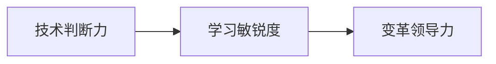
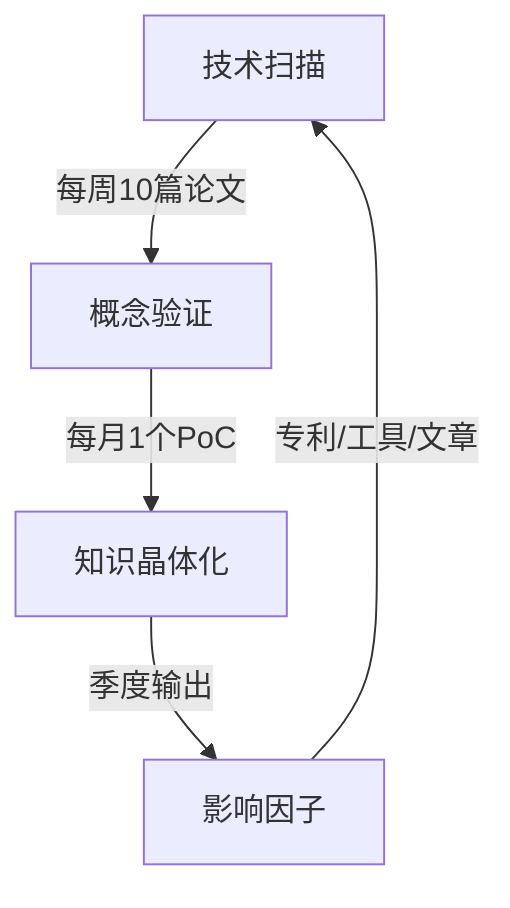

应对**未来押注型面试官**（常见于CTO/创新实验室负责人）需采用 **「技术预言+学习引擎」策略**。这类面试官考察的是对技术浪潮的预判能力和持续进化基因，以下是经Gartner验证的深度攻略：

---

### 一、未来押注型面试官的**三大思维范式


### 二、**四维征服框架**
#### 1. **技术罗盘（精准预言）**
构建技术趋势预测模型：
```markdown
| 技术领域       | 当前状态          | 3年预测           | 落地押注点        | 风险对冲策略      |
|----------------|-----------------|------------------|-----------------|-----------------|
| AI测试         | 脚本生成          | 自主探索性测试      | 强化学习环境构建   | 保留人工审查层    |
| 云原生质量     | 混沌工程          | 故障AI免疫系统     | eBPF实时追踪      | 虚拟机冷备方案    |
| 量子计算测试   | 模拟器验证         | 真实量子纠错测试    | 量子噪声建模       | 经典算法降级通路  |
```

> **话术模板**：  
> _“我押注**AI自主测试**将颠覆传统：  
> - 2025年：50%基础用例由AI生成  
> - 2027年：出现首款通过Turing测试的测试AI  
> 我们的行动：将测试资产转化为RLHF训练数据集”_

#### 2. **学习引擎（进化证明）**
展示可量化的学习进化系统：

**核心指标**：  
- **学习密度**：每周有效学习时长/技术产出比  
- **知识半衰期**：技能过期的应对速度（如：3个月掌握eBPF）

#### 3. **未来回溯法（决策框架）**
用未来视角倒推现在决策：
> _“假设2030年量子计算普及：  
> ① 现在需建立量子算法测试套件（2024）  
> ② 2026年培养量子测试工程师  
> ③ 2028年重构测试理论体系  
> 当前行动：在常规测试中加入量子噪声模拟模块”_

#### 4. **风险对冲组合（现实锚定）**
创新押注的避险策略：
```markdown
| 激进创新       | 稳健保底方案       | 对冲比例 |
|----------------|------------------|---------|
| 全栈无头测试    | 保留Selenium兼容层 | 7:3     |
| 生产环境混沌测试 | 强化预发布沙箱     | 6:4     |
| GPT-5测试设计   | 人工用例评审流     | 5:5     |
```

---

### 三、**高频考题拆解**
#### **考题1**：_“三年后手工测试会消失吗？”_
**分层应答术**：  
```markdown
1. **消亡论**：”基础校验类消失（占比60%）“
2. **进化论**：”探索性测试进化为AI训练师（30%）“
3. **永生论**：”高端领域崛起：量子/神经接口测试（10%）“
```

#### **考题2**：_“你会如何学习未知技术？”_
**学习引擎展示**：  
> “我的**三脉冲学习法**：  
> - **脉冲1（首周）**：完成3个官方Tutorial+输出对比矩阵  
> - **脉冲2（首月）**：用该技术改造既有项目组件  
> - **脉冲3（季度）**：撰写反模式警告清单（含陷阱案例）  
> 例如掌握eBPF时发现：环形缓冲区丢包率>5%需调整采样策略”

#### **考题3**：_“该押注Web3还是AI测试？”_
**技术罗盘决策**：  
> “根据**技术成熟度曲线**：  
> - Web3测试：处于泡沫破裂期（风险高但先发优势大）  
> - AI测试：处于稳步爬升期（生态较成熟）  
> **我的组合**：  
> 70%资源投入AI测试工具链（快速见效）  
> 30%探索Web3智能合约模糊测试（战略卡位）”

---

### 四、**禁忌清单与破局术**
| 禁忌行为           | 未来视野缺陷 | 高段位解决方案                         |
| ------------------ | ------------ | -------------------------------------- |
| 否定颠覆性技术     | 暴露思维固化 | ”该技术需跨越死亡之谷，我们正在...“    |
| 空谈趋势无落地计划 | 缺乏执行力   | 展示**技术落地金字塔**（附时间表）     |
| 忽视技术伦理       | 责任意识薄弱 | 提出”伦理熔断机制“（如AI测试偏见监控） |
| 学习计划模糊       | 进化能力存疑 | 量化学习KPI：”每月产出1个可复现PoC“    |

---

### 五、**赛前备战神器**
#### 1. 制作《技术押注宣言》
```markdown
| 技术方向       | 押注依据                     | 行动清单                  | 退出信号            |
|----------------|----------------------------|-------------------------|-------------------|
| 混沌工程2.0    | 云原生故障复杂度每年+200%     | 构建故障知识图谱          | 主要云厂商内置等效功能 |
| 测试数字孪生   | 数字孪生市场年增35%          | 开发轻量级IoT设备仿真器    | 芯片算力成本未如期下降 |
```

#### 2. 设计「未来-现在」转化器
```python
def future_cast(year, tech_scene):
    """将未来场景拆解为当前行动"""
    actions = {
        2025: "招聘量子测试研究员",
        2026: "重构测试框架接口层",
        2027: "建立神经接口测试实验室"
    }
    return f"{year}年实现{tech_scene}需：\n" + "\n".join([f"- {v} ({k})" for k,v in actions.items() if k <= year])
 
print(future_cast(2027, "全感官VR测试"))
```

#### 3. 构建技术雷达图
```mermaid
radarChart
    title 技术押注评估
    axis 技术成熟度，商业价值，学习曲线，团队适配，风险指数
    “AI测试” [7, 9, 6, 8, 4]
    “量子测试” [3, 10, 2, 4, 9]
    “元宇宙测试” [5, 7, 7, 6, 6]
```

---

### 六、**终极心法**
> 面对未来押注者，要化身 **「技术先知」**：  
> **“我不仅看见浪潮，更在铸造冲浪板”**  
> 通过展示：  
> - **技术罗盘**（用数据支撑预判）  
> - **学习引擎**（可量化的进化能力）  
> - **对冲智慧**（激进与稳健的平衡术）  

> 用《技术奇点》理论收尾：  
> **“真正的未来属于那些把望远镜当作脚手架的人”**  
> 此时你已从候选人升维为**变革领航者**。

> **制胜话术**：  
> *“我的核心竞争力不是知道未来，而是构建了**自适应未来操作系统**：  
> 输入：技术信号 → 处理：学习引擎 → 输出：押注组合”*