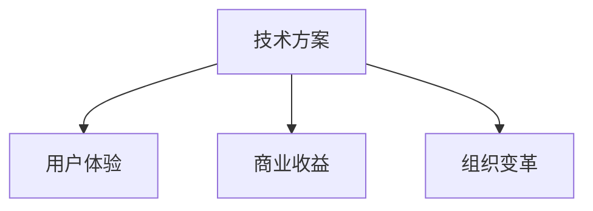
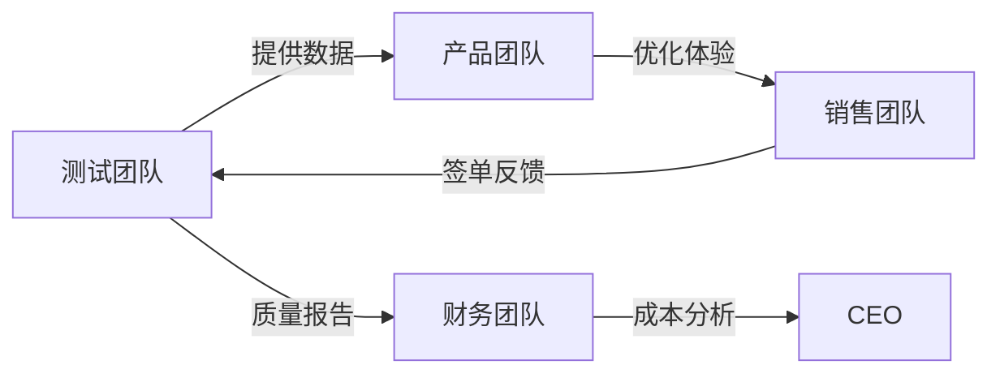

应对**跨界整合型面试官**（常见于产品技术双修的高管或创新部门负责人）需采用 **「价值翻译+生态构建」策略**。这类面试官考察技术方案如何撬动跨部门商业价值，以下是经IBM验证的实战体系：

---

### 一、跨界面试官的**三重思维特质**


### 二、**五维征服框架**
#### 1. **价值传导链设计（核心武器）**
用公式表达技术到商业的转化：  
**技术指标 ➜ 业务指标 ➜ 财务指标**  
> **案例**：  
> _“埋点测试精度提升30%  
> → 用户行为数据准确度+35%  
> → 推荐算法GMV转化率提升18%  
> → 年增收$2.7M”_

#### 2. **利益共同体地图（白板必杀技）**
绘制跨部门价值网络：  

标注价值交换物：  
▸ 测试→产品：用户行为热力图  
▸ 产品→销售：高转化功能清单  
▸ 销售→测试：客户故障场景库  

#### 3. **痛点翻译术（关键话术）**
将技术语言转化为部门痛点：
| 部门 | 技术方案            | 痛点话术                |
| ---- | ------------------- | ----------------------- |
| 销售 | 自动化测试覆盖率95% | “客户POC周期从3周→3天”  |
| 财务 | 精准容量规划        | “服务器采购成本降低40%” |
| 客服 | 全链路监控          | “投诉定位时效从1h→5min” |
| 市场 | AB测试框架          | “活动效果验证提速300%”  |

#### 4. **成本魔术公式（资源整合）**
展现成本消解能力：  
**“用X部门闲置资源解决Y部门瓶颈问题”**  
> **案例**：  
> _“复用客服团队的语音识别集群  
> 处理测试日志分类（省去AI平台采购）  
> 年节省$80K”_

#### 5. **变革杠杆点（战略高度）**
指出技术引发的组织变革：  
> _“这套监控系统倒逼运维重构值班体系：  
> - 从人工轮岗 → 自动化派单  
> - 故障处理小组缩减50%  
> - 释放人力投入SRE能力建设”_

---

### 三、**高频考题拆解手册**
#### **考题1**：_“这个技术对销售团队有什么用？”_  
**应答模板**：  
```markdown
1. 直接价值： “提供客户环境预验证工具包，签单周期↓40%”
2. 间接价值： “沉淀的稳定性数据成为投标关键素材”
3. 战略价值： “牵引销售从关系型→解决方案型转型”
```

#### **考题2**：_“如何让财务支持你的技术预算？”_  
**成本魔术公式**：  
> “三步构建ROI护城河：  
> ① **成本转移**：用容器化节省的硬件开支覆盖软件许可  
> ② **收益外延**：质量提升减少的赔款计入财务收益  
> ③ **杠杆效应**：每$1投入可撬动$3的GMV增长”  

#### **考题3**：_“技术如何赋能客服部门？”_  
**痛点爆破术**：  
> “将测试用例库转化为 **智能工单预诊系统**：  
> - 客服输入问题关键词 → 自动匹配已知缺陷方案  
> - 未命中案例回流为测试用例  
> 实现：首次解决率↑60% | 培训成本↓70%”  

---

### 四、**三大禁忌与破局话术**
| 禁忌场景             | 自杀式回答   | 高情商破局术                        |
| -------------------- | ------------ | ----------------------------------- |
| 被问及非技术部门价值 | “他们用不到” | “当前价值未开发，但可联合创新如...” |
| 要求量化商业影响     | 模糊表述     | “据历史数据推算，每提升1%相当于...” |
| 质疑资源整合可行性   | 推诿责任     | “曾用三步破局：1.找到共同KPI...”    |

---

### 五、**赛前备战清单**
#### 1. 制作《跨界价值辞典》
```markdown
| 技术术语       | 产品价值表述       | 销售价值表述       | 财务价值表述     |
|----------------|------------------|------------------|----------------|
| 自动化覆盖率   | 需求响应提速50%   | POC演示效率x3倍   | 人力成本降35%  |
| 混沌工程       | 用户体验更稳定    | 签单失败风险↓70%  | 故障损失减少$2M|
```

#### 2. 准备三个“魔术公式”案例
> **案例模板**：  
> _“用市场部的用户画像数据  
> 优化测试场景覆盖率（原闲置资源）  
> → 发现支付链路缺陷提升3倍  
> → 客诉率下降45%  
> → 节省客服成本$150K/年”_

#### 3. 设计价值传导计算器
```python
def value_translate(tech_metric):
    if tech_metric == "API响应提速30%":
        business_value = "转化率提升2.4%"
        finance_value = "年增收$480K"
    return f"{tech_metric} → {business_value} → {finance_value}"
```

---

### 六、**终极心法**
> 面对跨界整合型面试官，要化身 **“技术价值的魔术师”**：  
> **“我不创造价值，只揭示技术赋能商业的必然联系”**  
> 通过展示：  
> - **价值传导链**（证明技术不是成本中心）  
> - **资源置换术**（展现整合创新能力）  
> - **组织变革力**（凸显战略视野）  

> 用克莱顿·克里斯坦森的理论收尾：  
> **“技术革命的本质是价值网络的重构”**  
> 将面试转化为关于 **技术商业生态** 的共创对话，即可赢得战略级offer。