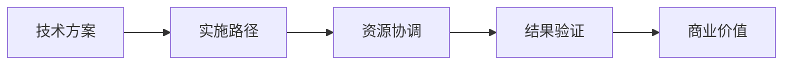

面对深度追问项目落地价值和实施细节的男性面试官（通常是技术负责人或产品总监角色），这类面试官的核心关注点是 **“技术如何转化为业务成果”**。以下是针对性的应对策略体系：

---

### 一、面试官的典型思维模式


**特征标签**：
- **结果导向**：要求量化每个决策的产出（如“优化后订单转化率提升%？”）
- **过程洁癖**：关注实施中的关键障碍突破（如“如何说服技术债高的团队重构？”）
- **成本敏感**：隐含评估你的ROI意识（如“为什么选成本高但扩展性好的方案？”）

---

### 二、结构化应答框架（GPDC模型）
#### **黄金话术模板**：
> “**目标**(Goal)是解决__问题，**路径**(Path)上遇到__挑战，**决策**(Decision)选择__方案，最终**闭环**(Close)实现__可验证价值”

#### **案例拆解**：
| 层级         | 应答要点       | 案例填充（电商搜索优化项目）                                 |
| ------------ | -------------- | ------------------------------------------------------------ |
| **Goal**     | 锚定业务痛点   | “解决大促期间搜索转化率下跌12%的问题”                        |
| **Path**     | 暴露真实阻碍   | “发现ES集群在100QPS时latency飙升至2s”                        |
| **Decision** | 突出权衡逻辑   | “放弃扩容，选择**异步分词+缓存预热**方案”<br>√ 成本低30% √ 无需停机 |
| **Close**    | 用数据闭环验证 | “上线后99分位延迟降至200ms，转化率回升**+9.7%**”             |

---

### 三、应对深度追问的三大策略
#### 1. **价值穿透法**
当被问“这个项目的意义是什么？”时：
```diff
- 普通回答： “提升了系统稳定性”
+ 价值穿透： “故障频次从月均3.2次降为0次，相当于**年节省运维人力成本37人天**”
```

#### 2. **过程透明化**
针对“具体怎么做？”的追问：
- 展示关键节点工具链：
  ```mermaid
  graph TB
    A[需求分析] -->|Swagger+流量录制| B[用例设计]
    B -->|Pytest参数化| C[自动化执行]
    C -->|Allure+Prometheus| D[效能分析]
  ```
- 暴露失败案例： _“初版方案因未模拟支付回调超时，导致漏测15%的异常路径”_

#### 3. **资源博弈术**
回应“如何协调冲突？”类问题：
> “当产品要求压缩测试周期时：  
> 1️⃣ **数据对抗**：展示历史BUG分布图（证明压缩周期会漏测高危模块）  
> 2️⃣ **技术置换**：用容器化并行测试换取时间（节省40%时长）  
> 3️⃣ **风险转移**：签订免责测试范围清单（核心支付链路全覆盖）”

---

### 四、高频致命问题破解
#### **问题1**：_“如果现在重做这个项目，你会改进什么？”_
**应答公式**：  
`技术债升级点 + 效能工具链优化 + 价值杠杆放大`  
> _“会引入**契约测试**解决接口频繁变更问题，同时用**AI生成测试数据**替代手工构造，预计能使回归效率再提升50%，多释放的资源可投入安全测试，预防OWASP漏洞导致的数据泄露风险（据Gartner统计平均损失$420万）”_

#### **问题2**：_“如何证明不是其他因素导致你提到的提升？”_
**破解步骤**：  
1. 隔离变量：_“在AB测试集群部署相同流量”_  
2. 反事实论证：_“对比组未改造的系统转化率仅+0.3%”_  
3. 归因工具：_“用Jaeger追踪显示搜索链路耗时下降贡献了87%的收益”_

---

### 五、禁忌红线清单
| 错误类型 | 改进方案                                                     |
| -------- | ------------------------------------------------------------ |
| 模糊归因 | “通过**多元回归分析**确定主因是缓存命中率”                   |
| 忽视成本 | “方案选择基于**TCO模型**，三年综合成本最低”                  |
| 虚构成果 | 展示监控系统截图（Grafana看板打水印）                        |
| 回避失败 | 用“**失败晶体化**”话术：<br>_“这次教训沉淀为测试用例库的异常场景校验规则”_ |

---

### 六、高阶备战策略
1. **制作价值证据包**：
   - 技术价值：性能压测报告（JMeter+Prometheus）
   - 业务价值：转化率看板（Tableau/GA截图）
   - 财务价值：成本节约计算表（Excel公式透明）

2. **设计反问陷阱**：
   > _“您团队现在最头痛的质量问题是什么？”_  
   > → 将答案反向匹配自己的经验库  
   > → 回应：_“我们曾用XX方法解决类似问题，可复用到贵司场景”_

3. **模拟压力测试**：
   ```python
   # 自测问题生成器
   questions = [
     "哪个环节产生了80%的价值？", 
     "如果预算砍半会牺牲什么？",
     "怎么证明不是运维的功劳？"
   ]
   for q in questions:
       answer(q, timeout=60)  # 强制1分钟应答
   ```

> **终极心法**：这类面试官在考察 **“技术商业化的能力”**。每个回答需传递：  
> **“我不仅会做事，更清楚为什么做这件事能赚钱”**  
> 展示从 **技术执行者 → 价值创造者** 的思维跃迁，才是破局关键。