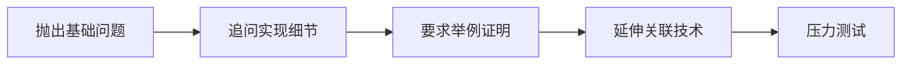

这类倾向于深度追问细节的女性面试官（在测试岗位中较为常见），通常具有以下典型特征及应对策略：

---

### **一、面试官核心特征分析**
#### **1. 思维模式特质**
- **细节强迫症**  
  关注技术实现的颗粒度（如：`“你提到的数据清洗，具体如何处理日期格式的边界值？”`）
- **逻辑链验证**  
  要求解释每一步的因果关系（如：`“为什么选Selenium而不选Cypress？请对比底层通信协议差异”`）
- **反常识挑战**  
  故意质疑常识性结论（如：`“你说Redis快是因为内存操作，那为什么Memcached更快？”`）

#### **2. 行为模式规律**


#### **3. 深层考察目标**
- **知识网状结构**：测试知识体系的完整性（如从API测试延伸到OAuth2.0签名机制）
- **故障推演能力**：对异常场景的预见性（如：`“这个自动化脚本在DNS污染环境下会怎样崩溃？”`）
- **认知方法论**：解决问题的思维框架（如：是否优先使用二分法定位缺陷）

---

### **二、针对性应对策略（技术向）**
#### **1. 结构化应答法（STAR-X 模型）**
```markdown
| 层级   | 要点                  | 案例                          |
|--------|-----------------------|-------------------------------|
| S      | 场景复杂点            | “在电商618大促压测中...”      |
| T      | 技术难点              | “需要模拟80%读20%写混合流量”  |
| A      | **关键细节** ← 重点   | “用GoReplay切分流量时发现...” |
| R      | 量化结果              | “错误率从4.3%降至0.2%”        |
| X      | 延伸思考              | “如果改用eBPF可减少30%损耗”   |
```

#### **2. 技术深挖防御策略**
- **预埋钩子法**  
  在回答中故意预留技术钩子：  
  > _“当时用Jmeter实现分布式压测，不过后来发现**Worker节点时钟偏移**会导致...”_  
  > （诱导追问你准备好的技术点）

- **元认知反击**  
  当被问倒时展示思维过程：  
  > _“这个问题我暂时没有实践过，但根据TCP重传机制推演，应该需要...”_

#### **3. 压力测试破解技巧**
| 压迫手段       | 破解方案                      |
| -------------- | ----------------------------- |
| 连续追问5层Why | 用“技术栈分层图”可视化解释    |
| 质疑项目价值   | 展示监控数据对比（如P99延迟） |
| 要求白板推导   | 边画架构图边解释关键路径      |

---

### **三、特殊场景处理指南**
#### **1. 遇到知识盲区时**
```python
# 错误示范
"这个我没学过"

# 正确方案
def answer_unknown(question):
    关联知识 = find_related_knowledge(question)  # 关联已知技术
    方法论 = "根据我在XX项目的经验，这类问题通常需要..." 
    行动方案 = "如果现在遇到，我会先检查Y指标再分析Z日志"
    return 方法论 + 行动方案
```

#### **2. 应对挑衅式提问**
> 面试官：_“你觉得这个方案很完美？难道没想过会引发内存泄漏吗？”_  
> **应答模板**：  
> 1️⃣ **共情**：_“您指出的风险非常专业”_  
> 2️⃣ **技术拆解**：_“在v1.0确实存在此问题，我们通过...”_  
> 3️⃣ **升华**：_“这提醒我设计时应该增加静态分析环节”_

---

### **四、核心禁忌清单**
- 🚫 使用模糊词汇：_“大概”、“可能”、“理论上”_  
- 🚫 暴露知识边界：_“这部分是同事做的”_  
- 🚫 对抗性质疑：_“您这问题实际中根本不会发生”_  
- ✅ 黄金话术：  
  _“这个问题可以拆解为三个技术层面：首先是...其次是...最底层是...”_

---

### **五、高阶备战建议**
1. **制作技术雷达图**  
   针对简历提到的每个技术点，准备：
   - 底层原理（如：HTTPS双向认证握手过程）
   - 致命缺陷（如：Pytest的Fixture在多进程下的局限）
   - 横向对比（如：Allure vs ReportNG的渲染机制差异）

2. **设计自曝缺陷案例**  
   主动准备1-2个“失败经历”，但重点展示：
   - 根因分析的深度（如：通过Java字节码验证线程竞争）
   - 改进措施的创新性（如：用ASM修改字节码解决）

3. **模拟压力测试**  
   使用录音设备反复练习，确保：
   - 语速稳定在180字/分钟（避免紧张加速）
   - 技术名词零口误（如准确区分WebDriver/W3C Protocol）

> **终极心法**：这类面试官本质是帮你暴露知识盲区，将追问视为**免费的技术评审**。最终展示出：  
> _“虽然我不懂所有细节，但我知道如何定位/学习/解决它”_  
> 往往比完美回答问题更重要。