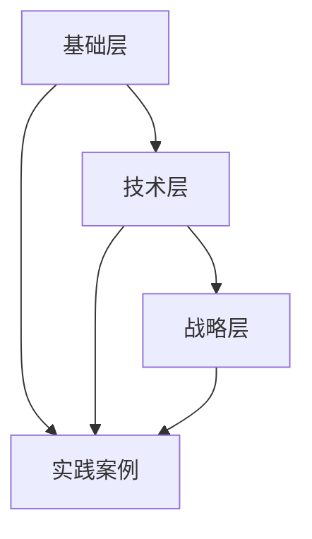

以下是为你设计的自动化测试书籍写作框架，结合教育心理学和专业技术体系，采用「问题驱动式」写作结构，帮助读者建立完整认知闭环：

---

### **一、书籍核心架构：3×5 金字塔模型**


#### **层级解析：**
1. **基础层（Why）**  
   - 自动化测试的本质认知
   - 常见认知误区破除
   - ROI计算模型（附计算器工具）

2. **技术层（How）**  
   - 关键技术栈深度解构
   - 反模式识别指南
   - 框架进化路线图

3. **战略层（What）**  
   - 团队能力矩阵建设
   - 效能度量体系设计
   - 持续测试流水线构建

---

### **二、章节设计：问题驱动式写作模板**
#### **标准章节结构（每章复用）：**
```markdown
# 第X章 [具体技术领域]
## 1. 现实之困（问题场景）
   - 真实故障案例：某电商618大促页面崩溃溯源
   - 痛点雷达图：开发/测试/运维多维视角
   - 传统方案失效分析

## 2. 破局之道（解决方案）
   ```mermaid
   graph LR
   A[原始状态] -->|手动测试瓶颈| B[技术选型]
   B --> C{决策树模型}
   C -->|Web应用| D[Playwright]
   C -->|移动端| E[Appium+云真机]
```

## 3. 庖丁解牛（技术实现）
   - 核心代码解剖（带安全警示标识）：
     ```python
     # ⚠️ 易错点：元素等待策略
     page.wait_for_selector('#dynamic-element', state='attached', timeout=10000)
     ```
   - 调试避坑指南（附错误代码对比表）

## 4. 效能革命（收益验证）
| 指标       | 实施前 | 实施后 | 提升率 |
| ---------- | ------ | ------ | ------ |
| 缺陷逃逸率 | 23%    | 5%     | 78%↓   |
| 回归耗时   | 8h     | 25min  | 95%↓   |

## 5. 进化之路（扩展场景）
   - 如何适配微服务架构
   - AI增强测试实践（视觉校验/智能生成）
```

---

### **三、创新内容设计**
#### 1. **反常识专栏（每章穿插）**
   > 「为什么100%自动化是灾难？」  
   > 揭示自动化覆盖率与维护成本的指数曲线关系，给出黄金平衡点公式：  
   > `最佳覆盖率 = (0.7 × 模块重要度) + (0.3 × 变更频率)`

#### 2. **技术决策树（关键抉择点）**
   ```mermaid
   graph TD
   A[测试需求] --> B{设备依赖？}
   B -->|是| C[云测试平台]
   B -->|否| D{跨浏览器？}
   D -->|是| E[Playwright/Cypress]
   D -->|否| F[Pytest+Requests]
```

#### 3. **可撕式速查卡（书末附赠）**
   ```markdown
   | 场景           | 首选工具       | 配置口诀         |
   |----------------|----------------|------------------|
   | API性能测试    | K6             | 1VU=1用户 100RPS|
   | 视觉回归       | Applitools     | 忽略动态区域编码|
   | 安全扫描       | OWASP ZAP      | 自动爬虫深度设置|
   ```

---

### **四、特色章节规划**
1. **第3章 测试代码的洁净之道**
   - 测试代码的SOLID原则重构
   - 反模式案例：硬编码数据的代价
   - 数据工厂模式深度解析

2. **第7章 在容器风暴中航行**
   - Kubernetes测试策略矩阵
   - 混沌工程测试框架集成
   - 瞬时环境构建技术栈

3. **第9章 模型驱动的自动化**
   ```mermaid
   graph TB
   A[业务流程图] --> B[Gherkin语法]
   B --> C[自动生成测试骨架]
   C --> D[AI填充测试数据]
   ```

4. **第12章 质量效能仪表盘**
   - 关键指标采集技术（ELK+Prometheus）
   - 四象限质量评估模型
   - 自动化健康度预警系统

---

### **五、学习体验增强设计**
1. **情景式学习沙箱**
   - 每章配套Docker化实验环境
   - 预置典型缺陷的待测系统
   - 安全破坏性实验指导

2. **三维知识检测体系**
   ```markdown
   | 检测类型   | 形式                  | 目标              |
   |------------|-----------------------|-------------------|
   | 技能验证   | 在线CI流水线挑战      | 实操能力认证      |
   | 认知评估   | 决策树迷宫游戏        | 技术选型思维      |
   | 效能挑战   | 测试代码重构竞赛      | 质量效率提升      |
   ```

3. **增强现实附录**
   - 手机扫描查看框架架构动态图
   - 3D模型展示测试执行拓扑
   - 视频案例库（真实故障重现）

---

### **六、收益论证体系**
采用「三层价值锚点」论证：
1. **个人层**  
   - 技能树升级路径图
   - 自动化薪资溢价数据（2024行业报告）

2. **团队层**  
   - 发布周期压缩公式：  
     `新周期 = 原周期 × (1 - 自动化占比 × 0.6)`
   - 质量门禁实施蓝图

3. **企业层**  
   - 质量成本（COQ）计算模型
   - 客户满意度提升的关联分析

---

### **七、内容编排技巧**
1. **认知负荷管理**
   - 复杂概念「三明治讲解法」：  
     现实类比 → 技术解析 → 生活场景还原
   - 每章信息密度曲线控制

2. **多维度内容标记**
   ```markdown
   ![基础必备] 元素定位策略  
   ![架构师必读] 测试框架扩展设计  
   ![前沿技术] 基于LLM的测试预言生成
   ```

3. **故障模式重现**
   - 经典bug重现实验室
   - 防御性测试编码模式

---

**书籍价值定位公式：**  
`读者获得感 = (实用工具包 + 认知升级) × 实践可行性`

建议采用**版本化写作**：
- V1.0 核心方法论（占60%）
- V2.0 行业案例库（持续更新）
- V3.0 在线实验平台（增值服务）

这种结构既保证系统性又增强实操性，通过可视化决策工具和量化收益模型，解决技术书籍「看得懂但不会用」的痛点。每章形成独立价值闭环，整体构建完整知识生态。