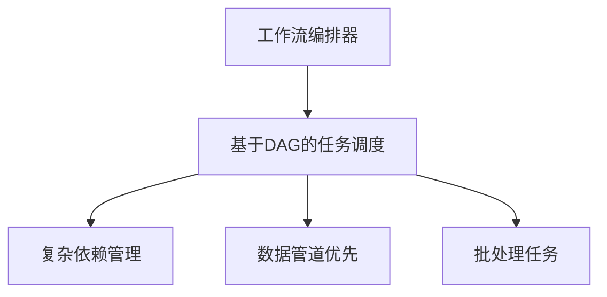
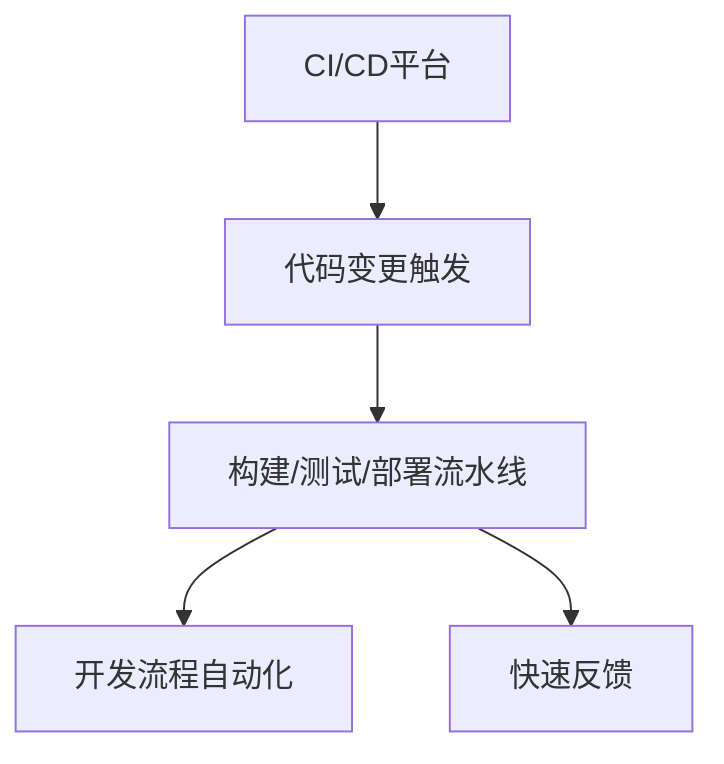

# Airflow vs Jenkins 执行 Pytest 测试的全面对比

## 1. **核心定位和设计理念差异**

### **Apache Airflow**


### **Jenkins**


## 2. **执行 Pytest 用例的具体对比**

### **配置方式对比**

#### **Airflow 配置示例**：
```python
# test_pipeline.py
from airflow import DAG
from airflow.operators.bash import BashOperator
from datetime import datetime

dag = DAG(
    'test_data_pipeline',
    schedule_interval='@daily',
    start_date=datetime(2024, 1, 1),
    catchup=False
)

# Python代码定义任务
run_tests = BashOperator(
    task_id='execute_pytest',
    bash_command='python -m pytest ./tests/ --junitxml=/tmp/results.xml',
    dag=dag
)

# 可以添加复杂依赖
prepare_data >> run_tests >> generate_report
```

#### **Jenkins 配置示例**：
```groovy
// Jenkinsfile (Pipeline as Code)
pipeline {
    agent any
    stages {
        stage('Checkout') {
            steps {
                git branch: 'main', url: 'https://github.com/your/repo.git'
            }
        }
        stage('Test') {
            steps {
                sh 'python -m pytest tests/ --junitxml=results.xml'
            }
            post {
                always {
                    junit 'results.xml'
                }
            }
        }
    }
}
```

### **执行机制对比表**：

| 特性         | **Apache Airflow**                    | **Jenkins**                           |
| ------------ | ------------------------------------- | ------------------------------------- |
| **触发方式** | 时间调度、手动触发、API触发           | 代码提交、定时触发、手动触发、Webhook |
| **执行环境** | 固定的Airflow环境（可配置Docker）     | 可灵活配置Slave节点、容器、云环境     |
| **并行能力** | 有限的并行（Worker池）                | 强大的并行构建（多节点、多执行器）    |
| **结果报告** | 需要自定义报告生成                    | 内置JUnit、HTML报告插件，可视化好     |
| **重试机制** | 内置任务级重试，可配置重试策略        | 构建级重试，需要插件支持细粒度重试    |
| **队列管理** | 基于优先级的任务队列                  | 基于标签和节点的队列                  |
| **资源隔离** | 依赖Executor类型（Local/ Celery/K8s） | 基于节点的隔离，支持Docker容器        |

## 3. **使用场景差异分析**

### **适合 Airflow 的场景**：

#### **场景1：数据驱动的测试工作流**
```python
# 数据验证测试管道
dag = DAG('data_validation_pipeline', ...)

extract_data >> validate_schema >> run_data_quality_tests >> generate_data_report
# ↑ 这里run_data_quality_tests包含pytest数据验证测试
```

#### **场景2：跨系统集成测试**
```python
# 系统集成验证
tasks = [
    deploy_staging,
    run_integration_tests,  # 使用pytest执行API测试
    wait_for_external_system,
    run_e2e_tests,          # 更多pytest测试
    clean_up_test_data
]
```

#### **场景3：周期性质量检查**
```python
# 每天凌晨运行完整测试套件
dag = DAG(
    'nightly_regression',
    schedule_interval='0 2 * * *',  # 每天2AM
    description='夜间回归测试套件'
)

run_smoke_tests >> run_regression_tests >> run_performance_tests
```

### **适合 Jenkins 的场景**：

#### **场景1：代码提交触发测试**
```groovy
// Jenkinsfile - 代码提交触发
pipeline {
    triggers {
        // GitHub webhook触发
        githubPush()
    }
    stages {
        stage('Unit Tests') {
            steps {
                sh 'pytest tests/unit/'
            }
        }
        stage('Integration Tests') {
            steps {
                sh 'pytest tests/integration/'
            }
        }
    }
}
```

#### **场景2：多环境测试矩阵**
```groovy
// 多环境并行测试
pipeline {
    agent none
    stages {
        stage('Test Matrix') {
            parallel {
                stage('Python 3.8') {
                    agent { docker { image 'python:3.8' } }
                    steps { sh 'pytest tests/' }
                }
                stage('Python 3.9') {
                    agent { docker { image 'python:3.9' } }
                    steps { sh 'pytest tests/' }
                }
                stage('Python 3.10') {
                    agent { docker { image 'python:3.10' } }
                    steps { sh 'pytest tests/' }
                }
            }
        }
    }
}
```

#### **场景3：持续交付流水线**
```groovy
// CI/CD完整流水线
pipeline {
    stages {
        stage('Build') { ... }
        stage('Unit Test') { ... }
        stage('Integration Test') { ... }
        stage('Deploy to Staging') { ... }
        stage('E2E Test') { ... }  // 在staging环境运行pytest
        stage('Deploy to Production') { ... }
    }
}
```

## 4. **技术架构对比**

### **Airflow 架构特点**：
```python
# 基于DAG的架构
class AirflowArchitecture:
    """
    优点：
    1. 可视化DAG，清晰的任务依赖关系
    2. 丰富的Operator库，支持各种系统集成
    3. 内置调度器，精确控制执行时间
    4. 任务状态追踪和历史记录
    
    缺点：
    1. 实时触发能力有限
    2. 并行扩展复杂
    3. 测试报告需要二次开发
    """
```

### **Jenkins 架构特点**：
```groovy
// 基于Master-Slave的架构
JenkinsArchitecture {
    /*
    优点：
    1. 强大的插件生态系统
    2. 灵活的分布式执行
    3. 完善的测试报告和趋势分析
    4. 实时构建状态监控
    
    缺点：
    1. 配置分散，维护成本高
    2. 状态管理相对简单
    3. 复杂工作流定义不够直观
    */
}
```

## 5. **实际应用场景选择指南**

### **选择 Airflow 当**：

#### **场景A：数据测试和质量验证**
```python
# 数据质量测试工作流
def create_data_test_dag():
    dag = DAG('data_quality_daily', ...)
    
    tasks = [
        extract_from_database,
        validate_data_completeness,      # 使用pytest验证数据完整性
        check_data_consistency,          # 更多pytest数据测试
        run_anomaly_detection,           # 异常检测测试
        generate_quality_report
    ]
    
    # 设置线性依赖
    for i in range(len(tasks)-1):
        tasks[i] >> tasks[i+1]
    
    return dag
```

#### **场景B：机器学习模型测试流水线**
```python
# ML模型验证工作流
ml_test_dag = DAG('model_validation', ...)

tasks = {
    'prepare_data': PythonOperator(...),
    'train_model': PythonOperator(...),
    'run_model_tests': BashOperator(  # 使用pytest测试模型
        bash_command='pytest tests/model_tests/',
        ...
    ),
    'deploy_if_passed': BranchPythonOperator(...)
}
```

#### **场景C：复杂的多系统测试编排**
```python
# 跨系统集成测试
dag = DAG('cross_system_integration', ...)

# 同时测试多个微服务
test_service_a = ExternalTaskSensor(
    task_id='wait_for_service_a',
    external_dag_id='deploy_service_a',
    ...
)

run_service_a_tests = BashOperator(
    task_id='test_service_a',
    bash_command='pytest tests/microservices/service_a/',
    dag=dag
)

# 类似的为其他服务...
```

### **选择 Jenkins 当**：

#### **场景A：开发团队快速反馈**
```groovy
// 开发阶段的快速测试
pipeline {
    agent any
    options {
        timeout(time: 30, unit: 'MINUTES')
    }
    stages {
        stage('Quick Tests') {
            steps {
                // 快速运行关键测试
                sh 'pytest tests/ -m "not slow" -x'  // -x 表示遇到失败立即停止
            }
            post {
                success {
                    slackSend(message: "✅ 快速测试通过")
                }
                failure {
                    slackSend(message: "❌ 快速测试失败")
                }
            }
        }
    }
}
```

#### **场景B：多分支并行测试**
```groovy
// GitHub多分支测试
pipeline {
    agent any
    triggers {
        // 每个分支的PR都会触发
        githubPullRequest(
            githubAuthId: 'github-token',
            triggerPhrase: '.*run tests.*'
        )
    }
    stages {
        stage('Test PR') {
            steps {
                sh '''
                    # 运行特定于PR的测试
                    python -m pytest tests/ \\
                        --cov=src \\
                        --cov-report=xml \\
                        --junitxml=test-results.xml
                '''
            }
        }
        stage('Quality Gate') {
            steps {
                // 代码覆盖率检查
                sh 'python -m coverage report --fail-under=80'
            }
        }
    }
}
```

#### **场景C：自动化回归测试套件**
```groovy
// 定期全面回归测试
pipeline {
    triggers {
        // 每晚2点运行
        cron('0 2 * * *')
    }
    stages {
        stage('Full Regression') {
            parallel {
                stage('API Tests') {
                    steps { sh 'pytest tests/api/ --junitxml=api-results.xml' }
                }
                stage('UI Tests') {
                    steps { sh 'pytest tests/ui/ --junitxml=ui-results.xml' }
                }
                stage('Performance Tests') {
                    steps { sh 'pytest tests/performance/ --junitxml=perf-results.xml' }
                }
            }
        }
        stage('Generate Report') {
            steps {
                // 合并所有测试报告
                sh 'junit-merge *.xml -o combined-results.xml'
                publishHTML([
                    target: [
                        allowMissing: false,
                        alwaysLinkToLastBuild: false,
                        keepAll: true,
                        reportDir: 'test-reports',
                        reportFiles: 'index.html',
                        reportName: 'Test Report'
                    ]
                ])
            }
        }
    }
}
```

## 6. **混合使用的最佳实践**

### **方案1：Jenkins触发Airflow工作流**
```groovy
// Jenkins触发Airflow DAG执行测试
pipeline {
    stages {
        stage('Trigger Airflow Tests') {
            steps {
                script {
                    // 通过Airflow REST API触发DAG
                    sh '''
                        curl -X POST "http://airflow-server:8080/api/v1/dags/test_suite/dagRuns" \
                            -H "Content-Type: application/json" \
                            -H "Authorization: Bearer $AIRFLOW_API_TOKEN" \
                            -d '{
                                "conf": {
                                    "test_suite": "regression",
                                    "environment": "staging"
                                }
                            }'
                    '''
                }
            }
        }
        stage('Monitor Airflow Run') {
            steps {
                script {
                    // 轮询检查Airflow DAG运行状态
                    timeout(time: 1, unit: 'HOURS') {
                        waitUntil {
                            def status = sh(
                                script: '''
                                    curl -s "http://airflow-server:8080/api/v1/dags/test_suite/dagRuns" \
                                        -H "Authorization: Bearer $AIRFLOW_API_TOKEN" | \
                                    jq -r '.dag_runs[0].state'
                                ''',
                                returnStdout: true
                            ).trim()
                            echo "Airflow DAG状态: ${status}"
                            return status == "success" || status == "failed"
                        }
                    }
                }
            }
        }
    }
}
```

### **方案2：Airflow编排，Jenkins执行**
```python
# Airflow DAG调用Jenkins Job执行测试
from airflow.providers.jenkins.operators.jenkins_job_trigger import JenkinsJobTriggerOperator

dag = DAG('test_orchestration', ...)

trigger_unit_tests = JenkinsJobTriggerOperator(
    task_id='trigger_unit_tests',
    jenkins_connection_id='jenkins_default',
    job_name='run_unit_tests',
    parameters={
        'test_path': 'tests/unit/',
        'python_version': '3.9'
    },
    dag=dag
)

trigger_integration_tests = JenkinsJobTriggerOperator(
    task_id='trigger_integration_tests',
    jenkins_connection_id='jenkins_default',
    job_name='run_integration_tests',
    parameters={
        'test_path': 'tests/integration/',
        'environment': 'staging'
    },
    dag=dag,
    trigger_rule='all_done'  # 无论单元测试是否成功都执行
)
```

## 7. **决策矩阵**

### **何时使用哪个工具**：

| **考虑因素** | **选择 Airflow**  | **选择 Jenkins**  | **混合方案**                     |
| ------------ | ----------------- | ----------------- | -------------------------------- |
| **主要目标** | 编排复杂工作流    | CI/CD自动化       | Jenkins CI + Airflow编排         |
| **调度需求** | 复杂时间/事件调度 | 代码变更/简单定时 | Jenkins触发，Airflow调度复杂任务 |
| **依赖管理** | 复杂DAG依赖       | 简单阶段依赖      | Airflow管理复杂依赖              |
| **测试报告** | 需要自定义集成    | 需要丰富可视化    | Jenkins负责报告展示              |
| **执行环境** | 固定/统一环境     | 多环境/多节点     | Jenkins提供环境，Airflow编排任务 |
| **团队规模** | 小到大型团队      | 中小型团队        | 大型复杂团队                     |

### **具体选择建议**：

```python
def select_test_platform(requirements):
    """
    根据需求选择测试平台
    """
    if requirements['complex_orchestration']:
        return "Airflow"
    elif requirements['fast_feedback']:
        return "Jenkins"
    elif requirements['both_needed']:
        return "Hybrid (Jenkins triggers Airflow)"
    else:
        # 简单场景
        if requirements['data_centric']:
            return "Airflow"
        else:
            return "Jenkins"
```

## 8. **性能和维护对比**

### **资源消耗**：
- **Airflow**：需要稳定的数据库和调度器，资源占用相对固定
- **Jenkins**：Master节点轻量，但Slave节点可按需扩展

### **维护复杂度**：
- **Airflow**：DAG版本控制清晰，但调度器和数据库需要维护
- **Jenkins**：插件管理复杂，配置分散在不同Job中

### **学习曲线**：
- **Airflow**：需要理解DAG概念和Python API
- **Jenkins**：需要掌握Groovy和Pipeline语法

## **总结建议**：

### **理想的分工模式**：
1. **使用 Jenkins 进行**：
   - 代码提交触发的快速测试
   - PR验证和代码质量门禁
   - 多环境并行测试执行
   - 测试报告收集和展示

2. **使用 Airflow 进行**：
   - 数据质量测试工作流
   - 复杂的集成测试编排
   - 跨系统测试协调
   - 周期性全量回归测试

3. **结合使用**：
   - Jenkins触发关键测试，Airflow处理后续复杂验证
   - Airflow编排测试流程，Jenkins提供执行环境
   - 两者通过API互相调用，形成完整测试生态系统

### **最终建议**：
- **小型项目/简单测试**：从Jenkins开始
- **数据驱动/复杂编排**：首选Airflow
- **大型企业级应用**：两者结合，发挥各自优势
- **已有技术栈**：优先考虑与现有工具集成度高的方案

两者各有优势，选择取决于你的具体测试需求、团队技术栈和工作流程特点。