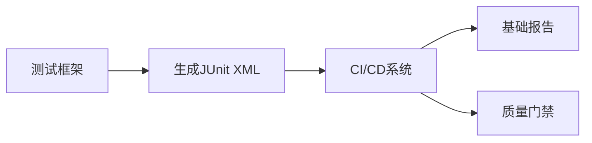
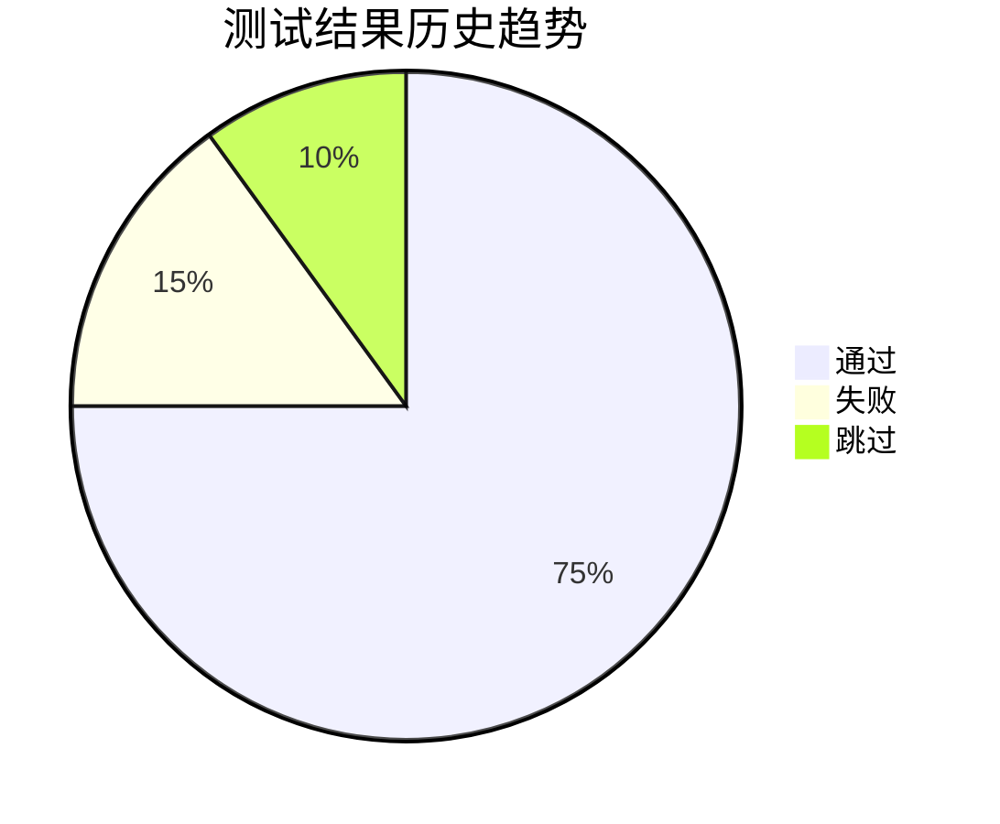
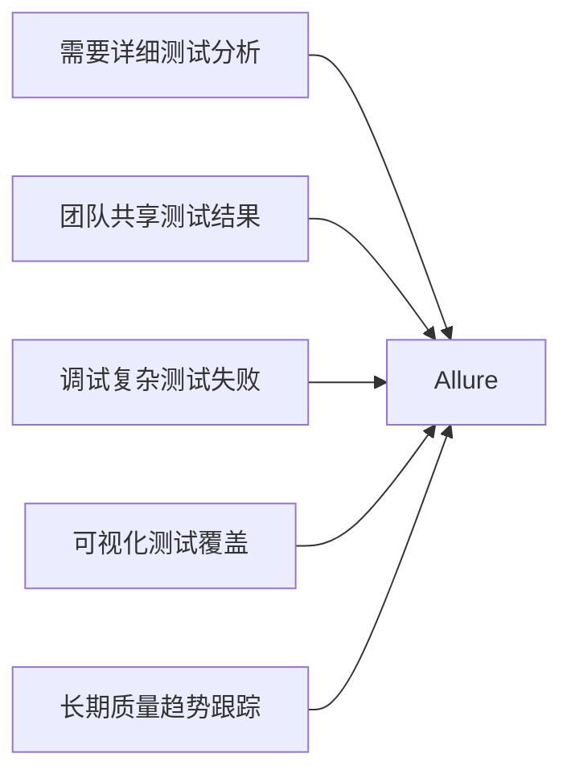
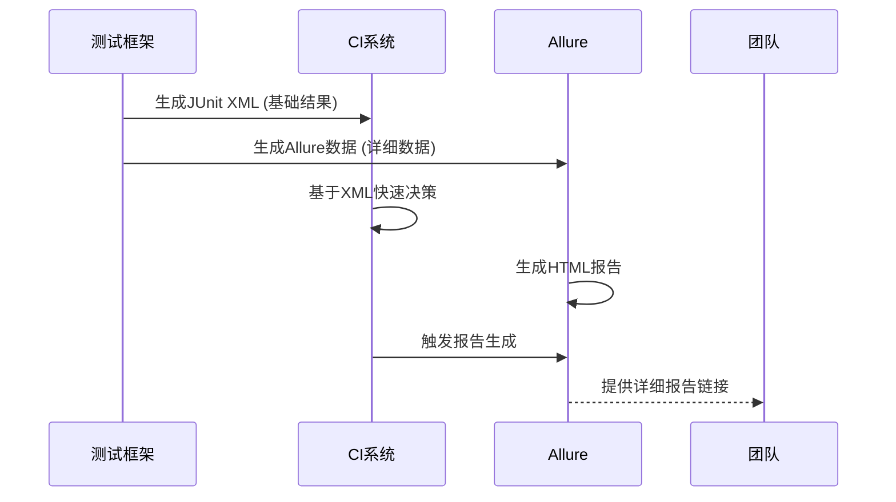

# JUnit XML 与 Allure 测试报告深度对比

JUnit XML 和 Allure 都是测试领域广泛使用的报告工具，但它们在设计理念、功能和用途上有显著区别。以下是两者的全面对比分析：

## 核心差异概览

| **特性**     | **JUnit XML**        | **Allure**             |
| ------------ | -------------------- | ---------------------- |
| **本质**     | 标准化的测试结果格式 | 完整的测试报告框架     |
| **主要用途** | CI/CD 系统集成       | 人类可读的详细测试报告 |
| **输出格式** | XML                  | HTML + JSON            |
| **可视化**   | 基础表格             | 丰富的交互式图表       |
| **数据深度** | 测试结果摘要         | 完整测试生命周期       |
| **生态系统** | 通用标准             | 完整工具链             |

## 一、架构与设计理念

### JUnit XML


- **本质**：标准化的数据交换格式
- **目标**：为自动化系统提供机器可读的测试结果
- **设计原则**：
  - 简单结构化
  - 轻量级
  - 跨语言兼容

### Allure


- **本质**：完整的测试报告解决方案
- **目标**：提供人类可读的丰富测试分析
- **设计原则**：
  - 可视化优先
  - 测试生命周期跟踪
  - 深度集成能力

## 二、核心功能对比

### 1. 测试结果展示

**JUnit XML**：
```xml
<testsuite name="LoginTests" tests="5" failures="1">
  <testcase name="test_valid_login" time="1.2"/>
  <testcase name="test_invalid_password" time="0.8">
    <failure message="Expected 401 but got 200"/>
  </testcase>
</testsuite>
```
- 仅提供基础数据：通过/失败/跳过计数
- 有限的错误信息展示
- 无测试步骤详情

**Allure**：

- 完整的测试步骤时间线
- 丰富的附件支持：截图、日志、视频
- 测试参数化展示
- 失败断言对比

### 2. 历史趋势分析

**JUnit XML**：
- 无内置历史分析
- 依赖外部系统（如Jenkins趋势图）
- 仅能比较基础指标

**Allure**：

- 内置历史趋势图表
- 可比较多版本结果
- 缺陷率变化分析
- 测试持续时间趋势

### 3. 环境与元数据

**JUnit XML**：
```xml
<properties>
  <property name="os.name" value="Windows 10"/>
</properties>
```
- 有限的环境属性支持
- 静态信息展示
- 无运行时数据

**Allure**：
```json
"environment": {
  "OS": "Ubuntu 20.04",
  "Browser": "Chrome 103",
  "Resolution": "1920x1080",
  "Test Data Version": "v2.3"
}
```
- 完整的运行环境记录
- 自定义标签系统
- 动态收集运行时数据
- 环境对比功能

## 三、集成与扩展性

### JUnit XML
- **集成方式**：
  ```bash
  pytest --junitxml=results.xml
  ```
- **优势**：
  - 几乎所有测试框架原生支持
  - CI系统开箱即用
  - 无需额外依赖
- **扩展**：
  - 有限的扩展能力
  - 通过自定义属性添加额外数据
  - 依赖外部工具处理数据

### Allure
- **集成方式**：
  ```bash
  pytest --alluredir=allure-results
  allure serve allure-results
  ```
- **优势**：
  - 丰富的插件系统
  - 支持自定义报告模板
  - 与问题跟踪系统集成（Jira, TFS等）
- **扩展**：
  - 自定义测试分类（Epic/Feature/Story）
  - 添加步骤描述和附件
  ```python
  @allure.step("输入用户名")
  def enter_username(username):
      allure.attach(f"输入: {username}", name="用户名输入")
  ```

## 四、报告交互性对比

### JUnit XML
- **典型CI视图**：
  
- 静态表格展示
- 点击查看错误详情
- 无过滤和搜索功能

### Allure
- **交互功能**：
  - 动态过滤（按状态、标签、环境）
  - 全文搜索
  - 测试步骤展开/折叠
  - 缺陷链接跳转
- **可视化组件**：
  ```mermaid
  graph TD
    A[仪表盘] --> B[缺陷分布]
    A --> C[测试分类]
    A --> D[持续时间热图]
    A --> E[环境矩阵]
  ```

## 五、使用场景对比

### 适用JUnit XML的场景
1. **CI/CD流水线集成**
   ```yaml
   # GitLab CI 示例
   test:
     script:
       - pytest --junitxml=report.xml
     artifacts:
       reports:
         junit: report.xml
   ```
2. **基础质量门禁**
   ```groovy
   // Jenkinsfile
   post {
     always {
       junit '**/test-results/*.xml'
     }
     unstable {
       script {
         def results = junit testResults: '**/test-results/*.xml'
         if (results.failCount > 5) {
           error "失败测试过多!"
         }
       }
     }
   }
   ```
3. **资源受限环境**

### 适用Allure的场景
1. **详细测试分析**
   ```python
   @allure.feature("登录功能")
   @allure.story("用户认证")
   def test_login():
       with allure.step("打开登录页面"):
           open_login_page()
       with allure.step("输入凭证"):
           enter_credentials("user", "pass")
       with allure.step("验证登录成功"):
           assert is_logged_in()
   ```
2. **团队协作与共享**
   - 共享HTML报告
   - 集成到Confluence
   - 自动发送邮件报告
3. **复杂测试调试**
   ```python
   def test_checkout():
       try:
           add_to_cart()
           checkout()
       except Exception as e:
           allure.attach(driver.get_screenshot_as_png(), name="失败截图")
           raise e
   ```

## 六、技术栈支持对比

| **技术**       | **JUnit XML支持** | **Allure支持** |
| -------------- | ----------------- | -------------- |
| **测试框架**   |                   |                |
| JUnit          | ✅                 | ✅              |
| TestNG         | ✅                 | ✅              |
| pytest         | ✅                 | ✅              |
| Cucumber       | ✅                 | ✅              |
| **编程语言**   |                   |                |
| Java           | ✅                 | ✅              |
| Python         | ✅                 | ✅              |
| JavaScript     | ✅                 | ✅              |
| .NET           | ✅                 | ✅              |
| **CI系统**     |                   |                |
| Jenkins        | ✅                 | ✅              |
| GitLab CI      | ✅                 | ✅              |
| GitHub Actions | ✅                 | ✅              |
| TeamCity       | ✅                 | ✅              |

## 七、典型报告对比

### JUnit XML报告（Jenkins视图）


### Allure报告


## 八、如何选择？

### 选择 **JUnit XML** 当：
- 需要快速集成到CI/CD系统
- 只关注基础通过率
- 在资源受限环境中运行
- 已有CI系统内置报告功能

### 选择 **Allure** 当：


## 九、结合使用的最佳实践

在实际项目中，通常**同时使用两者**：



**实现方案**：
1. 配置测试框架同时输出两种格式
   ```bash
   pytest 
     --junitxml=ci-results.xml 
     --alluredir=allure-results
   ```
2. CI系统使用JUnit XML进行快速反馈
3. 在CI流水线中生成Allure报告
   ```yaml
   # GitLab CI 示例
   generate-report:
     script:
       - allure generate allure-results -o allure-report
     artifacts:
       paths:
         - allure-report
   ```
4. 将Allure报告发布到共享位置

## 总结：核心差异矩阵

| **维度**       | **JUnit XML**      | **Allure**         |
| -------------- | ------------------ | ------------------ |
| **主要目的**   | 机器可读的测试结果 | 人类可读的测试分析 |
| **数据深度**   | 测试结果摘要       | 完整测试生命周期   |
| **可视化**     | 基础表格           | 丰富交互式图表     |
| **集成复杂度** | 简单               | 中等               |
| **历史分析**   | 需外部支持         | 内置完善           |
| **调试支持**   | 有限               | 强大（截图/日志）  |
| **环境信息**   | 基础               | 详细               |
| **最佳场景**   | CI/CD集成          | 团队报告/调试      |

**结论**：JUnit XML 是测试结果的标准传输格式，而 Allure 是专业的测试报告和分析工具。在成熟的测试体系中，两者通常结合使用：
- JUnit XML 用于 CI/CD 系统的快速反馈和质量门禁
- Allure 用于团队协作、详细分析和长期质量跟踪

这种组合既能满足自动化流水线的需求，又能提供人类可读的丰富洞察，是现代测试自动化架构的最佳实践。