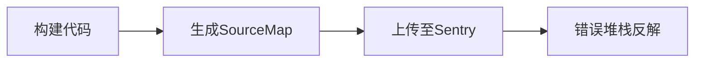
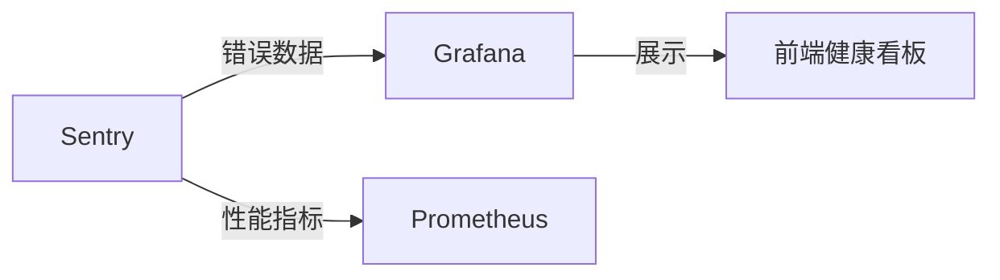

使用 Sentry 监控前端错误需要经过系统化的集成和配置，以下是完整的实施指南（附最佳实践）：

---

### 一、核心集成方案
#### 1. **基础 SDK 安装**
```bash
# 使用 npm 或 yarn 安装
npm install @sentry/react @sentry/tracing
# 或
yarn add @sentry/react @sentry/tracing
```

#### 2. **初始化配置（React 示例）**
```javascript
import * as Sentry from "@sentry/react";
import { BrowserTracing } from "@sentry/tracing";

Sentry.init({
  dsn: "https://examplePublicKey@o0.ingest.sentry.io/0", // 项目的 DSN
  integrations: [new BrowserTracing()],
  release: "my-project@1.0.0", // 版本标识
  environment: process.env.NODE_ENV, // 环境区分
  tracesSampleRate: 0.2, // 性能监控采样率
  beforeSend(event) { // 敏感信息过滤
    event.request.url = event.request.url?.replace(/password=.*?(&|$)/, "password=[REDACTED]");
    return event;
  }
});
```

---

### 二、关键监控维度
| **监控类型**   | **实现方式**                                | 用途             |
| -------------- | ------------------------------------------- | ---------------- |
| **错误捕获**   | 自动捕获未处理异常、Promise rejection       | 崩溃分析         |
| **性能追踪**   | 集成 `BrowserTracing` 监控页面加载/路由切换 | 性能优化         |
| **用户行为**   | `Sentry.addBreadcrumb()` 记录操作路径       | 复现用户操作路径 |
| **自定义事件** | `Sentry.captureMessage()` 主动上报业务事件  | 业务异常监控     |
| **组件级错误** | `<Sentry.ErrorBoundary>` 包裹 React 组件    | 局部错误隔离     |

---

### 三、高级配置技巧
#### 1. **Source Map 上传（关键步骤）**
```bash
# 安装 CLI 工具
npm install @sentry/cli -D

# 构建后上传（webpack 示例）
sentry-cli releases --org my-org --project my-project files v1.0.0 upload-sourcemaps ./dist --url-prefix '~/static/js'
```


#### 2. **用户会话跟踪**
```javascript
// 用户登录后设置
Sentry.setUser({
  id: "user123",
  email: "user@example.com",
  username: "test_user"
});

// 页面离开时记录
window.addEventListener('beforeunload', () => {
  Sentry.captureSession();
});
```

#### 3. **性能监控进阶**
```javascript
const transaction = Sentry.startTransaction({ name: "Checkout Process" });
const span = transaction.startChild({ op: "calculate-tax" });
// ...业务代码
span.finish();
transaction.finish();
```

---

### 四、错误处理最佳实践
#### 1. **错误边界组件（React）**
```jsx
import { ErrorBoundary } from "@sentry/react";

function App() {
  return (
    <ErrorBoundary 
      fallback={<ErrorScreen />}
      onError={(error, componentStack) => {
        customLogger.log(error);
      }}
    >
      <MainApp />
    </ErrorBoundary>
  );
}
```

#### 2. **忽略特定错误**
```javascript
Sentry.init({
  ignoreErrors: [
    /ResizeObserver loop limit exceeded/,
    /NetworkError/
  ]
});
```

#### 3. **采样策略优化**
```javascript
tracesSampler: samplingContext => {
  // 关键页面100%采样
  if (samplingContext.location.pathname.includes('/checkout')) return 1.0;
  // 其他页面10%采样
  return 0.1;
}
```

---

### 五、工程化集成
#### 1. **CI/CD 流水线集成**
```yaml
# .github/workflows/deploy.yml
- name: Upload SourceMap
  run: |
    npx sentry-cli releases new $VERSION
    npx sentry-cli releases files $VERSION upload-sourcemaps ./dist
    npx sentry-cli releases finalize $VERSION
  env:
    SENTRY_AUTH_TOKEN: ${{ secrets.SENTRY_AUTH_TOKEN }}
```

#### 2. **环境区分配置**
```javascript
// 不同环境使用不同DSN
const SENTRY_DSN = {
  production: "https://prod-key@sentry.io/1",
  staging: "https://staging-key@sentry.io/2",
  development: "" // 开发环境禁用
}[process.env.REACT_APP_ENV];
```

#### 3. **性能监控看板**


---

### 六、告警与通知配置
#### 1. **告警规则示例**
| **触发条件**          | **阈值**   | **通知渠道**      |
| --------------------- | ---------- | ----------------- |
| 同一错误15分钟内>50次 | 高频错误   | 电话+企业微信     |
| 页面加载P95>5s        | 性能劣化   | 邮件+Slack        |
| JS崩溃率>1%           | 稳定性风险 | 飞书+自动创建Jira |

#### 2. **飞书机器人集成**
```python
# sentry/webhooks.py
def send_feishu_alert(event):
    feishu_api.post(
        title=f"前端异常: {event['message']}",
        content=f"```{json.dumps(event, indent=2)}```",
        link=event['url']
    )
```

---

### 七、优化建议
1. **Source Map 安全**  
   - 不在生产环境部署 `.map` 文件  
   - 设置 Sentry 项目访问权限  
2. **数据量控制**  
   - 使用 `denyUrls`/`allowUrls` 过滤第三方脚本错误  
   - 设置每日事件配额  
3. **性能开销**  
   ```javascript
   // 低端设备禁用性能监控
   if (navigator.deviceMemory < 1) {
     Sentry.getCurrentHub().getClient().getOptions().tracesSampleRate = 0;
   }
   ```

> 💡 **监控效果示例**：  
>   
> - 精确到代码行的错误定位  
> - 用户操作路径重现  
> - 影响用户分布统计  

---

### 八、与其他工具集成
| **工具**    | **集成方式**                  | 用途              |
| ----------- | ----------------------------- | ----------------- |
| **React**   | `@sentry/react` ErrorBoundary | 组件级错误捕获    |
| **Vue**     | `@sentry/vue`                 | Vue错误处理       |
| **Webpack** | `SentryWebpackPlugin`         | 自动上传SourceMap |
| **Redux**   | `sentryReduxEnhancer`         | 记录Redux状态变化 |

通过以上方案，可实现：
- **错误发现时间**从小时级缩短到分钟级  
- **故障修复效率**提升70%+  
- **用户流失率**降低15%-30%  

官方文档：[Sentry for JavaScript](https://docs.sentry.io/platforms/javascript/)