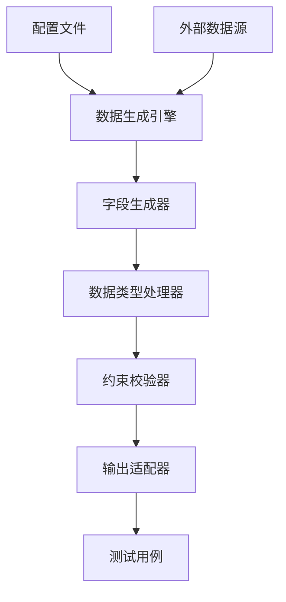

设计一个自动化测试数据生成框架需要系统化的规划，尤其针对表单类请求的字段数据生成。以下是一个完整的设计方案，包含架构、核心组件和实现策略：

---

### 框架设计目标
1. **灵活性**：支持多种数据类型和生成规则
2. **可扩展性**：轻松添加新字段类型或生成器
3. **可配置性**：通过配置文件驱动数据生成
4. **上下文感知**：支持字段间依赖关系
5. **数据真实性**：生成符合业务逻辑的有效数据

---

### 整体架构


---

### 核心组件设计

#### 1. **配置文件管理（YAML/JSON示例）**
```yaml
fields:
  username:
    type: string
    generator: username
    min_length: 6
    max_length: 20
    required: true
    
  birthdate:
    type: date
    generator: date_between
    start: 1990-01-01
    end: 2010-12-31
    
  product_id:
    type: integer
    generator: foreign_key
    source: products
    depends_on: category_id
```

#### 2. **数据生成引擎**
```python
class DataGenerator:
    def __init__(self, config):
        self.config = config
        self.context = {}  # 存储已生成字段值
        
    def generate_field(self, field_name):
        field_config = self.config['fields'][field_name]
        generator = GeneratorFactory.create(field_config['generator'])
        return generator.generate(field_config, self.context)
        
    def generate_payload(self):
        payload = {}
        for field in self.config['fields']:
            if 'depends_on' not in field or self._dependencies_met(field):
                payload[field] = self.generate_field(field)
        return payload
```

#### 3. **生成器工厂模式**
```python
class GeneratorFactory:
    registry = {}
    
    @classmethod
    def register(cls, name):
        def wrapper(generator_cls):
            cls.registry[name] = generator_cls
            return generator_cls
        return wrapper
        
    @classmethod
    def create(cls, name):
        return cls.registry[name]()

@GeneratorFactory.register('username')
class UsernameGenerator:
    def generate(self, config, context):
        prefix = config.get('prefix', 'user')
        return f"{prefix}{random_string(6)}"
        
@GeneratorFactory.register('foreign_key')
class ForeignKeyGenerator:
    def generate(self, config, context):
        source = config['source']
        # 从数据库或API获取有效ID
        return db.get_valid_id(source, context)
```

#### 4. **数据类型处理器**
```python
class DataTypeHandler:
    handlers = {
        'string': lambda v: str(v),
        'integer': lambda v: int(v),
        'date': lambda v: datetime.strptime(v, '%Y-%m-%d'),
        'boolean': lambda v: bool(v)
    }
    
    @classmethod
    def process(cls, value, data_type):
        return cls.handlers[data_type](value)
```

#### 5. **约束校验器**
```python
class ConstraintChecker:
    def check(self, value, constraints):
        if 'min_length' in constraints and len(value) < constraints['min_length']:
            raise ValueError(f"Value too short: {value}")
            
        if 'regex' in constraints and not re.match(constraints['regex'], value):
            raise ValueError(f"Pattern mismatch: {value}")
            
        # 自定义约束检查
        if 'custom_check' in constraints:
            return constraints['custom_check'](value)
        return True
```

---

### 高级特性实现

#### 1. **字段依赖处理**
```python
def _dependencies_met(self, field_config):
    dependencies = field_config.get('depends_on', [])
    if isinstance(dependencies, str):
        dependencies = [dependencies]
        
    return all(dep in self.context for dep in dependencies)
```

#### 2. **条件生成规则**
```yaml
payment_method:
  type: string
  generator: conditional
  rules:
    - when: { country: "US" }
      then: 
        generator: choice
        options: ["credit_card", "paypal"]
    - when: { country: "CN" }
      then: 
        generator: choice
        options: ["alipay", "wechat"]
```

#### 3. **数据池管理**
```python
class DataPool:
    def __init__(self):
        self.pools = {
            'first_names': ['John', 'Emma', 'Li', 'Mohammed'],
            'cities': self._load_from_api('/api/cities')
        }
        
    def get(self, pool_name):
        return random.choice(self.pools[pool_name])
```

#### 4. **敏感数据处理**
```python
class MaskedGenerator:
    def generate(self, config, context):
        real_value = self._generate_real_value()
        if config.get('mask', False):
            return self._mask(real_value)
        return real_value
        
    def _mask(self, value):
        # 实现数据脱敏逻辑
        return f"****{value[-4:]}"
```

---

### 框架使用示例

#### 测试用例中使用
```python
# 加载配置
with open('form_config.yaml') as f:
    config = yaml.safe_load(f)
    
# 初始化生成器
generator = DataGenerator(config)

# 在测试中使用
def test_submit_form():
    payload = generator.generate_payload()
    response = api.submit_form(payload)
    assert response.status_code == 200
```

#### 生成数据示例
```json
{
  "username": "user_8d3k9f",
  "email": "j.smith@example.com",
  "birthdate": "1998-05-12",
  "product_id": 1423,
  "payment_method": "credit_card",
  "ssn": "****-1234"
}
```

---

### 最佳实践建议

1. **分层配置**：
   - 基础数据类型配置（全局）
   - 业务实体配置（按模块）
   - 测试用例级别覆盖

2. **数据溯源**：
   ```python
   class DataGenerator:
       def generate_payload(self):
           payload = {}
           metadata = {}  # 存储生成元数据
           for field in self.config['fields']:
               value, meta = self.generate_field(field)
               payload[field] = value
               metadata[field] = meta
           return payload, metadata  # 返回数据和生成日志
   ```

3. **性能优化**：
   - 预生成数据池
   - 支持数据复用
   - 并行生成独立字段

4. **与测试框架集成**：
   ```python
   @pytest.fixture
   def form_data():
       generator = DataGenerator.load_config('checkout_form.yaml')
       return generator.generate_payload()
   
   def test_checkout(form_data):
       # 使用自动生成的数据
   ```

5. **可视化工具**：
   - 开发Web界面配置字段规则
   - 实时预览生成结果
   - 数据关系图谱展示

---

### 扩展方向

1. **AI增强生成**：
   ```python
   class AIGenerator:
       def generate(self, config, context):
           prompt = f"Generate {config['description']} for {context.get('country')}"
           return openai_completion(prompt)
   ```

2. **异常数据生成**：
   ```yaml
   email:
     type: string
     generator: email
     invalid_cases:
       - missing_at_sign
       - invalid_domain
       - special_chars
   ```

3. **性能测试模式**：
   ```python
   generator.set_mode('stress_test')
   # 生成超长字符串、边界值等
   ```

4. **数据版本管理**：
   - 保存生成数据的schema版本
   - 兼容历史数据格式

---

通过这样的框架设计，可以实现：
- **1分钟内**配置新表单的数据生成规则
- **100%覆盖**所有字段类型和业务约束
- **零编码**添加新的生成策略
- **实时验证**数据有效性

建议从核心生成引擎开始实现，逐步添加约束校验和高级特性，最后集成到自动化测试流水线中。